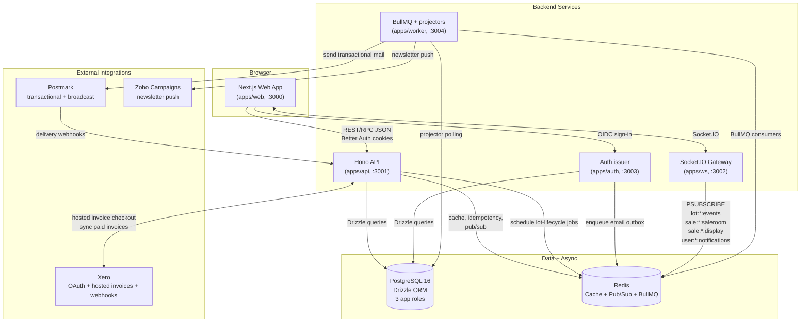
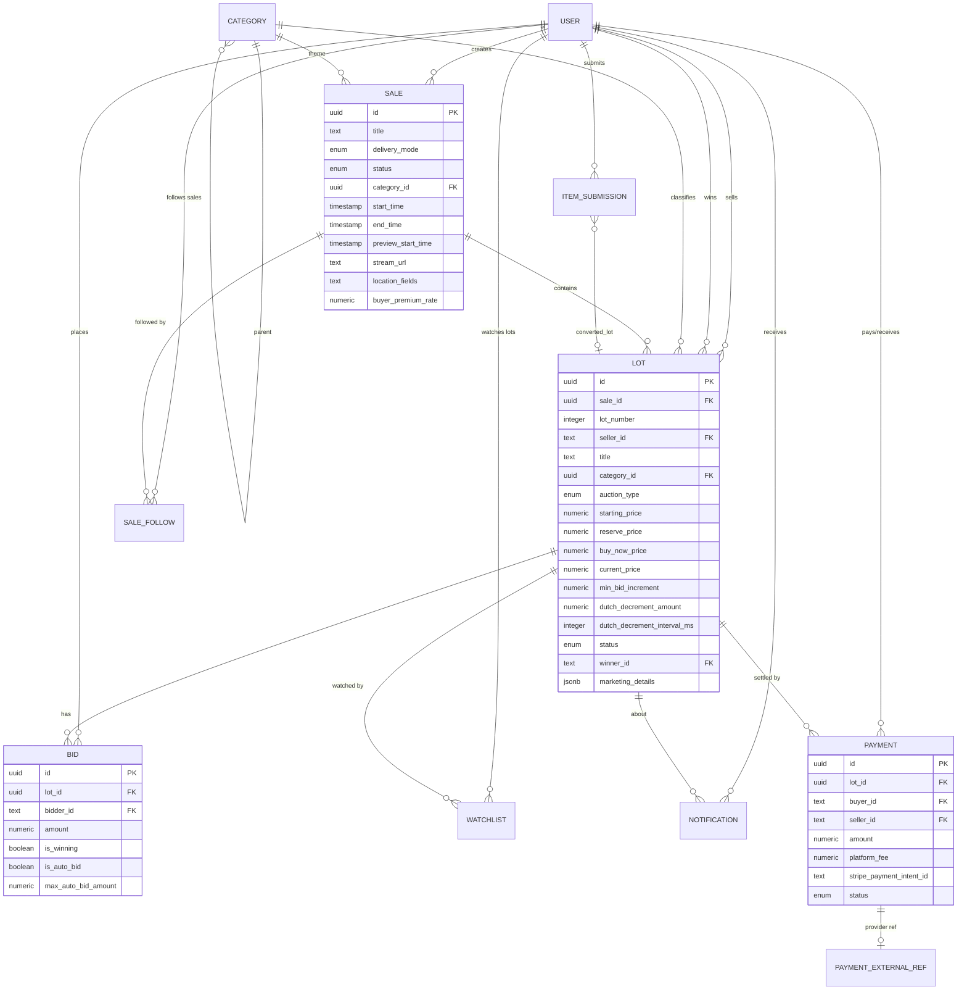
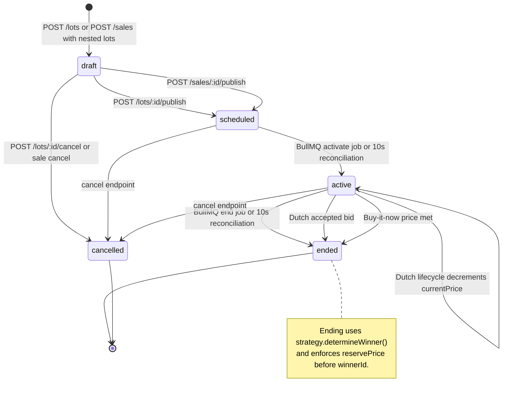
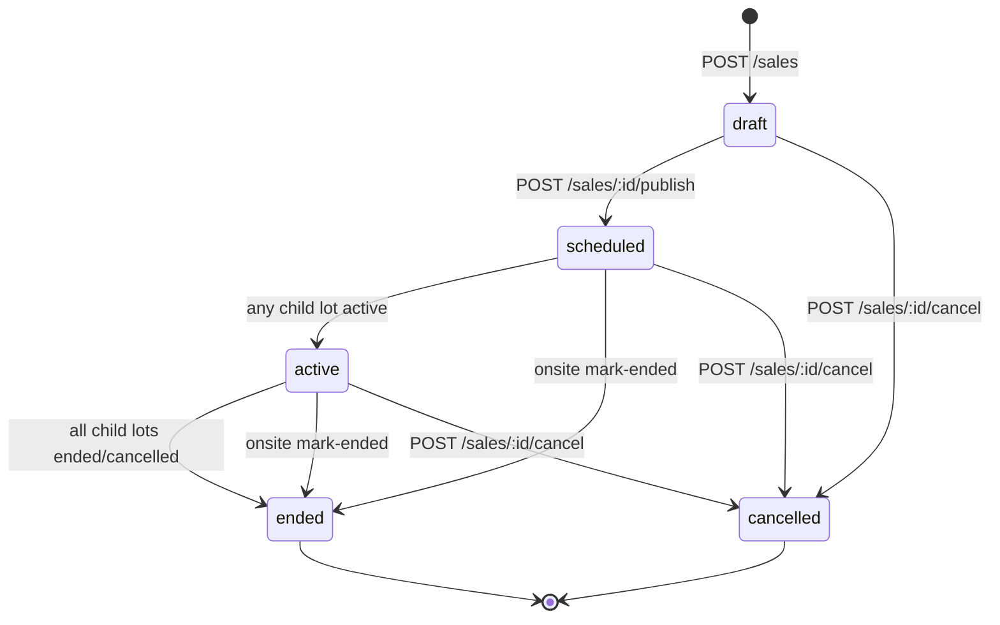
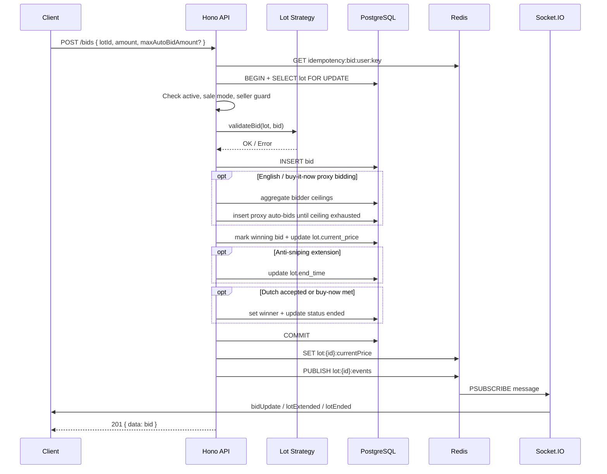
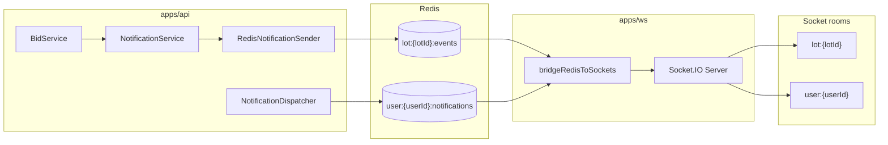
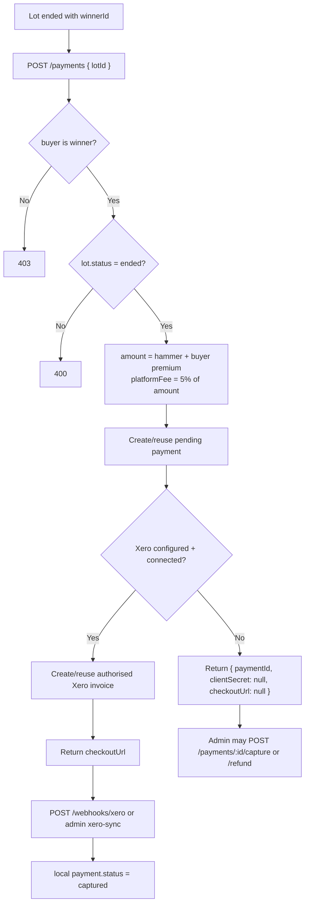
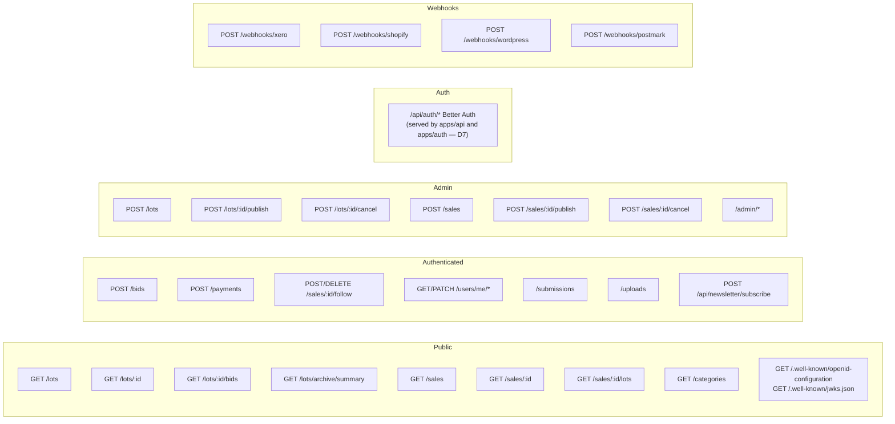

# Auction System - Visual Diagrams

Updated: 2026-05-05

These diagrams can be rendered in any Mermaid-compatible viewer. They focus on
the auction-domain runtime; the platform-wide architecture (auth, projectors,
deployment topology) lives in `docs/architecture/`.

## 1. System Architecture

## 2. Entity Relationship Diagram

## 3. Lot Lifecycle State Machine

## 4. Sale Lifecycle

## 5. Bid Placement Sequence

## 6. Realtime Fan-out

## 7. Payment and Xero Flow

## 8. Public API Quick Reference

