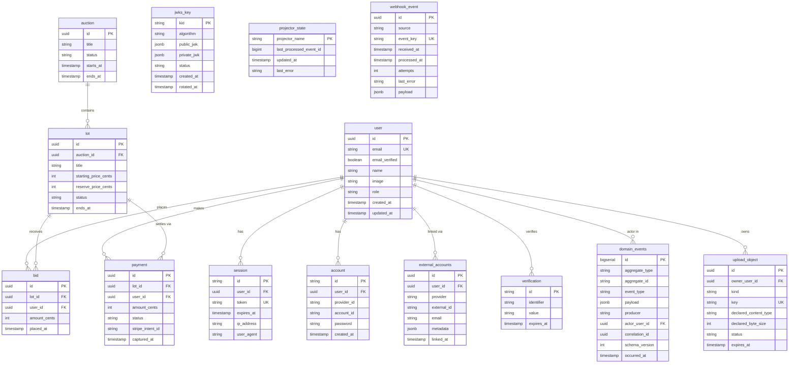

# Data model

This document is the source of truth for what's in the database. Every table that matters architecturally is described here. If you add a table or change a relationship, this doc gets updated in the same PR — stale schema docs are worse than no schema docs.

The database is a single PostgreSQL 16 cluster. Three application roles (`auth_app`, `api_app`, `worker_app`) are created by [packages/db/src/migrate-roles.ts](../../packages/db/src/migrate-roles.ts) and granted least-privilege access per D2. The **privileged owner connection** used to run migrations is the Postgres user provisioned by DigitalOcean managed Postgres (referred to as `auction_owner` in env vars and in the runbooks); `migrate-roles.ts` does **not** create that user — it uses it. Migrations run via the dedicated migration entrypoint at [packages/db/src/migrate-prod.ts](../../packages/db/src/migrate-prod.ts) (driven by `pnpm db:migrate:prod`), which in production is invoked from a one-shot job per F2; no long-running app process ever holds DDL grants.

> **Implementation status (last reviewed 2026-05-01)**
>
> - **Implemented:** every table in the ERD below exists at [packages/db/src/schema/](../../packages/db/src/schema/), including `domain_events.actor_user_id`, `domain_events.correlation_id` (DB default `gen_random_uuid()`), and `domain_events.schema_version` (DB default 1). Role grants in `migrate-roles.ts` enforce the role split.
> - **Scaffolded:** `external_accounts` exists with `(provider, external_id)` unique and `(email, provider)` index, but no service writes to it yet outside the seed script. `webhook_event` is written by the Shopify and WordPress handlers; the Xero handler does not write through it (D1 status).
> - **Planned:** the `(email, provider)` collision-resolution workflow per Q25 (no `collision_state` column today).

## Entity relationship diagram

## Tables by ownership

### Identity tables — owned by apps/auth, role auth_app

These tables contain everything related to who a user is and how they prove it. Only the `auth_app` Postgres role has full access. The `api_app` role has read access to `user` (for joins on bid and payment queries) but cannot read `session.token`, cannot read `account.password`, and has no access at all to `jwks_key`.

The `user` table is the canonical identity record. One row per human (modulo the deliberate exceptions documented below). The `email` column is unique, but linking happens by `(email, email_verified=true)` per D3 — an unverified email cannot claim ownership of an existing record.

The `session` table is better-auth's session storage. The `token` column is what the session cookie carries. In production the cookie is scoped to `.lax.bid` per F7, so both apps/web (lax.bid) and apps/auth (auth.lax.bid) can read it. Cross-registrable-suffix domains (lax.art, lax.shop) cannot share cookies and use JWTs instead.

The `account` table is better-auth's record of how a user authenticates. One row per (provider, account_id) pair. For email/password users, `provider_id = 'credential'` and the `password` column holds the bcrypt hash. For Google users, `provider_id = 'google'` and `account_id` is the Google `sub`. Note that this is distinct from `external_accounts` — `account` is for OAuth-flow-bearing identities (Google, Apple, future GitHub/Microsoft), while `external_accounts` is for cross-system identity stitching (Shopify customer ID, WordPress user ID).

The `verification` table is better-auth's pending-verification scratch space — email verification tokens, password reset tokens. Rows expire and are deleted by better-auth's cleanup job; nothing else reads from this table.

The `external_accounts` table is what links a single canonical user across our three external identity surfaces. When a Shopify webhook fires for a `customers/create` event, the worker either matches an existing user by verified email and writes a row here with `provider='shopify'`, or creates a new user and writes the link row. When Apple Sign-In returns a `@privaterelay.appleid.com` address, the linking happens by Apple `sub` only per F6 — never by email — so privacy-relay users get their own user record until they explicitly link.

The unique constraint `UNIQUE (provider, external_id)` is non-negotiable per M2. Without it, race conditions on concurrent social signups create duplicate rows. The additional index on `(email, provider)` exists for the D3 verified-email lookup pattern. If Q25's admin-review collision-resolution workflow ever permits transient duplicates, the constraint becomes a partial unique on `WHERE collision_state IS NULL` — defer until that workflow exists.

The `jwks_key` table holds the OIDC signing keys per D2. Only `auth_app` reads the `private_jwk` column. The `api_app` and `worker_app` roles have no grant on this table at all. Status transitions are `active` → `rotating` → `retired` → row deleted. Multiple rows can be `active` or `rotating` simultaneously during a 30-minute key rotation window — the runbook in [jwks-rotation.md](../runbooks/jwks-rotation.md) is the procedure.

### Application tables — owned by apps/api, role api_app

These hold the business state of the auction platform. Schema is illustrative — your existing tables likely have more columns than shown here. The fields that matter for the architecture are present.

The `auction` table represents a scheduled sale event with a start and end window. Lots belong to one auction. Lot status transitions (draft → scheduled → active → ended → settled) are driven by `apps/worker`'s `LotJobScheduler`, not by request-time code in `apps/api`.

The `bid` table is append-only — you do not update or delete bids, you place new ones. The current high bid on a lot is computed by `MAX(amount_cents) WHERE lot_id = $id`. This append-only invariant matters because every bid is also a domain event source — the `bid.first_for_user` and `bid.lot_won` events are derived from rows in this table.

The `payment` table is updated as a payment intent moves through its lifecycle (`pending` → `authorized` → `captured` → `failed` or `refunded`). The `stripe_intent_id` column links to the corresponding Stripe payment intent. When status transitions to `captured`, a `payment.captured` domain event is emitted in the same transaction (D8) — this is what the Xero projector consumes to issue an invoice.

The `upload_object` table tracks browser-direct uploads to DigitalOcean Spaces. `apps/api` inserts a `pending` row during `/uploads/presign`, moves it to `uploaded` on `/uploads/confirm`, and `apps/worker` validates the object before marking it `active` or `rejected`. The row stores declared size/type, actual size/type, owner, object key, rejection reason, and expiry for stale pending uploads. `api_app` and `worker_app` both have full grants because the API owns user-facing state transitions and the worker owns validation/GC transitions.

### Outbox and worker tables — readable by worker_app

The `domain_events` table is append-only and the source of truth for all integrations per D5. Every meaningful business action writes a row here in the same DB transaction as the entity write — non-negotiable per D8. The schema is intentionally generic: `aggregate_type` says what kind of entity changed (`user`, `lot`, `payment`), `aggregate_id` is its primary key, `event_type` is the verb (`user.registered`, `bid.lot_won`, `payment.captured`), `payload` is the jsonb snapshot of relevant data at the moment of the event.

The `actor_user_id` column is nullable — system-emitted events (a scheduled cron rotating keys, a worker advancing a lot through its lifecycle) have no human actor. The `correlation_id` is a UUID that propagates across related events: a bid placed → outbid notification → email sent all share the same correlation_id, which makes cross-service tracing trivial.

The `schema_version` column is an integer that lets us evolve event payloads safely. Version 1 of `bid.lot_won` might have a different shape than version 2 — projectors handle the difference explicitly. New schema version means new code path in every projector that consumes the event type; old events continue to work with the old code path.

The `projector_state` table holds one row per projector with `last_processed_event_id` as the cursor. The Zoho projector, Xero projector, and any future projectors each have their own row. They are independent: if Zoho is rate-limiting and the Zoho projector falls behind, the Xero projector keeps making progress. Replaying a single integration is `UPDATE projector_state SET last_processed_event_id = N WHERE projector_name = 'zoho'` and restart the worker.

### Webhook ingest — webhook_event

Inbound webhooks from Shopify, WordPress, Xero, and (future) Zoho all land in a single unified table per Q30. The `event_key` is a SHA-256 of the raw body plus relevant headers and is the dedupe key — when Shopify retries a webhook (which it does whenever it doesn't see a 200 within 5 seconds), the second delivery has the same `event_key` and is rejected on the unique constraint. The `source` column distinguishes which integration fired the event.

`received_at` is set when the HTTP handler claims the row, `processed_at` is set when the worker successfully processes it. Failed processing increments `attempts` and records `last_error`; BullMQ handles the retry schedule (1s, 5s, 30s, 5min, 30min, 5 attempts max, then dead-letter).

## Critical invariants

These are the rules the schema enforces or the application code maintains. Violating any of them indicates a bug.

**Outbox atomicity.** Every domain event row commits in the same transaction as the entity it describes. If the entity write rolls back, the event row rolls back. No code path should call `DomainEventPublisher.publish` outside an `await db.transaction(...)` block. The publisher's `publish(tx, event)` signature requires a transaction handle as the first argument specifically to make this hard to violate accidentally.

**Append-only events and bids.** No `UPDATE` or `DELETE` against `domain_events`, ever. No `UPDATE` or `DELETE` against `bid` (canceling a bid creates a new bid record with status='cancelled', not a delete). The audit-log property of these tables depends on this invariant.

**Verified-email gating for account linking.** A row is added to `external_accounts` linking a user to an external identity only when the linking decision is based on a verified email. Apple privacy-relay users (per D11/F6) are the deliberate exception — they link by `sub` alone and never inherit other identity links via email.

**JWKS retirement window.** A retired key remains in the `jwks_key` table with `status='retired'` for 30 minutes after rotation per D2 before deletion. The rotation procedure (P6 quarterly cron + the runbook) enforces this; do not write ad-hoc cleanup queries that delete retired keys faster than this.

**Single canonical user per verified email.** The `user.email` column has a unique constraint. Two humans accidentally sharing an email (rare but possible during Shopify-to-our-system collision) goes through the admin-review flow per Q25 — never auto-merge until both sides are email-verified and the operator confirms.

## Indexing

Every foreign key column has an index. The query patterns that matter beyond the obvious foreign-key joins:

`bid` is queried as `WHERE lot_id = $id ORDER BY amount_cents DESC LIMIT 1` to find the current high bid. A composite index on `(lot_id, amount_cents DESC)` makes this constant time.

`domain_events` is queried by the worker as `WHERE id > $cursor ORDER BY id LIMIT 100 FOR UPDATE SKIP LOCKED`. The primary key on `id` (bigserial) is the only index needed for this. Do not add other indexes unless a projector specifically benefits — every additional index slows down event publishing.

`webhook_event` is queried as `WHERE event_key = $hash` for dedupe. The unique constraint on `event_key` is sufficient.

`external_accounts` is queried two ways: by `(provider, external_id)` to find the linked user (the unique constraint serves as the index), and by `(email, provider)` for the D3 verified-email lookup at sign-in time (the explicit index on `(email, provider)` exists for this).

## Migrations

Schema changes go through Drizzle migrations. The generated SQL files live at [packages/db/drizzle/](../../packages/db/drizzle/) (with the metadata journal at [packages/db/drizzle/meta/](../../packages/db/drizzle/meta/)); the schema sources that produce them live at [packages/db/src/schema/](../../packages/db/src/schema/). The production runner is [packages/db/src/migrate-prod.ts](../../packages/db/src/migrate-prod.ts), invoked by `pnpm db:migrate:prod`. It uses the privileged owner connection URI held in `DATABASE_URL_OWNER`, which is set on the migration job and never loaded by application processes — the long-running app processes use `DATABASE_URL_API`, `DATABASE_URL_AUTH`, or `DATABASE_URL_WORKER` per role.

Adding a new column with a default value is safe online. Adding a `NOT NULL` column without a default requires a multi-step migration: add nullable, backfill, then add the constraint in a separate migration. Renaming a column requires the same multi-step pattern (add new, dual-write from app, backfill old to new, switch reads, drop old) — Drizzle's automatic migration generation will not produce this safely.

Role grants are applied by [packages/db/src/migrate-roles.ts](../../packages/db/src/migrate-roles.ts) (script: `pnpm db:roles`, also called automatically at the end of `pnpm db:migrate:prod`). The script is idempotent. **When you add a new table, also add it to the appropriate `*_FULL_TABLES` / `*_DENY_TABLES` / `*_SELECT_TABLES` constant in `migrate-roles.ts`** — without that, the apps will fail at runtime trying to read tables they don't have permission for.

## Where to look in the code

Schema definitions: [packages/db/src/schema/](../../packages/db/src/schema/) (one file per table for readability; cross-table relationships are declared in the file of the table that owns the foreign key).

Repository interfaces: [packages/db/src/repositories/](../../packages/db/src/repositories/). The `IRepositoryFactory` pattern lets us swap implementations for testing without touching service code.

Migration files: [packages/db/drizzle/](../../packages/db/drizzle/). Drizzle generates these from schema diffs via `pnpm db:generate` — never edit a migration that has already been applied to any environment; write a new one to compensate.

Role grants: [packages/db/src/migrate-roles.ts](../../packages/db/src/migrate-roles.ts).

Seed data for local dev: [packages/db/src/seed.ts](../../packages/db/src/seed.ts). Includes test users for each social provider per F10's local-dev requirement.
