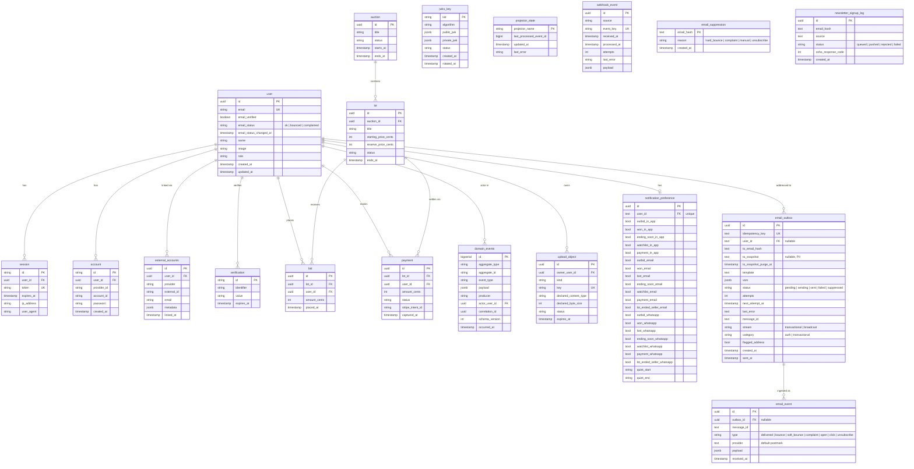

# Data model

This document is the source of truth for what's in the database. Every table that matters architecturally is described here. If you add a table or change a relationship, this doc gets updated in the same PR — stale schema docs are worse than no schema docs.

The database is a single PostgreSQL 16 cluster. Four application roles
(`auth_app`, `api_app`, `worker_app`, `shop_app`) are created by
[packages/db/src/migrate-roles.ts](../../packages/db/src/migrate-roles.ts).
The privileged `DATABASE_URL_OWNER` connection is held only by the migration
job; no long-running app process holds DDL grants.

> **Implementation status (last reviewed 2026-05-05)**
>
> - **Implemented:** every table in the ERD below exists at [packages/db/src/schema/](../../packages/db/src/schema/), including `domain_events.actor_user_id`, `domain_events.correlation_id` (DB default `gen_random_uuid()`), and `domain_events.schema_version` (DB default 1). Email-pipeline tables (`email_outbox`, `email_event`, `email_suppression`, `newsletter_signup_log`) plus `user.email_status` / `user.email_status_changed_at` and the `notification_preference.*Email` / `*Whatsapp` columns ship in migration `0021_email_integration_schema.sql`. Role grants in [packages/db/src/migrate-roles.ts](../../packages/db/src/migrate-roles.ts) enforce the role split: `api_app` owns synchronous email enqueue and product-subject usage reads, and `worker_app` has SELECT/UPDATE on `email_outbox` and `newsletter_signup_log`; migrations `0154` and `0155` remove all direct email-pipeline and product-table access from `auth_app`.
> - **Recent additions since the original schema landing:** multi-category for lots/sales/submissions (`lot_categories`, `sale_categories`, `submission_categories` join tables in migration `0022`), category admin metadata (`category.archived`, `sort_order`, etc. in migration `0024`), structured `user_address` (migration `0025`), `artist_profile` (migration `0026`; admin-curated catalogue registry with `kind`/`status` lifecycle), and the submission-expansion fields (`item_submissions` extended in migration `0023`).
> - **Artist consolidation (migration `0046`)**: `lot.artist_id` (uuid → `artist_profile.id`) is the canonical link between a lot and its catalogue artist (legacy `marketing_details.sellerArtistId` was backfilled then cleared). `artist_watchlist.artist_id` was repointed from `user.id` to `artist_profile.id` in the same migration. Artist creation is admin-only via `POST /artists` (capability `artist.review`); clients never produce pending artist rows.
> - **Scaffolded:** `external_accounts` exists with `(provider, external_id)` unique and `(email, provider)` index, but no service writes to it yet outside the seed script. Generic `webhook_event` persistence and worker processing remain available for providers that require asynchronous ingest.
> - **Planned:** the `(email, provider)` collision-resolution workflow per Q25 (no `collision_state` column today).

## Entity relationship diagram

## Tables by ownership

### Identity tables — owned by apps/auth, role auth_app

These tables contain everything related to who a user is and how they prove it.
Only `auth_app` has full access. Product code must not read them directly,
including when a compatibility grant still exists.

The `user` table is the canonical identity record. One row per human (modulo the deliberate exceptions documented below). The `email` column is unique, but linking happens by `(email, email_verified=true)` per D3 — an unverified email cannot claim ownership of an existing record.

`user.email_status` carries the deliverability state observed from Postmark feedback (`ok` | `bounced` | `complained`). The Postmark webhook handler in `apps/api` flips this to `bounced` on a hard bounce and `complained` on a spam complaint, and stamps `email_status_changed_at`. The web shell ([apps/web/src/components/layout/app-shell.tsx](../../apps/web/src/components/layout/app-shell.tsx)) renders an in-app banner when this is non-`ok` so the user is aware their notifications are silently failing. See [04-domain-events.md → "Email pipeline"](./04-domain-events.md#email-pipeline) for the full feedback loop.

The `session` table is Better Auth's Identity-session storage. Its cookie is
host-only to the Identity host. Bid and Shop maintain separate opaque host-only
BFF sessions and never receive or query this token.

The `account` table is better-auth's record of how a user authenticates. One row per (provider, account_id) pair. For email/password users, `provider_id = 'credential'` and the `password` column holds the bcrypt hash. For Google users, `provider_id = 'google'` and `account_id` is the Google `sub`. This is distinct from `external_accounts`: `account` is for authentication identities, while `external_accounts` is a generic seam for trusted cross-system identity links.

The `verification` table is better-auth's pending-verification scratch space —
email verification tokens and password reset tokens. Expired rows are deleted
in bounded batches by the `apps/auth` hourly maintenance schedule; no product
process reads or writes this table.

The `external_accounts` table can link trusted product-external records to a
canonical Identity subject. No live commerce flow currently writes it. Google
and Apple login accounts live in Better Auth's `account` table; Apple
privacy-relay users remain separate subjects until an explicit merge.

The unique constraint `UNIQUE (provider, external_id)` is non-negotiable per M2.
Without it, concurrent external-system webhooks can create duplicate links. The
additional index on `(email, provider)` supports the D3 verified-email lookup
pattern.

The `jwks_key` table holds the OIDC signing keys per D2. Only `auth_app` reads the `private_jwk` column. The `api_app` and `worker_app` roles have no grant on this table at all. Status transitions are `active` → `rotating` → `retired` → row deleted. Multiple rows can be `active` or `rotating` simultaneously during a 30-minute key rotation window — the runbook in [jwks-rotation.md](../runbooks/jwks-rotation.md) is the procedure.

### Product profiles and Identity read models — D13 boundary (partial migration)

Bid and Shop products maintain **local profiles** keyed by the immutable Identity subject (`user.id`).
Product-local read models may copy the minimum Identity facts needed for asynchronous work, but
those copies are never authoritative or product-writable. Products never read credentials,
sessions, or JWKS tables.

| Table | Owner role | Purpose |
|-------|------------|---------|
| `bid_user_profile` | `api_app` (writes), `worker_app` (provisioning) | Bid roles, staff roles, KYC/AML summary, persona, paddle preference, Bid suspension, deliverability mirror |
| `bid_identity_directory` | Identity-owned facts; `worker_app` projects, product roles read | Minimal PII directory (`email`, `name`, `image`, `phone`) plus verification/deletion lifecycle needed by notifications, marketing sync, and media cleanup |
| `shop_user_profile` | `shop_app` (writes), `worker_app` (projection) | Shop-local name/email mirror plus disable and subject-merge markers |

`apps/auth` does not query either product profile table. Its orphan-signup
compensation calls the machine-authenticated product API, where `api_app` checks
`bid_user_profile` and `external_accounts` in one query. Migration `0155`
removes the former `auth_app` grants on both product-owned tables.

`bid_identity_directory` has no foreign key to Identity `user`; `subject_id` is an
immutable external subject identifier. A retired merge alias is retained with
`merged_into_subject_id` and the canonical contact snapshot so historical product
records continue resolving locally. Identity lifecycle outbox events create and
update the directory and its aliases, and `user.identity_deleted` hard-deletes the
subject and aliases containing its PII. `api_app` has SELECT only; `worker_app` is
granted DML solely because it hosts the projector. The
`verify-identity-directory-drift.mjs` reconciliation must be clean before direct
worker reads of `user` are revoked by migration `0157`.

Migration `0150` removed the former `0140` compatibility triggers and Bid-owned
legacy columns from `user`. The remaining product reads and foreign keys are tracked
by the split exit criteria in [09-lax-identity-boundary.md](./09-lax-identity-boundary.md).

### Application tables — owned by apps/api, role api_app

These hold the business state of the auction platform. Schema is illustrative — your existing tables likely have more columns than shown here. The fields that matter for the architecture are present.

The `auction` table represents a scheduled sale event with a start and end window. Lots belong to one auction. Lot status transitions (draft → scheduled → active → ended → settled) are driven by `apps/worker`'s `LotJobScheduler`, not by request-time code in `apps/api`.

The `bid` table is append-only — you do not update or delete bids, you place new ones. The current high bid on a lot is computed by `MAX(amount_cents) WHERE lot_id = $id`. This append-only invariant matters because every bid is also a domain event source — the `bid.first_for_user` and `bid.lot_won` events are derived from rows in this table.

The `payment` table is updated as a payment intent moves through its lifecycle (`pending` → `authorized` → `captured` → `failed` or `refunded`). The `stripe_intent_id` column links to the corresponding Stripe payment intent. When status transitions to `captured`, a `payment.captured` domain event is emitted in the same transaction (D8) — this is what the Xero projector consumes to issue an invoice.

The `upload_object` table tracks browser-direct uploads to DigitalOcean Spaces. `apps/api` inserts a `pending` row during `/uploads/presign`, moves it to `uploaded` on `/uploads/confirm`, and `apps/worker` validates the object before marking it `active` or `rejected`. The row stores declared size/type, actual size/type, owner, object key, rejection reason, and expiry for stale pending uploads. `api_app` and `worker_app` both have full grants because the API owns user-facing state transitions and the worker owns validation/GC transitions.

### Outbox and worker tables — readable by worker_app

The `domain_events` table is append-only and the source of truth for all integrations per D5. Every meaningful business action writes a row here in the same DB transaction as the entity write — non-negotiable per D8. The schema is intentionally generic: `aggregate_type` says what kind of entity changed (`user`, `lot`, `payment`), `aggregate_id` is its primary key, `event_type` is the verb (`user.registered`, `bid.lot_won`, `payment.captured`), `payload` is the jsonb snapshot of relevant data at the moment of the event.

The `actor_user_id` column is nullable — system-emitted events (a scheduled cron rotating keys, a worker advancing a lot through its lifecycle) have no human actor. The `correlation_id` is a UUID that propagates across related events: a bid placed → outbid notification → email sent all share the same correlation_id, which makes cross-service tracing trivial.

The `schema_version` column is an integer that lets us evolve event payloads safely. Version 1 of `bid.lot_won` might have a different shape than version 2 — projectors handle the difference explicitly. New schema version means new code path in every projector that consumes the event type; old events continue to work with the old code path.

The `projector_state` table holds one row per projector with `last_processed_event_id` as the cursor. The Zoho projector, Xero projector, and any future projectors each have their own row. They are independent: if Zoho is rate-limiting and the Zoho projector falls behind, the Xero projector keeps making progress. Replaying a single integration is `UPDATE projector_state SET last_processed_event_id = N WHERE projector_name = 'zoho'` and restart the worker.

### Webhook ingest — webhook_event

The generic `webhook_event` table supports providers that need durable asynchronous ingest. The `event_key` is derived from the provider payload and routing identity; retries with the same key are rejected by the unique constraint. The `source` column selects the worker processor. Xero invoice processing is the current live consumer; other active webhooks use provider-specific ledgers where appropriate.

`received_at` is set when the HTTP handler claims the row, `processed_at` is set when the worker successfully processes it. Failed processing increments `attempts` and records `last_error`; BullMQ handles the retry schedule (1s, 5s, 30s, 5min, 30min, 5 attempts max, then dead-letter).

### Email-pipeline tables — `email_outbox`, `email_event`, `email_suppression`, `newsletter_signup_log`

These are the four tables behind the email pipeline. They are a **second outbox**, structurally similar to `domain_events` + `projector_state` but unrelated to the domain-events outbox: domain events project business state to external CRMs, the email outbox sends physical mail. See [04-domain-events.md → "Email pipeline"](./04-domain-events.md#email-pipeline) for the runtime flow.

`email_outbox` is the durable record of every transactional or notification email we intend to send. `IEmailService.enqueue()` ([packages/email/src/outbox-service.ts](../../packages/email/src/outbox-service.ts)) writes one row per call, deduplicated on `idempotency_key` (normally `template:userId-or-emailHash:sha256(vars)`; snapshot recipients also include the address hash so an address change cannot reuse an older snapshot). Status starts at `pending` (or `suppressed` if the recipient is in `email_suppression` *and* the category is `transactional`), and a BullMQ job is enqueued with `jobId = outboxId` to give the queue itself a second layer of idempotency. The worker's `send-email` job moves the row through `sending` → `sent`/`failed` and stores the Postmark `MessageID`. The `category` column has two values — `auth` (verification, password reset, password changed, change email, invite) and `transactional` (everything else). `auth` sends bypass `email_suppression` because they are operational mail the user must receive even if they previously bounced; the worker still sets `flagged_address=true` so the operator can spot the case in audit. `to_snapshot` is the plaintext recipient address kept for templates that resolve at enqueue time (e.g. invites to people without a `user.id`); `to_snapshot_purge_at` is the 30-day deadline at which a periodic job clears it back to NULL. `to_email_hash` (SHA-256 of the lowercased address) stays forever and is what we look up suppression by.

`email_event` is the append-only log of Postmark webhook callbacks. The Postmark webhook handler at `apps/api/src/routes/webhooks/postmark.ts` validates Basic Auth, parses the body, looks up the matching outbox row by `MessageID`, and inserts one event row per `RecordType` (`Delivery`, `Bounce`, `SpamComplaint`, `Open`, `Click`, `SubscriptionChange`). Hard bounces and complaints additionally upsert `email_suppression` and flip `user.email_status`. `outbox_id` is nullable so we don't lose a webhook when the outbox row was already purged or never wrote (e.g. legacy mail).

`email_suppression` is the deny-list. The primary key is `email_hash` (SHA-256 of the address) so we never store the plain address here. `reason` records why the address was added (`hard_bounce`, `complaint`, `manual`, `unsubscribe`). The unsubscribe route at `apps/api/src/routes/email.ts` writes `reason='unsubscribe'` for global opt-outs, while per-notification opt-outs flip the corresponding `notification_preference.*Email` column instead and never touch this table.

`newsletter_signup_log` is the audit record for the one-way push to Zoho Campaigns. `apps/api/src/routes/newsletter.ts` inserts a `queued` row and enqueues a `marketing-sync` job; the worker's `zoho-campaigns-sync` job calls Zoho and writes the result back as `pushed`, `rejected`, or `failed` plus the `zoho_response_code`. We never read the address back out of this table — it only exists so we can prove what we sent and respond to GDPR access/erasure requests. Subscriber state itself lives in Zoho.

`notification_preference` was extended with `*_email` and `*_whatsapp` columns matching each existing `*_in_app` toggle, plus `lot_ended_seller_email`/`_whatsapp` for the seller-side notification. The defaults intentionally minimize promotional-shaped mail: `outbid_email=false` and `watchlist_email=false` (high volume), but `won_email=true`, `lost_email=true`, `payment_email=true`, `lot_ended_seller_email=true` (operational). All `*_whatsapp` toggles default to `false` because the WhatsApp channel is a stub today (see `apps/api/src/infrastructure/whatsapp-notification.channel.ts` — it throws `NotImplementedError`).

**Role grants (now in place).** Identity email intents cross the
machine-authenticated `/internal/identity/emails` API boundary. `api_app`
performs the synchronous outbox/suppression work and writes all four pipeline
tables; `auth_app` has no privilege on `email_outbox` or `email_suppression`.
Identity-supplied recipients use the existing 30-day snapshot retention so the
worker never needs a later Identity `user` lookup. `apps/worker` updates
`email_outbox` and `newsletter_signup_log`; `worker_app` has `SELECT, UPDATE` on
both via `WORKER_LOCK_READ_TABLES` (the worker is denied `INSERT`/`DELETE` so it
cannot inflate the audit trail or collapse it).

## Critical invariants

These are the rules the schema enforces or the application code maintains. Violating any of them indicates a bug.

**Outbox atomicity.** Every domain event row commits in the same transaction as the entity it describes. If the entity write rolls back, the event row rolls back. No code path should call `DomainEventPublisher.publish` outside an `await db.transaction(...)` block. The publisher's `publish(tx, event)` signature requires a transaction handle as the first argument specifically to make this hard to violate accidentally.

**Append-only events and bids.** No `UPDATE` or `DELETE` against `domain_events`, ever. No `UPDATE` or `DELETE` against `bid` (canceling a bid creates a new bid record with status='cancelled', not a delete). The audit-log property of these tables depends on this invariant.

**Verified-email gating for account linking.** A row is added to `external_accounts` linking a user to an external identity only when the linking decision is based on a verified email. Apple privacy-relay users (per D11/F6) are the deliberate exception — they link by `sub` alone and never inherit other identity links via email.

**JWKS retirement window.** A retired key remains in the `jwks_key` table with `status='retired'` for 30 minutes after rotation per D2 before deletion. The rotation procedure (P6 quarterly cron + the runbook) enforces this; do not write ad-hoc cleanup queries that delete retired keys faster than this.

**Single canonical user per verified email.** The `user.email` column has a unique constraint. Any ambiguous external-identity email collision goes through the admin-review flow per Q25 — never auto-merge until both sides are email-verified and the operator confirms.

## Indexing

Every foreign key column has an index. The query patterns that matter beyond the obvious foreign-key joins:

`bid` is queried as `WHERE lot_id = $id ORDER BY amount_cents DESC LIMIT 1` to find the current high bid. A composite index on `(lot_id, amount_cents DESC)` makes this constant time.

`domain_events` is queried by the worker as `WHERE id > $cursor ORDER BY id LIMIT 100 FOR UPDATE SKIP LOCKED`. The primary key on `id` (bigserial) is the only index needed for this. Do not add other indexes unless a projector specifically benefits — every additional index slows down event publishing.

`webhook_event` is queried as `WHERE event_key = $hash` for dedupe. The unique constraint on `event_key` is sufficient.

`external_accounts` is queried two ways: by `(provider, external_id)` to find the linked user (the unique constraint serves as the index), and by `(email, provider)` for the D3 verified-email lookup at sign-in time (the explicit index on `(email, provider)` exists for this).

`email_outbox` carries four supporting indexes beyond the PK and the unique on `idempotency_key`: `(status, created_at)` for the worker's outbox-drain query that re-enqueues stale `pending` rows; `(user_id)` for "show me this user's email history"; `(message_id)` for webhook lookups; and `(to_snapshot_purge_at)` for the periodic PII-purge job. `email_event` has indexes on `(message_id)`, `(outbox_id)`, and `(type, received_at)` so the daily delivery-stats query stays cheap. `email_suppression` is a single-row-per-address lookup; the PK on `email_hash` is sufficient.

## Migrations

Schema changes go through Drizzle migrations. The generated SQL files live at [packages/db/drizzle/](../../packages/db/drizzle/) (with the metadata journal at [packages/db/drizzle/meta/](../../packages/db/drizzle/meta/)); the schema sources that produce them live at [packages/db/src/schema/](../../packages/db/src/schema/). The production runner is [packages/db/src/migrate-prod.ts](../../packages/db/src/migrate-prod.ts), invoked by `pnpm db:migrate:prod`. It uses the privileged owner connection URI held in `DATABASE_URL_OWNER`, which is set on the migration job and never loaded by application processes — the long-running app processes use `DATABASE_URL_API`, `DATABASE_URL_AUTH`, or `DATABASE_URL_WORKER` per role.

Identity hardening applies `0143_oauth_consent_client_user_unique.sql`,
`0144_oidc_rp_sessions.sql`, `0145_oidc_logout_and_shop_sessions.sql`, then
`0146_ssf_signal_transport.sql`. Roll back only in reverse order with
`0146_rollback.sql`, `0145_rollback.sql`, `0144_rollback.sql`, then
`0143_rollback.sql`. Shop uses `DATABASE_URL_SHOP`; no product may use a direct
Identity connection.

Adding a new column with a default value is safe online. Adding a `NOT NULL` column without a default requires a multi-step migration: add nullable, backfill, then add the constraint in a separate migration. Renaming a column requires the same multi-step pattern (add new, dual-write from app, backfill old to new, switch reads, drop old) — Drizzle's automatic migration generation will not produce this safely.

Role grants are applied by [packages/db/src/migrate-roles.ts](../../packages/db/src/migrate-roles.ts) (script: `pnpm db:roles`, also called automatically at the end of `pnpm db:migrate:prod`). The script is idempotent. **When you add a new table, also add it to the appropriate `*_FULL_TABLES` / `*_DENY_TABLES` / `*_SELECT_TABLES` constant in `migrate-roles.ts`** — without that, the apps will fail at runtime trying to read tables they don't have permission for.

## Where to look in the code

Schema definitions: [packages/db/src/schema/](../../packages/db/src/schema/) (one file per table for readability; cross-table relationships are declared in the file of the table that owns the foreign key).

Repository interfaces: [packages/db/src/repositories/](../../packages/db/src/repositories/). The `IRepositoryFactory` pattern lets us swap implementations for testing without touching service code.

Migration files: [packages/db/drizzle/](../../packages/db/drizzle/). Drizzle generates these from schema diffs via `pnpm db:generate` — never edit a migration that has already been applied to any environment; write a new one to compensate.

Role grants: [packages/db/src/migrate-roles.ts](../../packages/db/src/migrate-roles.ts).

Seed data for local dev: [packages/db/src/seed.ts](../../packages/db/src/seed.ts). Includes test users for each social provider per F10's local-dev requirement.
