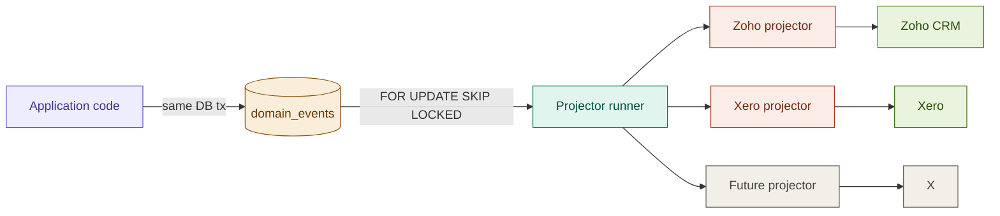

# Domain events

The domain events outbox is the single most important pattern in this architecture (D5). Every meaningful business action in the system — a user registering, a bid being placed, a payment captured — is recorded as a row in the `domain_events` table in the same database transaction as the entity it describes. A separate worker process polls that table and dispatches each event to every projector that subscribes to it. Projectors transform events into the shape an external system expects and call that system's API.

This single pattern gives us four properties that would otherwise require significant additional infrastructure: a complete audit log, replayability per integration, zero coupling between business logic and external services, and a foundation for any future event consumer without changes to application code.

> **Implementation status (last reviewed 2026-05-01).** The contract described in this document is **only partially implemented**.
>
> - **Implemented:** `domain_events` and `projector_state` tables with all the columns referenced below ([packages/db/src/schema/domain-events.ts](../../packages/db/src/schema/domain-events.ts)). `DomainEventPublisher.publish(tx, event)` ([apps/api/src/services/domain-event.publisher.ts](../../apps/api/src/services/domain-event.publisher.ts)). The `FOR UPDATE SKIP LOCKED` polling runner ([apps/worker/src/projectors/runner.ts](../../apps/worker/src/projectors/runner.ts)).
> - **Scaffolded but not wired:** the Zoho and Xero projectors exist as pure mapping helpers ([apps/worker/src/projectors/zoho.ts](../../apps/worker/src/projectors/zoho.ts), [apps/worker/src/projectors/xero.ts](../../apps/worker/src/projectors/xero.ts)) but the runner does not import them; the `ZohoClient` is a no-op stub. The runner advances only the `zoho` cursor — the `xero` row in `projector_state` is created at startup but never updated.
> - **Not yet wired:** **no service in `apps/api` calls `DomainEventPublisher.publish`** — registration, bid, and payment paths emit no events today. The event catalog below is the contract those services are being changed to satisfy, not a description of live traffic.
>
> The shape of the rest of this document is the design that the **(Phase 2)** wiring work is targeting; treat the catalog and runner SQL as authoritative for the schema, and the prose about projectors as the contract those projectors will satisfy once the outbound HTTP work lands.

## The flow at a glance



The application code on the left writes both the entity and the event in one transaction, so there is no scenario where one commits without the other. The `domain_events` table is the durable handoff. The runner in `apps/worker` polls with `FOR UPDATE SKIP LOCKED` so multiple worker instances cannot double-process the same row. Each projector has its own cursor in `projector_state`, so a slow Zoho projector cannot block a fast Xero projector — once the Xero cursor is actually advanced by the runner, which is **(Phase 2)**.

## Why this pattern over the alternatives

The decision in D5 documents the alternatives we rejected, but the reasoning is worth understanding deeply because every engineer who works on this system will at some point ask "why don't we just call Zoho directly?"

**Direct synchronous HTTP call from the request handler.** The user signs up, the request handler calls Zoho's API, returns to the user. This adds Zoho's latency to every signup (Zoho EU is fast but not instant), introduces a failure mode where a Zoho outage causes user-visible signup errors, and creates timing-dependent test flakiness. More importantly, it tightly couples the signup code to Zoho — adding a second integration (Xero, MailChimp, Slack) means modifying the signup code path. That coupling compounds with every new integration.

**Fire-and-forget queue jobs without an outbox.** Application code commits the entity, then enqueues a BullMQ job to call Zoho. This is the obvious next step from synchronous calls, and it's where most architectures stop. The problem is the gap between commit and enqueue: if the worker process crashes, gets killed, or runs out of memory between the two operations, the entity is committed but the job is lost forever. Silently. There's no audit trail saying "this user registered but we never told Zoho." For a CRM integration, eventual consistency is fine — silent loss is not.

**CDC tail of the Postgres write-ahead log.** Tools like Debezium can stream row changes from the WAL into Kafka, and downstream consumers project from Kafka. This is the pattern at hyperscale. It's beautiful at scale and operationally heavy below scale: Debezium needs a Kafka cluster to connect to, Kafka needs ZooKeeper or KRaft, you need consumer groups, you need monitoring for replication lag. Three pieces of infrastructure to add for a problem that a Postgres table solves directly.

**The outbox.** A row is written in the same transaction as the entity, so atomicity is guaranteed by Postgres. The runner reads from a single table with a cursor, so the operational model is "watch this number go up." Adding a projector is one new file. Replaying a projector is one SQL update. Crash recovery is automatic — the worker restarts, reads its cursor, picks up where it left off. The cost is a polling delay (1.5 seconds typical) which is irrelevant for CRM-shaped use cases.

The pattern's only meaningful cost is the discipline required to never bypass it. Anyone writing application code that calls Zoho directly defeats the entire architecture. Code review must reject any direct integration call from outside `apps/worker/src/projectors/`.

## Event catalog

This catalog is the contract between event producers and projectors. When you add a new event type, add it here. When you change a payload schema, bump the `schema_version` and document the change. When you add a new projector that consumes an existing event, add a new row to the consumers column.

> **Status note.** None of the events listed below are currently emitted by the application — wiring them up is **(Phase 2)**. The catalog is the contract `apps/api` services and the `apps/worker` projectors are being changed to satisfy.

| Event type | Producer | Consumers | Triggered by | Payload (v1) |
|---|---|---|---|---|
| `user.registered` | apps/api or apps/auth | zoho | New user row created | `{userId, email, name, source: 'credential'\|'google'\|'apple'}` |
| `user.email_verified` | apps/auth | zoho | Email verification token redeemed | `{userId, email, verifiedAt}` |
| `user.linked_external` | apps/api | zoho | external_accounts row written | `{userId, provider, externalId, linkedAt}` |
| `bid.first_for_user` | apps/api | zoho | First bid by this user on this lot | `{bidId, lotId, userId, amountCents, placedAt}` |
| `bid.outbid` | apps/api | zoho, notifications | This user's bid was exceeded | `{previousBidId, lotId, userId, newHighAmountCents}` |
| `bid.lot_won` | apps/worker (lot lifecycle) | zoho, notifications | Lot ended with this user as high bidder | `{lotId, userId, winningBidId, amountCents, endedAt}` |
| `payment.captured` | apps/api | xero, zoho | Stripe payment intent transitions to captured | `{paymentId, lotId, userId, amountCents, capturedAt, stripeIntentId}` |
| `payment.refunded` | apps/api | xero, zoho | Refund processed | `{paymentId, lotId, userId, amountCents, refundedAt, reason}` |
| `lot.activated` | apps/worker (lot lifecycle) | none yet | Lot start time reached | `{lotId, auctionId, activatedAt}` |
| `lot.ended` | apps/worker (lot lifecycle) | zoho (for unsold flag) | Lot end time reached | `{lotId, auctionId, endedAt, hadWinner}` |

Bid emissions are deliberately limited to milestones per Q14 to keep Zoho rate-limit headroom. Every individual bid is a row in the `bid` table; only first-bid-for-this-user-on-this-lot, outbid, and won-the-lot are domain events. Hot lots can take 100+ bids per minute and we never want that volume hitting Zoho.

## Producing an event

Every event is produced inside an existing database transaction. The `DomainEventPublisher` is a thin service-layer class that takes a transaction handle and an event spec.

```typescript
import { DomainEventPublisher } from "./services/domain-event.publisher";

await db.transaction(async (tx) => {
  const [user] = await tx
    .insert(users)
    .values({ email, name })
    .returning();

  await tx.insert(externalAccounts).values({
    userId: user.id,
    provider: "google",
    externalId: googleSub,
    email,
    linkedAt: new Date(),
  });

  await publisher.publish(tx, {
    aggregateType: "user",
    aggregateId: user.id,
    eventType: "user.registered",
    payload: { userId: user.id, email, name, source: "google" },
    correlationId: ctx.correlationId,
    actorUserId: null,
  });
});
```

The publisher's `publish` method requires a transaction handle as its first argument specifically to make it hard to misuse. There is no `publish(event)` overload — every call must be inside an existing transaction. If the entity write rolls back, the event row rolls back too.

Code review rule: any service method that emits a domain event must take its database handle as a constructor or function argument. No service should grab a global `db` instance and start its own transaction independently of the caller — that defeats the same-transaction invariant.

## Consuming events: projectors

A projector is a class with a single `process(event)` method. The runner in [apps/worker/src/projectors/runner.ts](../../apps/worker/src/projectors/runner.ts) polls `domain_events`, dispatches each event to every interested projector, advances each projector's cursor on success, and records errors on failure.

> **Status note.** Today the runner advances only the `zoho` cursor and logs each event without dispatching to a projector class. The Zoho and Xero projectors live as pure mapping functions in [apps/worker/src/projectors/zoho.ts](../../apps/worker/src/projectors/zoho.ts) and [apps/worker/src/projectors/xero.ts](../../apps/worker/src/projectors/xero.ts) but are not imported by the runner. The class-based shape below is the target.

```typescript
export class ZohoProjector implements IProjector {
  readonly name = "zoho";

  async process(event: DomainEvent): Promise<void> {
    switch (event.eventType) {
      case "user.registered":
        return this.upsertContact(event.payload as UserRegisteredPayload);
      case "bid.lot_won":
        return this.createDeal(event.payload as BidLotWonPayload);
      case "payment.captured":
        return this.attachInvoice(event.payload as PaymentCapturedPayload);
      default:
        return;
    }
  }
}
```

The projector decides what to do with each event type. It does not need to handle every event — events it doesn't recognize are ignored (the runner advances the cursor regardless). Adding a new event type does not require modifying any existing projector unless that projector wants to consume it.

A projector is allowed to fail. The runner catches errors, records them on `projector_state.last_error`, and retries on the next poll. If a projector keeps failing, the BullMQ retry schedule applies (1s, 5s, 30s, 5min, 30min) with a circuit breaker after 5 consecutive failures (R2). Failed jobs land in a dead-letter queue and trigger a Sentry alert. Operationally, projector lag is monitored — if Zoho's projector cursor falls more than five minutes behind the latest event, page on-call.

## The polling query

The runner's polling loop is the most performance-critical path in the worker. It uses `FOR UPDATE SKIP LOCKED` per F4 so multiple worker instances do not contend for the same rows.

```sql
BEGIN;

SELECT * FROM domain_events
WHERE id > (SELECT last_processed_event_id FROM projector_state WHERE projector_name = $1)
ORDER BY id
LIMIT 100
FOR UPDATE SKIP LOCKED;

-- runner dispatches each row to the projector in TypeScript

UPDATE projector_state
SET last_processed_event_id = $maxId, updated_at = now()
WHERE projector_name = $1;

COMMIT;
```

The lock is held for the duration of the transaction, which spans dispatching every row in the batch. If a projector takes a long time to process an event (Zoho API call), the lock stays held — but that's fine because it's only blocking other instances of the same projector from picking up those specific rows. Other projectors are unaffected, they have their own cursors.

The `SKIP LOCKED` clause is what makes this safe at any worker count. Two worker instances of the Zoho projector polling simultaneously will each take a different batch of 100 rows, no overlap, no manual coordination. Zero application-code changes needed when scaling from 1 worker to N.

The 100-row batch size is a tuning knob. Larger batches mean fewer round-trips to Postgres but longer-held locks; smaller batches mean more polling overhead but quicker recovery on failure. 100 is a reasonable default for our throughput; revisit if events-per-second exceeds a few hundred.

The 1.5-second sleep on empty results is the polling cadence. Latency between event publication and projection is therefore at most 1.5 seconds plus the projector's processing time — perfectly fine for CRM-shaped use cases. If we ever need lower latency (we won't, but if), the upgrade path is Postgres `LISTEN/NOTIFY` per the deferral in D8.

## Replaying a projector

The most common operational task is replaying a projector after fixing a bug or recovering from an integration outage. The procedure is one SQL statement and a worker restart.

```sql
-- to replay everything since a known-good cursor:
UPDATE projector_state
SET last_processed_event_id = 1234567
WHERE projector_name = 'zoho';

-- to replay everything from the beginning:
UPDATE projector_state
SET last_processed_event_id = 0
WHERE projector_name = 'zoho';
```

After the cursor is updated, restart the worker (or wait up to 1.5s for the next poll). The projector will process every event since the new cursor position. Idempotency in the projector is therefore important — calling Zoho's `Contact upsert` API twice for the same user must produce the same result. Most external APIs are idempotent on upsert by default; for the rare ones that aren't, the projector should check existence before creating.

Replaying does not affect other projectors. Resetting Zoho's cursor to 0 does not cause Xero to re-issue invoices. They have independent cursors.

## Adding a new projector

The flow when you want to add a new integration (MailChimp, Slack notifications, internal analytics):

Create a new class in `apps/worker/src/projectors/<name>.ts` implementing `IProjector`. Decide which event types it cares about based on the catalog above; ignore the rest. Implement `process(event)` to call the external system's API.

Insert a new row into `projector_state` with `projector_name='<name>'` and `last_processed_event_id` set to either 0 (process every event ever) or the current max event id (process only events from now on, no backfill). Most new projectors want the latter — backfilling years of events into a new system is rarely useful and risks rate-limit burns.

Wire the new projector into the worker's composition root in `apps/worker/src/container.ts`. Add it to the runner's projector list. Deploy.

Update the event catalog table in this document to list the new projector under "Consumers" for each event type it processes.

That's the complete checklist. No changes to `apps/api`, no changes to existing projectors, no changes to the schema beyond the one row in `projector_state`. This is the leverage that the outbox pattern buys you.

## Schema versioning

Event payloads evolve. When you change the shape of a payload, you bump `schema_version` for that event type and update every projector that consumes it.

The pattern is to handle both versions in the projector for at least one full deployment cycle (typically a week) so that in-flight events from before the deploy continue to work. After enough time has passed that no v1 events remain in the table, the v1 code path can be removed.

```typescript
async process(event: DomainEvent): Promise<void> {
  if (event.eventType !== "bid.lot_won") return;
  if (event.schemaVersion === 1) {
    return this.handleV1(event.payload);
  }
  if (event.schemaVersion === 2) {
    return this.handleV2(event.payload);
  }
  throw new Error(`Unknown schema version ${event.schemaVersion} for bid.lot_won`);
}
```

Throwing on unknown schema versions is correct — it means a deploy went out without the projector being updated, which is a bug we want to surface immediately, not silently ignore.

## Retention

Events are kept forever per Q50. The audit-log property is one of the main reasons we use this pattern; truncating the table defeats it. When the table size becomes operationally problematic (estimated at 100GB+), archive cold rows to DigitalOcean Spaces in monthly partitions and drop them from the live table — the projector cursors will continue to work because they only ever query for `id > $cursor`.

Archive format: gzipped NDJSON, one row per line, organized by year-month. A simple cron job in `apps/worker` does this monthly. Restoration (rare) is a manual SQL `COPY FROM` after pulling the archive back from Spaces.
