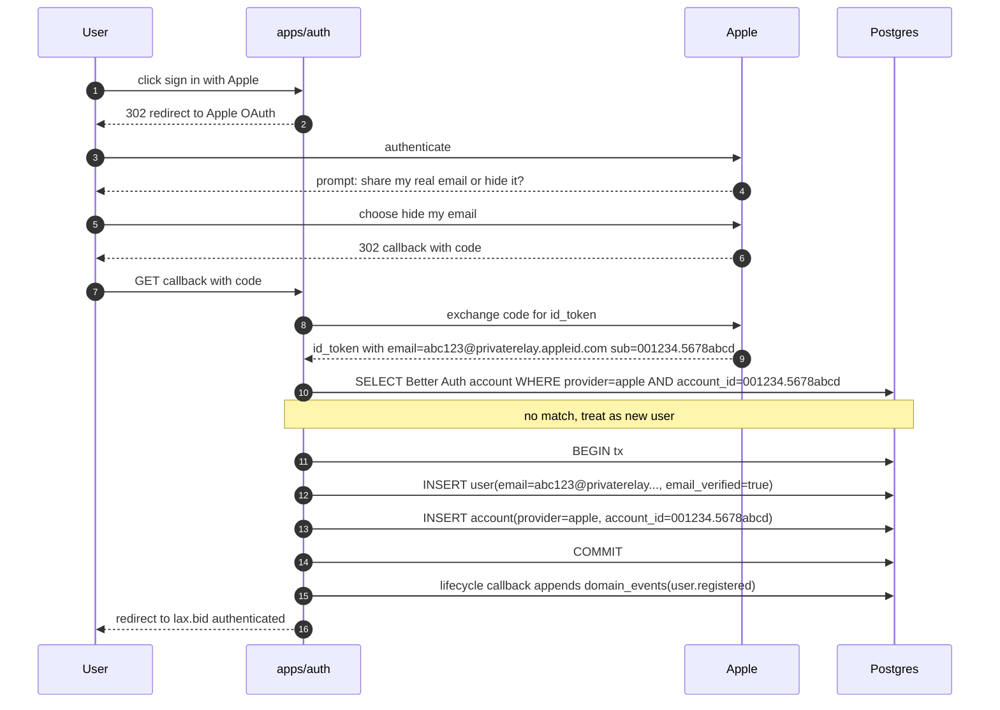
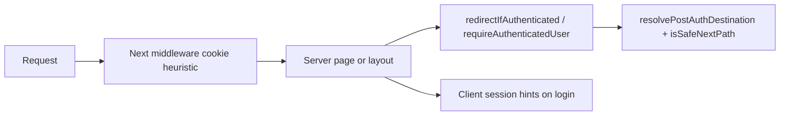

# Identity flow

This document walks through authentication at the canonical Identity issuer and
the Bid and Shop RP/BFFs. Marketing at `lax.art` is initially static and has no
authentication client.

If you understand these three flows, you understand the identity layer.

> **Implementation status (last reviewed 2026-08-06)**
>
> - **Implemented in code:** Better Auth issuance at
>   `https://auth.lax.bid`; confidential Bid and Shop authorization-code + PKCE
>   BFFs; host-only opaque product sessions; RFC 8693 resource exchange; local
>   API/WS verification; OIDC back-channel logout; and opt-in SSF.
> - **Canonical issuer:** `apps/auth` alone serves discovery, JWKS, credentials,
>   sessions, and `/api/auth/*`; the duplicate API issuer routes are retired.
> - **Frozen extraction contract:** [`packages/auth/src/contracts.ts`](../../packages/auth/src/contracts.ts) owns issuer normalization, discovery fields, JWKS/auth paths, trusted origins, no-store headers, and lifecycle ordering. Both composition roots provide their own database, Redis, email, and event adapters. [`packages/auth/src/client.ts`](../../packages/auth/src/client.ts) is the web-client boundary.
> - **JWT-only WS:** `apps/ws` verifies the Identity JWT, then loads Bid roles
>   through `apps/api/users/me`; cookie-only handshakes fail.
> - **Implemented asynchronously:** versioned Identity lifecycle events feed the
>   Shop projection and Bid provisioning. OIDC refresh rotation tracks token
>   families, detects reuse atomically, revokes the family and sessions, and
>   provides an encrypted short retry-grace response.
> - **Identity boundary (D13–D18):** `@auction/identity-contracts` owns exact
>   clients, resources, claims, discovery, logout, and SSF contracts. APIs
>   accept Bearer resource tokens only and load product authorization locally.

## Flow 1: First-time sign-up via Google on lax.bid

A user lands on lax.bid, clicks "Sign in with Google", and ends up authenticated. Behind that one click are roughly a dozen HTTP requests across four parties.

```mermaid
sequenceDiagram
  autonumber
  participant U as User
  participant W as apps/web
  participant A as apps/auth
  participant G as Google
  participant DB as Postgres

  U->>W: GET lax.bid/
  W-->>U: render landing page
  U->>W: click sign in with Google
  W->>A: GET auth.lax.bid/api/auth/sign-in/google
  A->>A: generate PKCE state + nonce
  A-->>U: 302 redirect to Google
  U->>G: GET accounts.google.com/o/oauth2/auth
  G-->>U: render Google consent
  U->>G: approve
  G-->>U: 302 redirect to auth callback with code
  U->>A: GET auth.lax.bid/api/auth/callback/google?code=...
  A->>G: POST token exchange (code + secret)
  G-->>A: id_token + access_token
  A->>A: verify id_token signature against Google JWKS
  A->>DB: BEGIN transaction
  A->>DB: SELECT user WHERE email=? AND email_verified=true
  Note over A,DB: no match found, this is a new user
  A->>DB: INSERT user and Better Auth account(provider=google)
  A->>DB: COMMIT
  A->>DB: lifecycle callback appends domain_events(user.registered, schema_v=1)
  A->>A: issue code-bound OIDC tokens
  A-->>U: 302 redirect to Bid callback
  U->>W: callback with authorization code
  W->>A: exchange code as lax-bid-web
  W->>W: verify ID token; store tokens server-side
  W-->>U: set opaque host-only Bid cookie
  W-->>U: render authenticated page
```

A few things in this flow are worth dwelling on.

**Steps 12–14 (token exchange and verification).** Google returns an `id_token`, which is a JWT signed by Google. Our auth server fetches Google's JWKS (cached) to verify the signature locally — this proves the token was actually issued by Google and not forged. The `id_token`'s payload contains `sub` (Google's stable user identifier), `email`, `email_verified`, and `name`. We trust `email_verified` from Google because Google itself verified it; we do not re-verify the email on our side.

**Steps 16–19 (identity write plus lifecycle publication).** Better Auth owns the
identity transaction. Its post-create lifecycle callback then appends the
`user.registered` domain event, which the worker consumes idempotently. Publication
failure is logged and does not roll back the identity; the backfill procedure in the
auth rollout runbook is the recovery path for that rare gap.

**The product cookie.** The Identity cookie remains host-only to
`auth.lax.bid`. Bid stores OIDC tokens server-side and sets a different opaque
host-only cookie at `lax.bid`. Before an API call, the BFF exchanges for a
single-resource token; API verifies it locally and
`BidContextEnrichedAuthenticator` loads product authorization.

## Flow 2: Shop OIDC BFF

A user opens `shop.lax.art`. Shop starts authorization code + PKCE against
Identity as confidential client `lax-shop-web`. If the host-only Identity
session remains valid, Identity can authorize without prompting. Shop verifies
the ID token and creates its own opaque host-only session; it never reads Bid's
cookie.

Shop then verifies the JWT locally via JWKS, upserts its local `shop_user_profile`, and keeps product authorization separate from Identity. See [Shop identity boundary runbook](../runbooks/identity-boundary-cutover.md) and `scripts/ci/verify-shop-oidc-roundtrip.mjs`.

## Flow 3: Apple "Hide My Email" — why F6 exists

Apple's privacy feature lets users sign in with Apple while concealing their real email address. Apple generates a random `@privaterelay.appleid.com` address, gives it to us, and forwards any email we send to that address to the user's real inbox. This breaks email-based account linking, which is why D11 has explicit handling.



The same user later starts a separate email/password sign-up with their real address `alice@example.com`. The privacy-relay address and real address do not match, and the credential identity has no Apple `sub`, so the subjects remain separate until the user explicitly proves control of both.

**Why this is the correct behavior.** Apple's privacy contract says: the relay email is private; we should not tie it to other knowledge about the user without their consent. If we silently merged the two identities by some other heuristic, we'd be defeating Apple's privacy feature and potentially violating Apple's developer agreement. The "two identities until explicitly linked" outcome is what the user actually wants.

**The fallback path.** An explicit account-merge flow can be added later. A
logged-in user must prove control of both subjects before the canonical Identity
service merges them; product projections then consume `identity.subject_merged`.
There is no heuristic merge based on relay addresses.

## What you need to know about cookies

A few things that have surprised engineers in the past:

**Authentication cookies are host-only.** Identity, Bid, and Shop each set their
own cookie without a `Domain` attribute. `NEXT_PUBLIC_COOKIE_DOMAIN` is limited
to non-auth preference/analytics cookies. The cutover from a parent-domain auth
cookie causes one intentional logout.

**The `SameSite=Lax` attribute is non-negotiable.** Lax means the cookie is sent on top-level navigation (link clicks, form submissions) but not on cross-origin XHR. This protects against CSRF without breaking the OIDC redirect flow. `SameSite=Strict` would block the redirect-back-from-Google flow because Google's redirect counts as cross-site. `SameSite=None` would require `Secure` and would expose us to CSRF on third-party iframes — not worth it for a public-facing site.

**The `Secure` attribute is non-negotiable in production.** Cookies with `Secure` are only sent over HTTPS. Cloudflare's full-strict TLS configuration (D38) ensures the entire path from user to origin is HTTPS, so `Secure` adds defense-in-depth without breaking anything. In local dev where we run plain HTTP, `Secure` is omitted.

**Cross-registrable-suffix domains do not share cookies, period.** `lax.art` and its `shop.lax.art` subdomain have a different registrable domain from `lax.bid`. There is no browser configuration that makes them share cookies — this is a fundamental limitation of the cookie spec to prevent supercookie tracking. Hence OIDC. The handshake from Flow 2 is the only way to recognize a user across registrable-suffix boundaries.

**`apps/ws` uses JWT on handshake.** Socket.IO clients fetch a short-lived JWT
from the canonical auth host and pass it as `handshake.auth.token`. WS verifies
issuer, audience, and signature, then asks Bid API for local authorization.
Anonymous visitors may still join explicitly public rooms.

## What you need to know about the JWT

The access token issued by our auth server is an RS256-signed JWT with a 15-minute lifetime per Q2. The payload is intentionally minimal:

```json
{
  "iss": "https://auth.lax.bid",
  "sub": "01HQXY7JGPVE2T8NVV0AM6S3ZQ",
  "aud": "lax-bid-api",
  "iat": 1730409600,
  "exp": 1730410500,
  "sid": "identity-session-id"
}
```

Notice what's not there: no `role` claim. Roles are looked up server-side every request because role changes need to take effect immediately (revoking admin access, etc.) and a JWT-cached role would persist for up to 15 minutes after the change. PII is also limited — no phone, no address, no payment details. The minimum needed to identify the user; everything else is a server-side lookup.

**Audience is resource-specific.** `lax-bid-api`, `lax-ws`, and
`lax-shop-api` are distinct. The BFF exchanges a client-bound subject token
through RFC 8693 for exactly one resource and namespaced scopes. ID tokens retain
the OIDC client id as audience and are never API credentials.

**Refresh tokens are server-side.** Successful rotation links predecessor and
successor rows to a stable family and marks the predecessor consumed. Reuse
outside the short retry grace revokes the family and Identity sessions. The
retry response is encrypted in Redis; browser continuity uses the Better Auth
cookie rather than exposing refresh tokens to the web application.

## Where things go wrong

The failure modes that have actually happened in production at other companies running this pattern. None of these are theoretical.

**Clock skew between our auth server and a relying party.** An OIDC consumer with a clock 60 seconds slow may reject our id_token as "issued in the future." Mitigation: ensure NTP is configured on every host, and accept up to 5 seconds of clock skew in JWT validation (`jose` does this by default with the `clockTolerance` option).

**JWKS cache stampede after rotation.** If 1000 worker processes all hit the JWKS endpoint at the same moment after a key rotation, that's a small DDoS on our auth server. Mitigation: each verifier uses `jose`'s `createRemoteJWKSet` with `cacheMaxAge: 600000` (10 min) and `cooldownDuration: 30000` (30 s) so refreshes are coalesced per process and stale keys keep working during the cooldown. The downstream Cloudflare cache TTL on `/.well-known/jwks.json` (60 s, configured at the edge per `docs/integrations/cloudflare.md`) absorbs the cross-process burst.

**Unexpected `Domain` on an authentication cookie.** Treat this as a release
blocker. Identity and each product BFF must issue host-only cookies. Confirm the
response omits the `Domain` attribute and clear any historical parent-domain
cookie during cutover.

**Apple email-relay rate limiting.** If we send too many emails too quickly through Apple's relay, Apple may throttle or stop forwarding. Mitigation: rate-limit our outbound mailers, and monitor bounce rates from privacy-relay addresses specifically (different bounce signature than regular emails).

**Relying party caching the wrong issuer URL.** If a consumer cached discovery during a brief misconfiguration window, it may keep the wrong issuer. Mitigation: flush the consumer's OIDC discovery cache after issuer or JWKS changes and verify with the Shop round-trip script.

The single best operational practice is reading the access logs on `apps/auth` after any auth-related change. Most issues show up there as 4xx responses with informative error codes. Sentry catches exceptions; structured logs catch policy decisions (cookie rejected, claim missing, replay detected).

## Authed-aware marketing routes (`apps/web`)

The auction web app treats **public marketing auth pages** (`/login`, `/register` without `invite`, `/forgot-password`) differently from **token-bound** pages (`/verify-email`, `/reset-password`, `/unsubscribe`, `/register?invite=…`). A session cookie alone must not trap users on sign-in when they are already signed in, but it must not break invite or reset-token flows.

### Three layers



1. **Edge (`apps/web/src/middleware.ts`)** — Two checks run before any other logic (see `auth-edge-policy.ts`):
   - **Stale public landing recovery**: if a non-dashboard/admin page arrives with `?from=auth-edge` *and* a `better-auth.session_token` cookie, the edge redirects 307 to `/login?session_expired=1` (preserving a clean `next`, purging auth cookies). This prevents users being stranded on marketing pages after backing out of OAuth.
   - **Auth-page fast-path**: if the path is `/login` or `/register` (without bypass flags) and a session cookie is present, redirect 307. Protected `next` values (`/dashboard/**`, `/admin/**`) go directly with `?from=auth-edge&welcome=back`. All other `next` values (marketing pages, lot pages, etc.) route through `/auth/social-callback` so SSR validates the session before landing anywhere unguarded.
   - **Bypass flags** (edge redirect skipped): `?switch=1`, `?session_expired=1`, `?auth=required`, `?social_error=1`, `?registered=1`, `?reset=1`, `?verify_pending=1`, `/register?invite=…`.
   - `/forgot-password` is never matched at the edge so SSR can route staff to `/admin` and clients to account settings.
2. **Server (`apps/web/src/lib/auth/guards.server.ts`)** — `getServerSessionUser` is authoritative. `redirectIfAuthenticated` and `redirectIfVerifyPendingNotNeeded` enforce the routing table; `requireAuthenticatedUser` protects `/dashboard`, `/admin`, and handles `x-lax-auth-edge` when the session is missing (redirect to `/login?session_expired=1` instead of bouncing forever).
3. **Client** — `SocialSignInButtons` uses `disableRedirect: true` + `window.location.replace()` so the pre-OAuth `/login` page is removed from browser history; Back at the provider lands on the page *before* login rather than looping back through it. `SignInForm` shows “already signed in” / switch-account UI when Better Auth’s client session disagrees with SSR (multi-tab, rare races).

### `?next=` safety

All relative `next` targets must pass `isSafeNextPath` in [`apps/web/src/lib/auth/post-auth-destination.ts`](../../apps/web/src/lib/auth/post-auth-destination.ts) (blocks `//`, `\`, `/api`, etc.). Staff default homes and suspended routing are centralized in `resolvePostAuthDestination`.

### Constitution

See post-auth routing rules in
[`post-auth-destination.ts`](../../apps/web/src/lib/auth/post-auth-destination.ts)
and the `?next=` safety section above.
