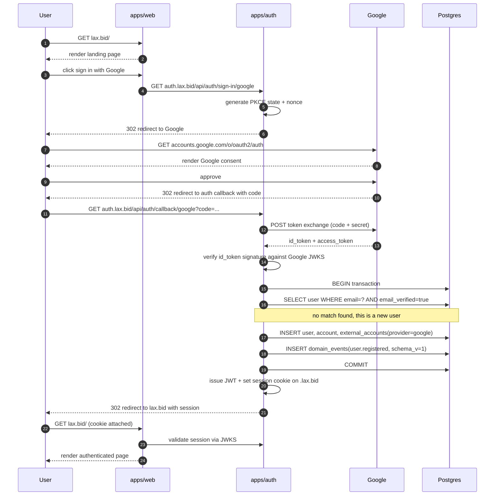
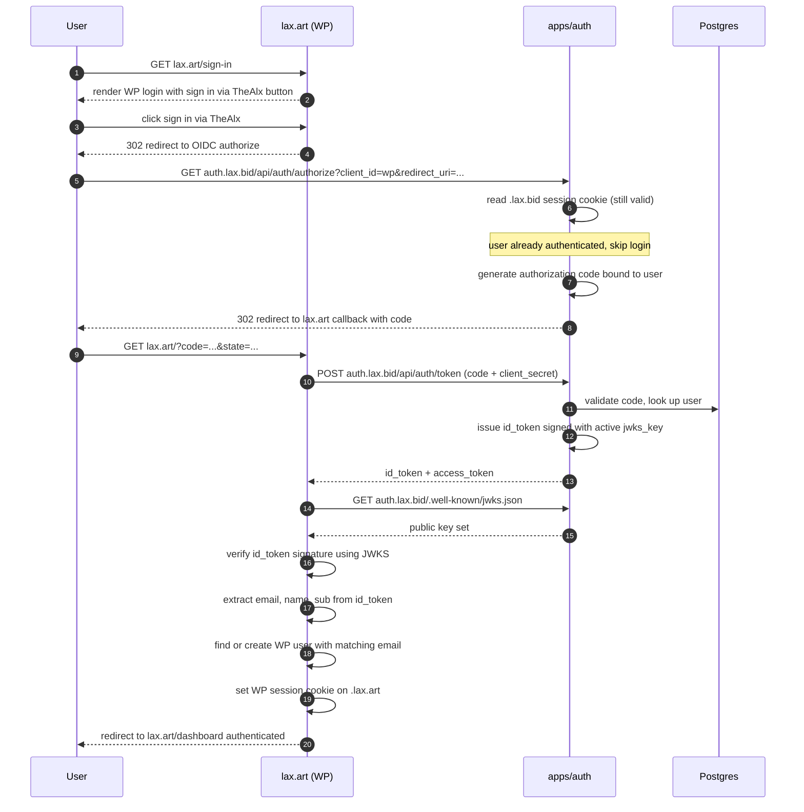
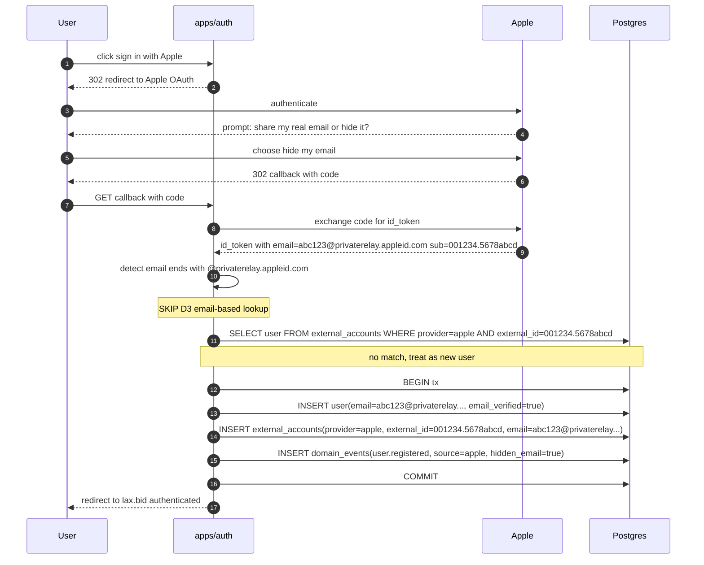
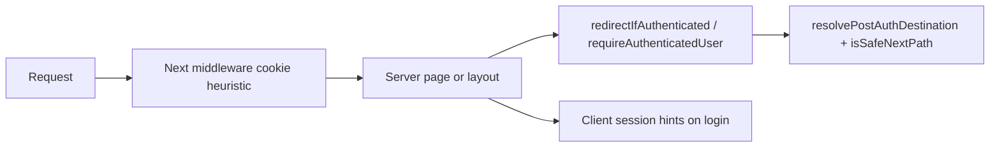

# Identity flow

This document walks through what happens when a user authenticates across the three TheAlx domains. There are three flows worth understanding deeply: sign-up via a social provider on the main auction site, cross-domain recognition on a domain that doesn't share cookies with the auction site, and the Apple "Hide My Email" relay path that explains why D11/F6 exists.

If you understand these three flows, you understand the identity layer.

> **Implementation status (last reviewed 2026-05-05)**
>
> - **Implemented:** better-auth issuing both session cookies and OIDC + JWT tokens with the canonical issuer URL `https://auth.lax.bid` ([packages/auth/src/server.ts](../../packages/auth/src/server.ts)). Google and Apple social providers, conditional on env vars. Cookie scoped to `.lax.bid` when `COOKIE_DOMAIN` is set ([apps/api/src/container.ts](../../apps/api/src/container.ts), [apps/auth/src/index.ts](../../apps/auth/src/index.ts), `.env.production.example`). Apple privacy-relay branch in [apps/api/src/services/account-linking.service.ts](../../apps/api/src/services/account-linking.service.ts). JWT verification on the `apps/ws` Socket.IO handshake ([apps/ws/src/services/jwt-verifier.ts](../../apps/ws/src/services/jwt-verifier.ts)).
> - **Dual-stack today:** `apps/auth` and `apps/api` both serve OIDC discovery, JWKS, and `/api/auth/*` (D7); WordPress can target either. Issuer claim is identical (`OIDC_ISSUER_URL`) so consumers do not see the topology.
> - **Hybrid today:** `apps/ws` validates JWT-on-handshake, **but also still falls back to a cookie relay** against `apps/api/users/me` when `LEGACY_WS_COOKIE_RELAY` is enabled ([apps/ws/src/handlers/socket-handler-registry.ts](../../apps/ws/src/handlers/socket-handler-registry.ts)). Removing the relay is **(Phase 2)**.
> - **Not implemented:** the `domain_events` insert in the auth transactions shown below — see [04-domain-events.md](./04-domain-events.md). Refresh-token rotation with reuse detection is **(planned)**; today better-auth issues sessions and short-lived JWTs only.

## Flow 1: First-time sign-up via Google on lax.bid

A user lands on lax.bid, clicks "Sign in with Google", and ends up authenticated. Behind that one click are roughly a dozen HTTP requests across four parties.



A few things in this flow are worth dwelling on.

**Steps 12–14 (token exchange and verification).** Google returns an `id_token`, which is a JWT signed by Google. Our auth server fetches Google's JWKS (cached) to verify the signature locally — this proves the token was actually issued by Google and not forged. The `id_token`'s payload contains `sub` (Google's stable user identifier), `email`, `email_verified`, and `name`. We trust `email_verified` from Google because Google itself verified it; we do not re-verify the email on our side.

**Steps 16–19 (the all-important transaction).** Inserting the user, the account, the external_accounts link, *and* the `user.registered` domain event all happen in a single database transaction. If any step fails, all of them roll back. There is no scenario where the user record is created but the event is lost — the outbox pattern from D5/D8 enforces this at the database level.

**Step 22 (the cookie).** The session cookie is set with `Domain=.lax.bid` per F7. The leading dot means both `lax.bid` (the web app) and `auth.lax.bid` (the auth server) can read it. Cross-registrable-suffix domains (`.lax.art`, `.lax.shop`) cannot share cookies by browser policy, which is why those domains use JWTs instead.

**Step 25 (validating the session).** Same-origin requests from `apps/web` to `apps/api` carry the `.lax.bid` session cookie. `apps/api`'s `CompositeAuthenticator` first asks better-auth to resolve the cookie ([apps/api/src/infrastructure/composite-authenticator.ts](../../apps/api/src/infrastructure/composite-authenticator.ts), composed in [apps/api/src/container.ts](../../apps/api/src/container.ts)). The Bearer-token / JWKS path is the **second** authenticator in the chain — it covers cross-domain consumers (the WordPress plugin, future mobile apps, `apps/ws`) that cannot share cookies with `.lax.bid`. JWKS verification is implemented with `jose`'s `createRemoteJWKSet` (10-minute `cacheMaxAge`, 30-second `cooldownDuration`) in [packages/auth/src/middleware.ts](../../packages/auth/src/middleware.ts) — that's library-default stale-while-revalidate, not a custom cache layer.

## Flow 2: Cross-domain recognition on lax.art (WordPress)

The user has signed in on lax.bid. Some time later, they visit lax.art (the WordPress marketing site on Hostgator). They click "Sign in" on the WordPress site. Because lax.art is on a different registrable domain than lax.bid, the browser does not send the .lax.bid cookie — WordPress has no idea who the user is, even though our system does.

This is the OIDC handshake that bridges the two domains.



The user clicks "Sign in" once on lax.art and is authenticated without entering any credentials, because their .lax.bid session cookie was still valid when WordPress redirected them to our authorize endpoint. Our auth server saw the cookie, recognized the user, and issued an OIDC code and id_token without prompting for credentials.

**Steps 5–8 (silent re-authentication).** This is where the cookie scoping pays off. When the browser hits `auth.lax.bid/api/auth/authorize`, it sends the `.lax.bid` cookie automatically. Our auth server reads the cookie, finds the active session, and skips the login UI entirely. From the user's perspective, they clicked one link and were "magically" recognized.

**Step 11 (token exchange).** WordPress's OpenID Connect Generic plugin exchanges the authorization code for an id_token using its registered `client_secret`. This is back-channel — it never goes through the user's browser, so the secret is safe.

**Steps 14–16 (signature verification).** WordPress fetches our JWKS endpoint to get the public key, then verifies the id_token's signature locally. This proves the token was issued by us. If we rotate keys (D2 + the rotation runbook), retired keys remain in JWKS for 30 minutes so any in-flight token verifications continue to succeed during the transition.

**Step 19 (find or create WP user).** WordPress's plugin matches the OIDC `sub` (or `email`) to a WP user record. On first sign-in this creates a new WP user; on subsequent sign-ins this finds the existing record. The WP user is independent of our auction user — they live in different databases — but they're tied together by the `sub` claim, which is stable for the lifetime of the OIDC client.

The user now has two parallel sessions: the original .lax.bid cookie for the auction app, and a new .lax.art cookie for WordPress. Each is scoped to its own domain. If they sign out of WordPress, their auction session is unaffected, and vice versa.

## Flow 3: Apple "Hide My Email" — why F6 exists

Apple's privacy feature lets users sign in with Apple while concealing their real email address. Apple generates a random `@privaterelay.appleid.com` address, gives it to us, and forwards any email we send to that address to the user's real inbox. This breaks email-based account linking, which is why D11 has explicit handling.



The same user later signs up via email/password on lax.shop using their real address `alice@example.com`. Without F6, our system might try to link these two identities by email — but the privacy-relay address and the real address don't match, and even if we tried to match by Apple `sub`, the email/password signup has no Apple `sub`. The user appears as two separate identities until they explicitly link.

**Why this is the correct behavior.** Apple's privacy contract says: the relay email is private; we should not tie it to other knowledge about the user without their consent. If we silently merged the two identities by some other heuristic, we'd be defeating Apple's privacy feature and potentially violating Apple's developer agreement. The "two identities until explicitly linked" outcome is what the user actually wants.

**The fallback path.** The architecture allows for an explicit "link my accounts" flow in v2 — a logged-in user can prove they own both identities (e.g., by logging into both and confirming) and the system stitches them via `external_accounts`. This is deferred per the out-of-scope list, but the database supports it today: just write a new row in `external_accounts` linking the existing Apple-relay user to the email/password account.

**Step 11 (the detection).** The check is a simple string suffix: `email.endsWith('@privaterelay.appleid.com')` plus `provider === 'apple'`. The same defensive pattern applies if Google ever returns a no-email signup (rare but possible) — see D11.

## What you need to know about the cookie

A few things that have surprised engineers in the past:

**The cookie domain is set in production but empty in local dev.** Setting `Domain=.lax.bid` requires actually running on .lax.bid. Local dev runs on localhost, where setting a cookie with a `Domain` attribute fails silently (or visibly, depending on the browser). The `COOKIE_DOMAIN` env var is empty in dev so the cookie is set as a host-only cookie scoped to localhost.

**The `SameSite=Lax` attribute is non-negotiable.** Lax means the cookie is sent on top-level navigation (link clicks, form submissions) but not on cross-origin XHR. This protects against CSRF without breaking the OIDC redirect flow. `SameSite=Strict` would block the redirect-back-from-Google flow because Google's redirect counts as cross-site. `SameSite=None` would require `Secure` and would expose us to CSRF on third-party iframes — not worth it for a public-facing site.

**The `Secure` attribute is non-negotiable in production.** Cookies with `Secure` are only sent over HTTPS. Cloudflare's full-strict TLS configuration (D38) ensures the entire path from user to origin is HTTPS, so `Secure` adds defense-in-depth without breaking anything. In local dev where we run plain HTTP, `Secure` is omitted.

**Cross-registrable-suffix domains do not share cookies, period.** lax.art and lax.shop are different registrable domains than lax.bid. There is no browser configuration that makes them share cookies — this is a fundamental limitation of the cookie spec to prevent supercookie tracking. Hence OIDC. The handshake from Flow 2 is the only way to recognize a user across registrable-suffix boundaries.

**`apps/ws` uses JWT on handshake (Phase 2 complete on web).** Socket.IO clients on `lax.bid` fetch a short-lived JWT from `GET /api/auth/token` (better-auth jwt plugin) and pass it as `handshake.auth.token`. The WS server verifies via JWKS (`OIDC_ISSUER`, `JWKS_URL`). `LEGACY_WS_COOKIE_RELAY=false` in production — cookies alone are not used for identity. Anonymous visitors still join public rooms (`joinLot`, `joinSaleroom`) without a token.

## What you need to know about the JWT

The access token issued by our auth server is an RS256-signed JWT with a 15-minute lifetime per Q2. The payload is intentionally minimal:

```json
{
  "iss": "https://auth.lax.bid",
  "sub": "01HQXY7JGPVE2T8NVV0AM6S3ZQ",
  "aud": "lax.bid",
  "iat": 1730409600,
  "exp": 1730410500,
  "email": "alice@example.com",
  "email_verified": true,
  "name": "Alice Example"
}
```

Notice what's not there: no `role` claim. Roles are looked up server-side every request because role changes need to take effect immediately (revoking admin access, etc.) and a JWT-cached role would persist for up to 15 minutes after the change. PII is also limited — no phone, no address, no payment details. The minimum needed to identify the user; everything else is a server-side lookup.

**The `aud` claim is per-domain.** Per Q5, we issue tokens with `aud=lax.bid`, `aud=lax.art`, or `aud=lax.shop` depending on which client requested the token. Each consumer verifies that the `aud` matches their expectation; a token issued for one domain won't validate on another. This bounds the blast radius of a stolen token to a single domain.

**Refresh tokens are server-side and rotation-detecting per Q3 (planned).** The target design is server-side, single-use refresh tokens whose replacement is a new refresh token; if a refresh token is ever reused, the entire token family is invalidated and the user is forced to re-authenticate. **Today better-auth issues sessions plus short-lived JWTs without a refresh-token rotation flow** — extending sessions across the 15-minute JWT lifetime relies on the cookie session, not on a refresh token. Implementing rotation-with-reuse-detection is **(planned)**.

## Where things go wrong

The failure modes that have actually happened in production at other companies running this pattern. None of these are theoretical.

**Clock skew between our auth server and a relying party.** A WordPress plugin running on a server with a clock 60 seconds slow will reject our id_token as "issued in the future." Mitigation: ensure NTP is configured on every host, and accept up to 5 seconds of clock skew in JWT validation (`jose` does this by default with the `clockTolerance` option).

**JWKS cache stampede after rotation.** If 1000 worker processes all hit the JWKS endpoint at the same moment after a key rotation, that's a small DDoS on our auth server. Mitigation: each verifier uses `jose`'s `createRemoteJWKSet` with `cacheMaxAge: 600000` (10 min) and `cooldownDuration: 30000` (30 s) so refreshes are coalesced per process and stale keys keep working during the cooldown. The downstream Cloudflare cache TTL on `/.well-known/jwks.json` (60 s, configured at the edge per `docs/integrations/cloudflare.md`) absorbs the cross-process burst.

**Cookie not being set due to misconfigured `Domain`.** If `COOKIE_DOMAIN=.lax.bid` is set on a deployment that's actually serving on `staging.lax.bid`, the cookie attempt is rejected by the browser as "domain mismatch" and the user appears to log in successfully but every subsequent request shows them as logged out. Mitigation: the auth server logs cookie-set attempts at debug level; production smoke tests verify the cookie round-trip.

**Apple email-relay rate limiting.** If we send too many emails too quickly through Apple's relay, Apple may throttle or stop forwarding. Mitigation: rate-limit our outbound mailers, and monitor bounce rates from privacy-relay addresses specifically (different bounce signature than regular emails).

**WordPress plugin caching the wrong issuer URL.** If the WP plugin was configured during a brief window where the issuer was misconfigured, its cached discovery doc may have the wrong URL. Mitigation: when we change anything in the discovery doc, we also instruct ops to flush the WP plugin's cache (admin → tools → flush OIDC cache). Documented in [the WordPress integration guide](../integrations/wordpress.md).

The single best operational practice is reading the access logs on `apps/auth` after any auth-related change. Most issues show up there as 4xx responses with informative error codes. Sentry catches exceptions; structured logs catch policy decisions (cookie rejected, claim missing, replay detected).

## Authed-aware marketing routes (`apps/web`)

The auction web app treats **public marketing auth pages** (`/login`, `/register` without `invite`, `/forgot-password`) differently from **token-bound** pages (`/verify-email`, `/reset-password`, `/unsubscribe`, `/register?invite=…`). A session cookie alone must not trap users on sign-in when they are already signed in, but it must not break invite or reset-token flows.

### Three layers



1. **Edge (`apps/web/src/middleware.ts`)** — Two checks run before any other logic (see `auth-edge-policy.ts`):
   - **Stale public landing recovery**: if a non-dashboard/admin page arrives with `?from=auth-edge` *and* a `better-auth.session_token` cookie, the edge redirects 307 to `/login?session_expired=1` (preserving a clean `next`, purging auth cookies). This prevents users being stranded on marketing pages after backing out of OAuth.
   - **Auth-page fast-path**: if the path is `/login` or `/register` (without bypass flags) and a session cookie is present, redirect 307. Protected `next` values (`/dashboard/**`, `/admin/**`) go directly with `?from=auth-edge&welcome=back`. All other `next` values (marketing pages, lot pages, etc.) route through `/auth/social-callback` so SSR validates the session before landing anywhere unguarded.
   - **Bypass flags** (edge redirect skipped): `?switch=1`, `?session_expired=1`, `?auth=required`, `?social_error=1`, `?registered=1`, `?reset=1`, `?verify_pending=1`, `/register?invite=…`.
   - `/forgot-password` is never matched at the edge so SSR can route staff to `/admin` and clients to account settings.
2. **Server (`apps/web/src/lib/auth/guards.server.ts`)** — `getServerSessionUser` is authoritative. `redirectIfAuthenticated` and `redirectIfVerifyPendingNotNeeded` enforce the routing table; `requireAuthenticatedUser` protects `/dashboard`, `/admin`, and handles `x-lax-auth-edge` when the session is missing (redirect to `/login?session_expired=1` instead of bouncing forever).
3. **Client** — `SocialSignInButtons` uses `disableRedirect: true` + `window.location.replace()` so the pre-OAuth `/login` page is removed from browser history; Back at the provider lands on the page *before* login rather than looping back through it. `SignInForm` shows “already signed in” / switch-account UI when Better Auth’s client session disagrees with SSR (multi-tab, rare races).

### `?next=` safety

All relative `next` targets must pass `isSafeNextPath` in [`apps/web/src/lib/auth/post-auth-destination.ts`](../../apps/web/src/lib/auth/post-auth-destination.ts) (blocks `//`, `\`, `/api`, etc.). Staff default homes and suspended routing are centralized in `resolvePostAuthDestination`.

### Constitution

See **VIII. Public Auth Routes And Post-Auth Navigation** in [`.specify/memory/constitution.md`](../../.specify/memory/constitution.md).
