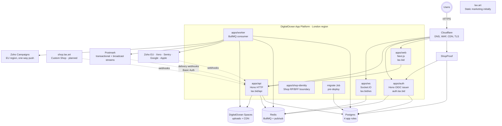

# Deployment

This document describes how the system is deployed and operated in production. It covers the DigitalOcean App Platform topology, the Cloudflare edge layer, the relationship between our test and production environments, and the explicit thresholds at which we revisit architectural decisions.

If you're trying to deploy a change, the [deploy checklist runbook](../runbooks/deploy-checklist.md) is the procedure. If you're trying to understand why the deployment is shaped the way it is, this document is the rationale.

> **Implementation status (last reviewed 2026-05-05)**
>
> - **Implemented in code:** six Dockerized apps with their own entrypoints —
>   `apps/web`, `apps/api`, `apps/auth`, `apps/ws`, `apps/worker`, and the
>   executable `apps/shop-identity` Shop RP/BFF boundary. The production
>   migration runner is `pnpm db:migrate:prod`.
> - **Implemented in IaC:** the full topology now lives in [infra/terraform/](../../infra/terraform/), split into `bootstrap/` (manual one-time, see [BOOTSTRAP.md](../../infra/terraform/BOOTSTRAP.md)), `persistent/<env>/` (DNS, Cloudflare zone settings, projects, Spaces media bucket, Sentry projects), and `ephemeral/<env>/` (Postgres cluster + RBAC, Redis cluster, App Platform components and pre-deploy Job, monitoring, Sentry alerts, Cloudflare rate limits and WAF rules — including `/webhooks/postmark`, `/api/auth/sign-up`, `/api/auth/send-verification-email`). Applies run through GitHub Actions (state in DigitalOcean Spaces; production apply requires the typed `APPLY-PROD` confirmation).
> - **Operational, not in repo:** the GitHub-side environment secrets (`DIGITALOCEAN_TOKEN`, `BETTER_AUTH_SECRET`, `MEDIA_SPACES_*`, OAuth/webhook secrets, Sentry tokens, JWKS snapshot keys), Apple/Google OAuth client registrations, `mail.lax.bid` SPF/DKIM/DMARC DNS verification on the Postmark side, Postmark sender domain warmup, and the manual deploy promotion gate. The numbers in the *Target instance sizing* table below are recommendations.
> - **Planned:** branch-based gated production deploys (the `main` → test → `release` → prod cadence), pre-deploy smoke tests in CI, automated drift remediation beyond the weekly drift workflow.
>
> Anywhere this document describes "instance counts" or "$ costs" as if they were declarative state, the canonical numbers live in `infra/terraform/ephemeral/<env>/main.tf`. Treat the prose below as the architectural rationale; treat Terraform as the source of truth for what's actually deployed.

## The deployed system at a glance



The system has six long-running components plus one pre-deploy job inside one App
Platform app. They share a Postgres cluster with role separation, Redis, and a
DigitalOcean Space. External integrations connect through Cloudflare: the
worker makes outbound calls and the API receives verified webhooks. Postmark
delivery callbacks return to `/webhooks/postmark`; the worker sends through
Postmark and Zoho Campaigns. See
[04-domain-events.md → "Email pipeline"](./04-domain-events.md#email-pipeline).

## DigitalOcean App Platform components

Each component is a separate process with its own resources, scaling, and deployment cadence. They share the same Git repo and are built from the same monorepo, but they run independently.

### apps/web

The Next.js frontend served at lax.bid. It's a TypeScript Next.js application using Tailwind for styling and the better-auth client for authentication. It talks to apps/api over HTTP and apps/auth over OIDC discovery. Static assets are served via Next.js's standalone output mode and cached at Cloudflare's edge.

In production and test, `apps/web` is **prebuilt in GitHub Actions** and pushed to DOCR (`lax-<env>-web`). Build-time `NEXT_PUBLIC_*` values come from [`infra/web-build/<env>.env`](../../infra/web-build/README.md) plus GitHub vars/secrets; App Platform pulls the image instead of building Next.js on each deploy. The web component's Terraform env entries still supply runtime values (including Sentry server DSN and secrets).

Container starts with `node apps/web/server.js` from the standalone output. Health check: `GET /api/health`.

### apps/auth

The OIDC issuer per D9. It runs better-auth with the OIDC Provider plugin, the Google and Apple social provider plugins, and a custom JWKS endpoint backed by the `jwks_key` table. It exposes `/.well-known/openid-configuration`, `/.well-known/jwks.json`, `/.well-known/apple-developer-domain-association.txt`, and `/api/auth/*` for sign-in flows and token issuance.

The auth server is the only component with direct read access to the JWKS private keys via the `auth_app` Postgres role. No other component can read those keys — that's the security boundary that the role split enforces (D2). `apps/auth` also runs the JWKS retirement scheduler ([packages/auth/src/jwks-retirement.ts](../../packages/auth/src/jwks-retirement.ts)) under a Postgres advisory lock so only one auth replica retires expired keys per tick.

`apps/auth` retains Redis for issuer-local rate limits, replay protection, and
coordination. Better Auth email hooks depend on the Identity-owned `EmailSender`
port, whose HTTP adapter posts to the machine-authenticated
`apps/api /internal/identity/emails` endpoint. API persists the intent in the
existing product email outbox and BullMQ pipeline with a 30-day recipient
snapshot. `auth_app` has no direct email-pipeline table privilege.

Health checks: `GET /health/live` returns 200 unconditionally; `GET /health/ready` validates DB connectivity and the ability to load JWKS keys ([apps/auth/src/index.ts](../../apps/auth/src/index.ts)).

`apps/auth` is the sole OIDC issuer. Product BFFs own host-only sessions;
`apps/api` verifies audience-bound Bearer tokens and does not resolve browser
sessions or serve issuer routes.

### apps/shop-identity

The executable confidential OIDC/BFF boundary for the custom Shop at
`shop.lax.art`. It has only the `shop_app` database role and writes
`shop_user_profile`; it does not import Bid roles or repositories. It is a
reference for the future customer-facing Shop implementation. Health checks are
`/health/live` and `/health/ready`; logout and SSF receivers are
`/api/auth/backchannel-logout` and `/api/ssf/events`.

### apps/api

The HTTP backend for the auction. It owns bid placement, lot retrieval, payment intent creation, user profile, and the inbound webhook surface. The intent is that it owns no background work — but **today it also runs the lot lifecycle BullMQ worker in-process** ([apps/api/src/index.ts](../../apps/api/src/index.ts), [apps/api/src/jobs/lot-job-scheduler.ts](../../apps/api/src/jobs/lot-job-scheduler.ts)). Migrating `LotJobScheduler` into `apps/worker` is **(Phase 2)**.

It uses the `api_app` Postgres role, which has full access to most product tables,
read-only access to `bid_identity_directory`, and, after migration `0161`, no
access to Identity `user`, `jwks_key`, sessions, accounts, OAuth tables, or
verification (see [packages/db/src/migrate-roles.ts](../../packages/db/src/migrate-roles.ts)).
It validates Bearer tokens locally via `jose`'s `createRemoteJWKSet` against the
JWKS endpoint, with library-default cache (`cacheMaxAge: 600000`) and cooldown
(`cooldownDuration: 30000`).

`JwtAuthenticator` accepts Bearer tokens with issuer
`https://auth.lax.bid` and audience `lax-bid-api`;
`BidContextEnrichedAuthenticator` loads local authorization. Browser cookies are
terminated at the Bid BFF.

Health checks: `GET /health/live` and `GET /health/ready` ([apps/api/src/app.ts](../../apps/api/src/app.ts)). Pino-formatted logs with request-id propagation, and a `/metrics` endpoint exposing Prometheus default metrics plus HTTP histograms ([apps/api/src/middleware/metrics.ts](../../apps/api/src/middleware/metrics.ts)).

### apps/ws

The Socket.IO real-time gateway. Bid events placed via apps/api are published to
a Redis pub/sub channel; ws subscribes and fans them out via Socket.IO. WS
verifies canonical Identity JWTs locally, then resolves Bid authorization from
`apps/api/users/me`; it has no cookie-relay fallback.

The Redis pub/sub bridge means ws and api never call each other directly outside the legacy relay. Their only shared state is Redis. This makes ws horizontally scalable independently of api: more concurrent socket connections means more ws instances, no api impact.

Health checks at `GET /health/live` and `GET /health/ready` ([apps/ws/src/index.ts](../../apps/ws/src/index.ts)). Sticky sessions need to be configured at the App Platform load balancer so a given client stays connected to the same ws instance for the duration of the connection — this is **(operational, not in repo)**.

### apps/worker

BullMQ consumer for asynchronous work. Today it runs six queues plus the `domain_events` polling runner ([apps/worker/src/index.ts](../../apps/worker/src/index.ts), [apps/worker/src/projectors/runner.ts](../../apps/worker/src/projectors/runner.ts)):

- **`webhook-events`** — API enqueues after inbox claim when `WEBHOOK_EVENTS_ENQUEUE=true`; worker processes when `WEBHOOK_EVENTS_PROCESS=true` (both default false). Xero invoice ingress can use `XERO_WEBHOOK_INBOX_MODE=inbox` on the API. See [async-delivery-phase-two.md](../runbooks/async-delivery-phase-two.md) and [worker-runtime-cutover.md](../runbooks/worker-runtime-cutover.md).
- **`validate-upload`** ([apps/worker/src/jobs/validate-upload.ts](../../apps/worker/src/jobs/validate-upload.ts)) — HEADs and sniffs Spaces objects before users can attach them.
- **`image-cleanup`** ([apps/worker/src/jobs/image-cleanup.ts](../../apps/worker/src/jobs/image-cleanup.ts)) — deletes orphaned objects when their `upload_object` row is removed.
- **`gc-pending-uploads`** — hourly repeatable job that deletes stale pending rows/objects.
- **`email`** ([apps/worker/src/jobs/send-email.ts](../../apps/worker/src/jobs/send-email.ts)) — claims `email_outbox` rows and dispatches via the configured `IEmailSender` (`PostmarkEmailSender` in production, `ConsoleEmailSender` in dev), plus the `outbox-drain` repeatable job that re-enqueues stale `pending` rows every 60s.
- **`marketing-sync`** ([apps/worker/src/jobs/zoho-campaigns-sync.ts](../../apps/worker/src/jobs/zoho-campaigns-sync.ts)) — pushes one row at a time to Zoho Campaigns.

The `domain_events` runner drives Zoho/Xero and internal projectors; outbound CRM/accounting calls require explicit projector mode env vars. Finance/platform crons default to API rollback execution (`FINANCE_CRON_EXECUTION_OWNER=api_rollback`); worker-owned handlers are documented in [worker-runtime-cutover.md](../runbooks/worker-runtime-cutover.md). Lot lifecycle defaults to `apps/api` (`LIFECYCLE_EXECUTION_OWNER=api`); worker-owned lifecycle uses the same `@auction/lot-lifecycle-app` stack (notifications, anti-shilling, saleroom skip, absentee replay via `/internal/jobs/replay-absentee-for-lot`) when `LIFECYCLE_EXECUTION_OWNER=worker`. API `/internal/jobs/lot-lifecycle-tick` returns 409 while worker owns lifecycle. JWKS retirement intentionally runs in `apps/auth`, not the worker, so `worker_app` remains denied on signing keys.

It uses the `worker_app` Postgres role. Grants include `domain_event_delivery`, `payment` (maintenance), `notification_outbox`, lifecycle reads (`watchlist`, `saleroom_session`), and existing projector/outbox tables — see [packages/db/src/migrate-roles.ts](../../packages/db/src/migrate-roles.ts) and the cutover gate [packages/db/src/worker-app-role.contract.test.ts](../../packages/db/src/worker-app-role.contract.test.ts) (`DATABASE_URL_WORKER` in CI). Identity tables and signing keys are denied. Outbound calls to Zoho, Xero, Postmark, Zoho Campaigns, and Sentry are made from this component only — `apps/api` never calls these directly.

Health checks: `GET /health/live` and `GET /health/ready`. Readiness checks Redis ping plus heartbeat keys per queue (each BullMQ worker writes a heartbeat on job completion, and the `domain_events` runner heartbeats every poll). The check has a 60-second grace period after startup; a long-idle queue can briefly look unready until the first heartbeat lands.

### migrate (pre-deploy Job)

A one-shot DigitalOcean Job that runs before each production deploy. It executes `pnpm db:migrate:prod` using the privileged owner connection URI held in `DATABASE_URL_OWNER` (the `auction_owner` Postgres user), which is never available to any long-running process. This is the only place that DDL grants are exercised per F2. The runner is [packages/db/src/migrate-prod.ts](../../packages/db/src/migrate-prod.ts) and applies migrations through the production ceiling (default `0159`; explicit `PRODUCTION_MIGRATION_THROUGH=0160` then `0161`) followed by [migrate-roles.ts](../../packages/db/src/migrate-roles.ts) so the `auth_app`/`api_app`/`worker_app` grants stay current.

`apps/api`'s container entrypoint **does not run migrations** — only the dedicated job does. If migrations fail, the deploy aborts before any new container starts. App Platform's pre-deploy Job semantics handle this — the live deployment continues serving traffic while we figure out why the migration failed.

The job binding (App Platform's `pre_deploy` configuration, the `DATABASE_URL_OWNER` env binding, etc.) is declared in the `digitalocean-app` module under [infra/terraform/modules/digitalocean-app/](../../infra/terraform/modules/digitalocean-app/).

## The Cloudflare layer

Cloudflare sits in front of everything. It does DNS, WAF, rate limiting, edge caching, and TLS termination. The full-strict TLS posture (D38) means the connection from user to Cloudflare is HTTPS and the connection from Cloudflare to our origin is also HTTPS with origin certificate verification.

Specific Cloudflare configurations that matter architecturally:

**Cache TTL on `/.well-known/*` is 60 seconds** per D2/Q36. Discovery and JWKS endpoints are intentionally cacheable so we're not absorbing 1000 req/s on every key rotation. The 60-second TTL is the lower bound that bounds key-rotation propagation latency.

**Rate limit on `/api/auth/sign-up` and `/api/auth/send-verification-email`** is the single edge rate-limit rule we run today. Both endpoints can be abused to enumerate addresses or burn our Postmark sending reputation, so they share the highest-priority edge slot. They sit in one Cloudflare rule with the most-restrictive per-IP bucket — see [../integrations/cloudflare.md](../integrations/cloudflare.md).

**Why only one edge rule?** `lax.bid` is on the Cloudflare Free plan, which caps the `http_ratelimit` phase at a single rule per zone. Production protection takes that slot; everything else is rate-limited at the app layer.

**Rate limit on `/api/auth/sign-in/*` is 5 attempts per 15 minutes per IP** per Q37. Bounds password-spray attempts. Legitimate users rarely retry sign-in more than two or three times. This runs in the auth app, not at the edge.

**Rate limit on `/webhooks/*` (incl. `/webhooks/postmark`) and `/.well-known/*`** runs at the app layer (`apps/api/src/middleware/rate-limit.ts`) on Free. Xero and Postmark each fire from their own IP ranges, so per-source limits are still meaningful from origin.

**Cache on `/.well-known/*`** still happens at Cloudflare per D2/Q36, so steady-state read traffic is absorbed at the edge regardless of which layer holds the rate-limit rule.

**WAF challenges non-browser User-Agent strings on `/api/auth/authorize`** per Q37. Legitimate OIDC clients sending users through this endpoint always have browsers; bots scraping authorize endpoints don't. Server-to-server endpoints like `/api/auth/token` and `/.well-known/*` skip this check because they're explicitly machine-to-machine.

## Test versus production environments

The medium-grade tier deliberately runs the same security configuration in test as in production. The differences are about size and HA, not posture.

The table below summarises the **target sizing**. The authoritative numbers live in `infra/terraform/ephemeral/<env>/main.tf` — when there's a disagreement, Terraform wins.

| Component | Test (target) | Production (target) |
|---|---|---|
| Postgres | db-s-1vcpu-1gb, 1 node | db-s-2vcpu-4gb, 2 nodes (HA) |
| Redis | db-s-1vcpu-1gb | db-s-1vcpu-2gb |
| App instance size | basic-xxs | professional-xs |
| HTTP service instance count | 1 | 2 (HA) |
| Worker instance count | 1 | 1 (scale by apply during incidents) |
| Domain | test.lax.bid + test.auth.lax.bid | lax.bid + auth.lax.bid |
| Authentication cookie domain | host-only per service | host-only per service |
| Backup retention | 7 days | 30 days |
| Cloudflare WAF strict rules | enabled | enabled |
| Log level | debug | info |
| Git branch (deploy source) | `main` | `release` |

The principle is: "it works in test" should mean "it works behind the same security posture as production." We don't skimp on TLS, WAF, or rate limits in test. We do skimp on instance count and storage, because test traffic is artificial and small.

**The branch-based deploy gate (`main` → test, `release` → production) is the target.** As of this writing, both deploys come from the same branch and the production gate is manual.

## Deferral triggers

The architectural decisions in this system are sized for the medium-grade tier with explicit thresholds at which we revisit them. None of these triggers are blocking concerns today; they're the operational early-warning system.

| Trigger | What we do when it fires |
|---|---|
| Sustained DAU > 50,000 | Revisit per-app database split (D2 currently uses one cluster with four app roles) |
| domain_events > 1M rows/day | Switch projector polling to Postgres LISTEN/NOTIFY (D8 single-file change) |
| Worker queue depth > 1,000 sustained | Add a second worker instance, possibly sharded by job type |
| Postgres CPU > 80% sustained | Add read replica for analytics-style queries; possibly split out a read-only `api_app_read` role |
| Auth incident requiring forensic isolation | Isolate the existing `apps/auth` deployment and rotate affected credentials or keys per the incident runbooks |
| p95 API latency > 300ms sustained | Profile and optimize hot paths; consider edge caching for read endpoints |
| Multi-region user latency complaints | Add a US-region App Platform deployment with database replication |
| Second backend engineer hired | Reconsider service mesh, distributed tracing, additional observability tooling |
| Zoho rate-limit pressure during normal load | Stop pushing milestone events; reconsider whether Zoho is the right CRM |
| 100 GB+ in domain_events | Implement monthly archive to DigitalOcean Spaces, retain on disk for last 90 days |

The "what we do" column is deliberately specific. Each trigger has a known response, and the response is documented elsewhere — typically in a runbook. Crossing a trigger is not a five-week architecture project; it's a planned operational migration with a documented procedure.

## Identity migrations and required environment

The released production lineage is buyer-interest migrations `0137`–`0139`,
followed by Identity migrations `0140`–`0161`. The main upgrade test exercises
that exact sequence. `0146`–`0149` form the OAuth/logout/SSF schema sub-sequence
and roll back only in reverse (`0149` through `0146`). The `0159` directory must
be reconciled and soaked before `0160` and `0161` remove worker/API reads from
Identity `user`; those grant cutovers also roll back in reverse with their code.

A normal production migrate (`pnpm db:migrate:prod`) applies through `0159`
only. It does not apply `0160` or `0161` unless an operator sets
`PRODUCTION_MIGRATION_THROUGH` to the next staged value after soak. Local and
CI `pnpm db:migrate` still apply every pending migration.

```sh
# Default production migrate: through 0159 (directory). Leaves 0160/0161 pending.
pnpm db:migrate:prod

# After directory reconciliation soak is clean — worker user-read revoke only.
PRODUCTION_MIGRATION_THROUGH=0160 pnpm db:migrate:prod

# After 0160 is applied and API/export directory readers have soaked.
PRODUCTION_MIGRATION_THROUGH=0161 pnpm db:migrate:prod
```

On App Platform, set `PRODUCTION_MIGRATION_THROUGH` on the migrate Job, then
run the normal deploy so `pnpm db:migrate:prod` picks it up. The runner
fail-closes on unknown values and refuses to skip a stage (0161 requires 0160
already applied). After a grant rollback, lower or clear that variable before
the next production migrate or the Job will re-apply the revoked grant.

Do not promote a database that ran the superseded feature-branch ordering where
Identity occupied `0137` onward. Those timestamps collide with the released
main migrations, so the state requires manual inventory and reconciliation
rather than automatic renumbering. The production runner rejects a mismatched or
gapped applied-history hash before applying later migrations. The host-only
cookie cutover logs users out once.

Production Identity requires `DATABASE_URL_AUTH`, `BETTER_AUTH_SECRET`,
`OIDC_ISSUER_URL`, `WEB_ORIGIN`, `AUTH_DEK_KEY`,
`IDENTITY_MACHINE_CLIENT_ID`, and `IDENTITY_MACHINE_CLIENT_SECRET`. Bid API
requires `DATABASE_URL_API`, `OIDC_ISSUER_URL`, `JWT_AUDIENCE=lax-bid-api`,
and the machine-client pair. Bid BFF requires
`OIDC_CLIENT_SECRET_LAX_BID_WEB`, `BID_BFF_SESSION_ENCRYPTION_KEY`,
`OIDC_ISSUER_URL`, and `REDIS_URL`. Shop requires `DATABASE_URL_SHOP`,
`OIDC_CLIENT_ID=lax-shop-web`, `OIDC_CLIENT_SECRET`, `OIDC_REDIRECT_URI`,
`OIDC_POST_LOGOUT_REDIRECT_URI`, `SESSION_SECRET`, and `OIDC_ISSUER_URL`.
`OIDC_INTERNAL_BASE_URL` is optional for private routing.

SSF additionally uses `SSF_DELIVERY_ENABLED`,
`SSF_DELIVERY_TIMEOUT_MS`, and `SSF_DELIVERY_MAX_ATTEMPTS`. Keep delivery
disabled until both exact receivers pass verification. See
[SSF operations](../runbooks/ssf-stream-operations.md).

## Deployment cadence

Terraform applies and App Platform deploys both run through GitHub Actions. State lives in the versioned `lax-tf-state` DigitalOcean Space (no native locking, so applies are serialised by the workflow). Production Terraform applies require the typed `APPLY-PROD` confirmation; production app deploys use `doctl apps create-deployment` against the `DO_PROD_APP_ID` secret.

On each push to `main` (test) or `release` (prod), the **`App deploy`** workflow builds all six component images in parallel (when `USE_PREBUILT_IMAGES_*` is enabled), pushes them to DOCR, then triggers App Platform to pull them. See [infra/web-build/README.md](../../infra/web-build/README.md) for how web build args are sourced.

The migration Job runs as part of every deploy. If migrations fail, the deploy aborts and the previous version stays live.

The branch-based gated cadence (`main` → test, `release` → prod with human approval between) is **(planned)** — see the deploy checklist for the manual gate today.

The end-to-end deploy procedure is in [deploy-checklist.md](../runbooks/deploy-checklist.md). Read it before doing your first production deploy.

## Cost shape

Order-of-magnitude cost estimates for steady-state operation, treated as expectations rather than optimization targets — the architecture is sized to be operable by a small team. The line items below are reconstructable from `infra/terraform/ephemeral/<env>/main.tf` (Postgres + Redis cluster sizes, App Platform `instance_size_slug` and `instance_count`).

Do not derive current spend from an app-count estimate in this document.
Terraform component sizes/counts and the provider invoice are authoritative;
the image matrix also contains one-shot migration and malware-scanning images
that are not equivalent to long-running product apps.

## What's deliberately not deployed

Per the medium-grade tier, several things you'd see in a hyperscale deployment do not exist in our setup. They are documented out of scope so engineers do not waste time wondering if they were forgotten:

A separate API gateway (Kong, Traefik) — Cloudflare plays this role. A service
mesh (Istio, Linkerd) — six apps are below the threshold where mesh value
exceeds setup cost. Kubernetes — App Platform absorbs orchestration. A managed
event bus — the Postgres outbox plays this role until 1M events/day. KMS for key
storage remains a future hardening step. All eight image-matrix components are
prebuilt in GitHub Actions and pulled from DOCR when prebuilt images are enabled.

The defer triggers above are the explicit conditions under which any of these become candidates for the next architectural iteration.

## Where to look in the code

Application Dockerfiles live next to their source, including
[`apps/shop-identity/Dockerfile`](../../apps/shop-identity/Dockerfile).

The production migration runner is [packages/db/src/migrate-prod.ts](../../packages/db/src/migrate-prod.ts), invoked by `pnpm db:migrate:prod`. Role grants are applied by [packages/db/src/migrate-roles.ts](../../packages/db/src/migrate-roles.ts) (`pnpm db:roles`).

Health check endpoints are mounted in each app's main entrypoint, including the
The Shop boundary's `/health/live` and `/health/ready`.

Env-var inventory: [.env.example](../../.env.example) lists the development variables, [.env.production.example](../../.env.production.example) lists the production-shaped variables (with `DATABASE_URL_OWNER`, the per-role URLs, social provider creds, webhook secrets, Sentry DSNs, and Cloudflare/Cookie domain config).

**Deployment configuration:** [infra/terraform/](../../infra/terraform/) is the source of truth — `bootstrap/` for one-time manual prep ([BOOTSTRAP.md](../../infra/terraform/BOOTSTRAP.md)), `persistent/<env>/` for resources that survive teardown, `ephemeral/<env>/` for the rebuildable application surface, and `modules/` for the reusable components (`cloudflare-domain`, `digitalocean-app`, `digitalocean-project`, `digitalocean-spaces`, `monitoring`, `postgres-cluster`, `postgres-rbac`, `redis-cluster`, `sentry-alerts`, `sentry-projects`).
