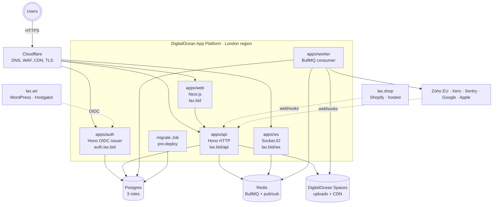

# Deployment

This document describes how the system is deployed and operated in production. It covers the DigitalOcean App Platform topology, the Cloudflare edge layer, the relationship between our test and production environments, and the explicit thresholds at which we revisit architectural decisions.

If you're trying to deploy a change, the [deploy checklist runbook](../runbooks/deploy-checklist.md) is the procedure. If you're trying to understand why the deployment is shaped the way it is, this document is the rationale.

> **Implementation status (last reviewed 2026-05-01)**
>
> - **Implemented in code:** five Dockerized apps with their own entrypoints — [apps/web/Dockerfile](../../apps/web/Dockerfile), [apps/api/Dockerfile](../../apps/api/Dockerfile), [apps/auth/Dockerfile](../../apps/auth/Dockerfile), [apps/ws/Dockerfile](../../apps/ws/Dockerfile), [apps/worker/Dockerfile](../../apps/worker/Dockerfile). Production migration runner at [packages/db/src/migrate-prod.ts](../../packages/db/src/migrate-prod.ts) (`pnpm db:migrate:prod`). Cloudflare configuration documented in [../integrations/cloudflare.md](../integrations/cloudflare.md). DigitalOcean managed Postgres + Redis configuration documented in [../integrations/digitalocean.md](../integrations/digitalocean.md).
> - **Operational, not codified in the repo:** the App Platform component definitions, instance sizing, HA counts, `pre-deploy` Job binding, Cloudflare rate-limit/WAF rules, and DNS records all live in the DigitalOcean and Cloudflare consoles, not in IaC. There is no `infra/terraform/` and no `.do/app.yaml` in this repo today. The numbers in the *Target instance sizing* table below are recommendations, not declarative state.
> - **Planned:** Terraform/IaC capture of the full topology, branch-based gated production deploys (the `main` → test → `release` → prod cadence), pre-deploy Job binding declared in repo, and a CI-driven smoke test loop.
>
> Anywhere this document describes "instance counts", "$ costs", or "Terraform plan/apply" as if they were committed to the repo, treat that as the *target state*. Today, the only authoritative deployment artifacts in-repo are the Dockerfiles, the migrate script, and the env files.

## The deployed system at a glance

The system has five long-running components plus one pre-deploy job, all inside one App Platform app. They share a single Postgres cluster (with role separation as the security boundary), a single Redis cluster, and a DigitalOcean Space for browser-direct uploads. External integrations connect via Cloudflare in both directions: outbound calls from the worker, inbound webhooks to the API.

## DigitalOcean App Platform components

Each component is a separate process with its own resources, scaling, and deployment cadence. They share the same Git repo and are built from the same monorepo, but they run independently.

### apps/web

The Next.js frontend served at lax.bid. It's a TypeScript Next.js application using Tailwind for styling and the better-auth client for authentication. It talks to apps/api over HTTP and apps/auth over OIDC discovery. Static assets are served via Next.js's standalone output mode and cached at Cloudflare's edge.

Container starts with `node apps/web/.next/standalone/server.js`. Build command runs the standard Next.js production build inside Turborepo's workspace context. The Next.js app **does not currently expose `/health/live`** — the App Platform health check today is the default TCP probe on the listening port. Adding a dedicated health route is **(planned)**.

### apps/auth

The OIDC issuer per D9. It runs better-auth with the OIDC Provider plugin, the Google and Apple social provider plugins, and a custom JWKS endpoint backed by the `jwks_key` table. It exposes `/.well-known/openid-configuration`, `/.well-known/jwks.json`, and `/api/auth/*` for sign-in flows and token issuance.

The auth server is the only component with direct read access to the JWKS private keys via the `auth_app` Postgres role. No other component can read those keys — that's the security boundary that the role split enforces (D2).

Health checks: `GET /health/live` returns 200 unconditionally; `GET /health/ready` validates DB connectivity and the ability to load JWKS keys ([apps/auth/src/index.ts](../../apps/auth/src/index.ts)).

`apps/auth` is a deployable today, but `apps/api` still serves the same OIDC routes in parallel (D7). The Cloudflare CNAME for `auth.lax.bid` may point to either component without consumers seeing a difference. Removing the duplicate routes from `apps/api` is **(Phase 2)**, gated on the WordPress relying-party round-trip test.

### apps/api

The HTTP backend for the auction. It owns bid placement, lot retrieval, payment intent creation, user profile, and the inbound webhook surface. The intent is that it owns no background work — but **today it also runs the lot lifecycle BullMQ worker in-process** ([apps/api/src/index.ts](../../apps/api/src/index.ts), [apps/api/src/jobs/lot-job-scheduler.ts](../../apps/api/src/jobs/lot-job-scheduler.ts)). Migrating `LotJobScheduler` into `apps/worker` is **(Phase 2)**.

It uses the `api_app` Postgres role, which has full access to most public tables, read-only access to `user`, and no access at all to `jwks_key`, `session.token`, `account`, the `oauth_*` tables, or `verification` (see [packages/db/src/migrate-roles.ts](../../packages/db/src/migrate-roles.ts) — the `API_DENY_TABLES` array). It validates Bearer tokens locally via `jose`'s `createRemoteJWKSet` against the JWKS endpoint, with library-default cache (`cacheMaxAge: 600000`) and cooldown (`cooldownDuration: 30000`).

The `CompositeAuthenticator` (D10) accepts both cookie sessions (for same-origin web app traffic) and Bearer tokens (for cross-domain consumers).

Health checks: `GET /health/live` and `GET /health/ready` ([apps/api/src/app.ts](../../apps/api/src/app.ts)). Pino-formatted logs with request-id propagation, and a `/metrics` endpoint exposing Prometheus default metrics plus HTTP histograms ([apps/api/src/middleware/metrics.ts](../../apps/api/src/middleware/metrics.ts)).

### apps/ws

The Socket.IO real-time gateway. Bid events placed via apps/api are published to a Redis pub/sub channel; ws subscribes to that channel and fans out events to connected clients via Socket.IO. ws verifies JWTs locally on the Socket.IO handshake using JWKS ([apps/ws/src/services/jwt-verifier.ts](../../apps/ws/src/services/jwt-verifier.ts)). It also still falls back to a cookie relay against `apps/api/users/me` when `LEGACY_WS_COOKIE_RELAY` is enabled — removing that fallback is **(Phase 2)**.

The Redis pub/sub bridge means ws and api never call each other directly outside the legacy relay. Their only shared state is Redis. This makes ws horizontally scalable independently of api: more concurrent socket connections means more ws instances, no api impact.

Health checks at `GET /health/live` and `GET /health/ready` ([apps/ws/src/index.ts](../../apps/ws/src/index.ts)). Sticky sessions need to be configured at the App Platform load balancer so a given client stays connected to the same ws instance for the duration of the connection — this is **(operational, not in repo)**.

### apps/worker

BullMQ consumer for asynchronous work. Today it runs the `webhook-events` queue consumer and a `domain_events` polling runner that updates the `zoho` cursor ([apps/worker/src/index.ts](../../apps/worker/src/index.ts), [apps/worker/src/projectors/runner.ts](../../apps/worker/src/projectors/runner.ts)). The intended scope also includes `lot-lifecycle` (currently still in `apps/api`), the Zoho/Xero projector outbound calls (currently no-op stubs), scheduled JWKS rotation (helper exists at [apps/worker/src/jobs/jwks-rotation.ts](../../apps/worker/src/jobs/jwks-rotation.ts) but is not scheduled), email sending, and image processing — all **(Phase 2)**.

It uses the `worker_app` Postgres role, which has SELECT on `domain_events` and `user`, full access to `projector_state` and `webhook_event`, and no access to identity tables or signing keys. Outbound calls to Zoho, Xero, and Sentry are intended to be made from this component only — `apps/api` never calls these directly.

Health checks: `GET /health/live` and `GET /health/ready`. Readiness checks Redis ping plus heartbeat keys per queue (each BullMQ worker writes a heartbeat on job completion, and the `domain_events` runner heartbeats every poll). The worker currently consumes `webhook-events`, `validate-upload`, and `gc-pending-uploads`; `validate-upload` HEADs and sniffs Spaces objects before users can attach them, and `gc-pending-uploads` deletes stale pending rows/objects hourly. The check has a 60-second grace period after startup; a long-idle queue can briefly look unready until the first heartbeat lands.

### migrate (pre-deploy Job)

A one-shot DigitalOcean Job that runs before each production deploy. It executes `pnpm db:migrate:prod` using the privileged owner connection URI held in `DATABASE_URL_OWNER` (the `auction_owner` Postgres user), which is never available to any long-running process. This is the only place that DDL grants are exercised per F2. The runner is [packages/db/src/migrate-prod.ts](../../packages/db/src/migrate-prod.ts) and applies migrations followed by [migrate-roles.ts](../../packages/db/src/migrate-roles.ts) so the `auth_app`/`api_app`/`worker_app` grants stay current.

`apps/api`'s container entrypoint at [apps/api/docker-entrypoint.sh](../../apps/api/docker-entrypoint.sh) **does not run migrations** — only the dedicated job does. If migrations fail, the deploy aborts before any new container starts. App Platform's pre-deploy Job semantics handle this — the live deployment continues serving traffic while we figure out why the migration failed.

The job binding itself (the App Platform spec that says "run this job before each release") is **(operational, not in repo)** — see [../integrations/digitalocean.md](../integrations/digitalocean.md) for the configuration.

## The Cloudflare layer

Cloudflare sits in front of everything. It does DNS, WAF, rate limiting, edge caching, and TLS termination. The full-strict TLS posture (D38) means the connection from user to Cloudflare is HTTPS and the connection from Cloudflare to our origin is also HTTPS with origin certificate verification.

Specific Cloudflare configurations that matter architecturally:

**Cache TTL on `/.well-known/*` is 60 seconds** per D2/Q36. Discovery and JWKS endpoints are intentionally cacheable so we're not absorbing 1000 req/s on every key rotation. The 60-second TTL is the lower bound that bounds key-rotation propagation latency.

**Rate limit on `/.well-known/*` is 100 req/min/IP** per F9. These endpoints are intentionally unauthenticated (they have to be, per the OIDC spec), so we shield them from scraping and scanning at the edge. Cache hits don't count against this limit because Cloudflare doesn't reach origin.

**Rate limit on `/api/auth/sign-in/*` is 5 attempts per 15 minutes per IP** per Q37. Bounds password-spray attempts. Legitimate users rarely retry sign-in more than two or three times.

**Rate limit on `/webhooks/*` is 100 req/min/IP per source** per Q37. Shopify, WordPress, and Xero each fire from their own IP ranges, so this is a per-source limit in practice. Anyone outside those ranges hitting our webhook endpoints at high volume is by definition an attack.

**WAF challenges non-browser User-Agent strings on `/api/auth/authorize`** per Q37. Legitimate OIDC clients sending users through this endpoint always have browsers; bots scraping authorize endpoints don't. Server-to-server endpoints like `/api/auth/token` and `/.well-known/*` skip this check because they're explicitly machine-to-machine.

## Test versus production environments

The medium-grade tier deliberately runs the same security configuration in test as in production. The differences are about size and HA, not posture.

The table below is the **target sizing** (recommended, not committed to repo). The actual instance sizes and counts live in the DigitalOcean App Platform console; treat this table as the spec the next IaC commit should encode.

| Component | Test (target) | Production (target) |
|---|---|---|
| Postgres | db-s-1vcpu-1gb, 1 node | db-s-2vcpu-4gb, 2 nodes (HA) |
| Redis | db-s-1vcpu-1gb | db-s-1vcpu-2gb |
| App instance size | basic-xxs | professional-xs |
| HTTP service instance count | 1 | 2 (HA) |
| Worker instance count | 1 | 1 (scale by apply during incidents) |
| Domain | test.lax.bid + test.auth.lax.bid | lax.bid + auth.lax.bid |
| Cookie domain | .test.lax.bid | .lax.bid |
| Backup retention | 7 days | 30 days |
| Cloudflare WAF strict rules | enabled | enabled |
| Log level | debug | info |
| Git branch (deploy source) | `main` | `release` |

The principle is: "it works in test" should mean "it works behind the same security posture as production." We don't skimp on TLS, WAF, or rate limits in test. We do skimp on instance count and storage, because test traffic is artificial and small.

**The branch-based deploy gate (`main` → test, `release` → production) is the target.** As of this writing, both deploys come from the same branch and the production gate is manual.

## Deferral triggers

The architectural decisions in this system are sized for the medium-grade tier with explicit thresholds at which we revisit them. None of these triggers are blocking concerns today; they're the operational early-warning system.

| Trigger | What we do when it fires |
|---|---|
| Sustained DAU > 50,000 | Revisit per-app database split (D2 currently uses one cluster with three roles) |
| domain_events > 1M rows/day | Switch projector polling to Postgres LISTEN/NOTIFY (D8 single-file change) |
| Worker queue depth > 1,000 sustained | Add a second worker instance, possibly sharded by job type |
| Postgres CPU > 80% sustained | Add read replica for analytics-style queries; possibly split out a read-only `api_app_read` role |
| Auth incident requiring forensic isolation | Trigger D7 extraction of apps/auth into its own deployment (DNS-only cutover per D9) |
| p95 API latency > 300ms sustained | Profile and optimize hot paths; consider edge caching for read endpoints |
| Multi-region user latency complaints | Add a US-region App Platform deployment with database replication |
| Second backend engineer hired | Reconsider service mesh, distributed tracing, additional observability tooling |
| Zoho rate-limit pressure during normal load | Stop pushing milestone events; reconsider whether Zoho is the right CRM |
| 100 GB+ in domain_events | Implement monthly archive to DigitalOcean Spaces, retain on disk for last 90 days |

The "what we do" column is deliberately specific. Each trigger has a known response, and the response is documented elsewhere — typically in a runbook. Crossing a trigger is not a five-week architecture project; it's a planned operational migration with a documented procedure.

## Deployment cadence (target)

Both this section and the cost section below describe the target deployment cadence and pricing model. Concrete CI workflows, branch protections, and the `terraform plan`/`apply` automation referenced here are **(planned)** — they are not committed to this repo today.

The intended shape: production deploys happen on demand via merge to the `release` branch. CI runs the full test suite, then `terraform plan` against the prod environment, then waits for human approval before `terraform apply` plus the App Platform deploy. Test deploys happen automatically on merge to `main` with an analogous `terraform plan`/`apply` against the test environment.

The migration Job runs as part of every deploy. If migrations fail, the deploy aborts and the previous version stays live. This part is real today (the job binding lives in the DO console) — the rest of the cadence is the target.

The deploy procedure end-to-end is in [deploy-checklist.md](../runbooks/deploy-checklist.md). Read it before doing your first production deploy.

## Cost shape (target)

Order-of-magnitude cost estimates for steady-state operation, treated as expectations rather than optimization targets — the architecture is sized to be operable by a small team. **These are projections; the actual line items will reflect whatever instance sizes/counts get committed to IaC when that work lands.**

Production runs roughly $220/month at zero traffic: $60 for Postgres HA, $20 for Redis, $5 per running app component ($50 for the five components × two instances each), plus Cloudflare ($20 for the Pro plan with WAF), Sentry ($26 team plan), and DigitalOcean Spaces for state and archives ($5).

Test runs roughly $60/month: $15 single-node Postgres, $15 Redis, $25 for App Platform basic-xxs instances (5 × $5), plus a slice of the shared Cloudflare and Sentry plans.

Traffic adds App Platform bandwidth charges ($0.01/GB outbound), Postgres compute under high load (negligible at our scale), and Cloudflare bandwidth (free up to 10TB/month on Pro). Realistic monthly cost at 10k DAU is ~$300/month total across both environments.

## What's deliberately not deployed

Per the medium-grade tier, several things you'd see in a hyperscale deployment do not exist in our setup. They are documented out of scope so engineers do not waste time wondering if they were forgotten:

A separate API gateway (Kong, Traefik) — Cloudflare plays this role. A service mesh (Istio, Linkerd) — five components is below the threshold where mesh value exceeds setup cost. Kubernetes — App Platform absorbs orchestration. A managed event bus (Kafka, NATS, SQS) — the Postgres outbox plays this role until 1M events/day. KMS for key storage — keys live in Postgres encrypted at rest, with role-based access. Multi-region deployment — single London region with Cloudflare edge cache. A separate observability stack (Prometheus + Grafana + Loki) — DO's built-in monitoring plus Sentry is sufficient at this scale. A dedicated build server — App Platform builds in-place from Git.

The defer triggers above are the explicit conditions under which any of these become candidates for the next architectural iteration.

## Where to look in the code

Application Dockerfiles live next to their source: [apps/auth/Dockerfile](../../apps/auth/Dockerfile), [apps/api/Dockerfile](../../apps/api/Dockerfile), [apps/worker/Dockerfile](../../apps/worker/Dockerfile), [apps/ws/Dockerfile](../../apps/ws/Dockerfile), [apps/web/Dockerfile](../../apps/web/Dockerfile).

The production migration runner is [packages/db/src/migrate-prod.ts](../../packages/db/src/migrate-prod.ts), invoked by `pnpm db:migrate:prod`. Role grants are applied by [packages/db/src/migrate-roles.ts](../../packages/db/src/migrate-roles.ts) (`pnpm db:roles`).

Health check endpoints are mounted in each app's main entrypoint: [apps/api/src/app.ts](../../apps/api/src/app.ts), [apps/auth/src/index.ts](../../apps/auth/src/index.ts), [apps/ws/src/index.ts](../../apps/ws/src/index.ts), [apps/worker/src/index.ts](../../apps/worker/src/index.ts).

Env-var inventory: [.env.example](../../.env.example) lists the development variables, [.env.production.example](../../.env.production.example) lists the production-shaped variables (with `DATABASE_URL_OWNER`, the per-role URLs, social provider creds, webhook secrets, Sentry DSNs, and Cloudflare/Cookie domain config).

**Deployment configuration (App Platform spec, Cloudflare DNS/WAF, IaC):** *not yet committed to repo* — see the configuration in the DigitalOcean and Cloudflare consoles. Capturing it as Terraform is **(planned)**.
