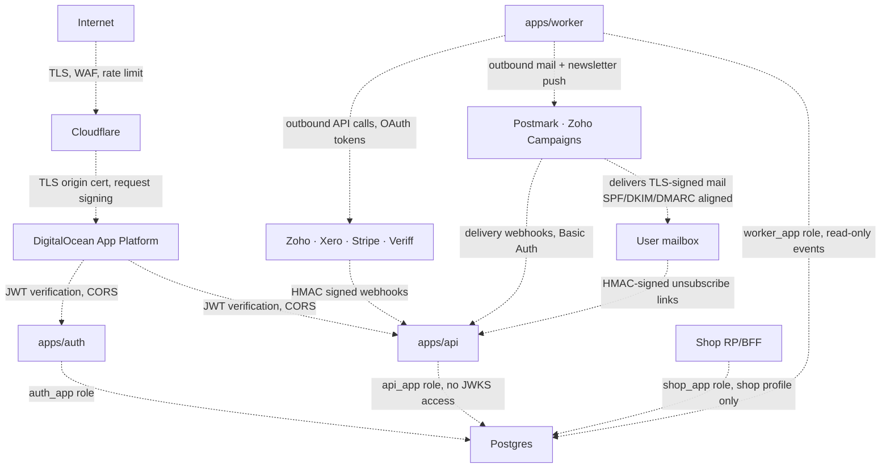

# Security model

This document is the source of truth for what threats the system defends against, what threats it accepts, and what trust boundaries enforce the difference. If you're making a change that crosses a trust boundary, this document describes what you're crossing.

The threat model is real. We have actual attackers — every public-facing auction site does. The model is sized for our actual threat surface (small e-commerce platform, no government adversaries, no targeted nation-state interest), not for hypothetical worst cases. We harden against opportunistic attacks and credential stuffing; we do not harden against zero-days in the Linux kernel.

> **Implementation status (last reviewed 2026-05-05)**
>
> - **Implemented:** least-privilege `auth_app`, `api_app`, `shop_app`, and
>   `worker_app` roles; canonical auth-host rate limits; 15-minute access tokens;
>   secure cookies; backend security headers; signed webhooks and unsubscribe
>   links; and conditional Sentry initialization.
> - **Edge controls (codified in Terraform, applied via the GitHub Actions workflow):** Cloudflare DDoS, full-strict TLS, a single shared edge rate-limit rule on `/api/auth/sign-up` + `/api/auth/send-verification-email` (Cloudflare Free caps the `http_ratelimit` phase at one rule per zone and requires **10s** `period` and **10s** `mitigation_timeout` in that phase; production auth abuse takes the slot), WAF challenges on `/api/auth/authorize`, and zone-level DDoS protection — all live in [infra/terraform/modules/cloudflare-domain/](../../infra/terraform/modules/cloudflare-domain/) and are applied from `infra/terraform/persistent/<env>/`. Lower-priority paths (`/.well-known/*`, `/webhooks/postmark`) are rate-limited at the app layer until the zone is upgraded to Pro and the per-path edge rules are restored. See [../integrations/cloudflare.md](../integrations/cloudflare.md) for the full rule layout.
> - **Email-pipeline boundary (resolved):** Identity email intents cross a
>   machine-authenticated internal API route. `auth_app` has no email-pipeline
>   table privilege; `api_app` enqueues and `worker_app` has `SELECT, UPDATE` on
>   `email_outbox` and `newsletter_signup_log`. Wired in
>   [packages/db/src/migrate-roles.ts](../../packages/db/src/migrate-roles.ts)
>   (`AUTH_DENY_TABLES`, `WORKER_LOCK_READ_TABLES`).
> - **Implemented in code:** OIDC bearer columns are one-way `h1:` fingerprints;
>   refresh reuse has family tracking, atomic reservation, whole-family/session
>   revocation, post-success consumption, and encrypted retry grace. Existing
>   deployments must run the documented at-rest backfill during cutover.
> - **Planned:** MFA and complete structured-log redaction.

Anywhere the prose below describes a control as if it were active, the status block above is the reality check.

## Trust boundaries

A trust boundary is a line in the system where data crosses from less-trusted to more-trusted (or vice versa). Each boundary needs a control: validation, authentication, authorization, or encryption. These are the boundaries that matter in TheAlx.

**Internet to Cloudflare.** TLS terminates at Cloudflare's edge, with cert auto-renewal via Cloudflare. The WAF and rate limits do their work here. Anyone can attempt this boundary — that's what "internet-facing" means — but request rate, certain paths, and bot signatures are filtered before they reach our origin.

**Cloudflare to DigitalOcean origin.** The connection from Cloudflare to our App Platform origin is HTTPS using a DigitalOcean-managed origin certificate. Cloudflare verifies the certificate (full-strict TLS mode per D38), so a man-in-the-middle between Cloudflare and our origin would fail verification.

**Browser to product.** Each product BFF validates its opaque host-only session;
tokens remain server-side. No authentication cookie has a parent-domain
`Domain` attribute.

**Product to resource server.** Protected API and WS endpoints require an
RS256 Bearer resource token with canonical issuer, exact resource audience,
valid lifetime, and required namespaced scopes. They then load product
authorization locally. ID tokens and browser cookies are rejected as API
credentials.

**Identity to receivers.** Back-channel logout receivers validate
client-addressed `logout+jwt` and atomically invalidate matching local sessions.
SSF receivers separately validate resource-addressed `secevent+jwt`, reserve
`jti`, and apply one supported event atomically. See
[09-lax-identity-boundary.md](./09-lax-identity-boundary.md).

**App to database.** The most important internal trust boundary in the system. Each app holds a different Postgres role with different grants. A SQL injection in apps/api cannot read JWT signing keys — the `api_app` role has no grant on `jwks_key`. This is not theoretical defense; this is the actual mechanism that limits blast radius if any single app is compromised.

**External webhook to API.** Active inbound providers use source-specific verification per D6: Stripe and Xero validate signatures over the raw body, Postmark uses dedicated Basic Auth, Brevo uses its webhook secret, and Veriff validates its provider signature. Authentication is checked before business logic runs.

**Postmark webhook to API.** Postmark posts delivery, bounce, complaint, open, click, and `SubscriptionChange` callbacks to `POST /webhooks/postmark`. We authenticate them with HTTP Basic Auth (`POSTMARK_WEBHOOK_BASIC_AUTH`) configured on the Postmark side and validated in `apps/api/src/routes/webhooks/postmark.ts`. The handler also writes through `email_event` so a replay is observable in the audit log even if it slips past the auth check. A Cloudflare rate-limit rule on `/webhooks/postmark` bounds enumeration attempts. Postmark does not currently sign webhook bodies, which is why the Basic Auth credential is treated as the trust boundary; on rotation, both Postmark and our env var must be updated together.

**Recipient to API (unsubscribe).** Every notification mail with a List-Unsubscribe URL embeds an HMAC-signed token (`EMAIL_UNSUBSCRIBE_SECRET`) scoped to either `(userId, notificationType)` or `globalUnsubscribe`. The unsubscribe route at `apps/api/src/routes/email.ts` rebuilds the signature and rejects mismatched tokens. This means a leaked or scraped unsubscribe URL cannot be used to opt out a different user, and tokens have no exposure to any other secret.

**App to external service.** Outbound calls from apps/worker to Zoho, Xero, Postmark, Zoho Campaigns, and other external services use OAuth refresh tokens or per-vendor API keys stored in the database or environment. The worker is the only component making these calls; `apps/api` never calls them directly. This isolates the credential surface to one component.

## Threats and mitigations

The threat catalog below is roughly ordered by likelihood-times-impact. Each threat is paired with the specific control that mitigates it.

### Credential stuffing against /api/auth/sign-in

**Likelihood:** High. Every public auth endpoint sees credential-stuffing traffic.

**Impact:** Account takeover for users with reused passwords. Stripe payment fraud if takeover succeeds.

**Mitigations.** Application-layer rate limit at `/api/auth/sign-in` of 5 attempts per IP per 15 minutes, enforced in [apps/api/src/middleware/auth-rate-limit.ts](../../apps/api/src/middleware/auth-rate-limit.ts) using a Redis counter (Q37 calls for an additional Cloudflare-edge limit; configuring it at the edge is **(operational, not in repo)** per [../integrations/cloudflare.md](../integrations/cloudflare.md)). Better-auth hashes credentials via `@better-auth/utils/password` (default scrypt-family parameters; the explicit cost-factor 12 referenced in earlier drafts is **not configured in repo today** — adopting an explicit override is **(planned)**). We do not currently mandate MFA — the sign-in rate limit is the primary defense, and MFA is on the v2 backlog.

**Acceptance.** A determined attacker with a botnet can spread attempts across enough IPs to evade IP-based rate limits. Account-level limits constrain damage per target. We accept that low-effort attackers will be filtered; high-effort targeted attacks may succeed. MFA is the planned mitigation when it ships.

### Stolen JWT replay

**Likelihood:** Low (requires interception or theft). High impact if it happens.

**Impact:** Full impersonation of the victim user for the lifetime of the access token.

**Mitigations.** Short access token lifetime — 15 minutes per Q2. Refresh-token
reuse triggers family and session revocation, with a short encrypted idempotency
window for legitimate concurrent retries. JWT consumers verify issuer and their
configured audience. TLS prevents passive interception.

**Acceptance.** A determined attacker with active access to a user's device can extract tokens. We mitigate the replay window (15 min) but cannot prevent the initial theft. The user's recovery path is to sign out from all devices, which invalidates all refresh tokens.

### Cross-product cookie theft or confused-deputy token use

**Likelihood:** Medium if a product host or subdomain is compromised.

**Impact:** Reuse of one product's session or token against another product.

**Mitigations.** Identity, Bid, and Shop use separate host-only cookies. BFFs
store tokens server-side. Resource tokens have one audience and namespaced
scopes; ID tokens use the client id and are not API credentials. Verifiers reject
wrong token class, issuer, audience, or scope.

**Acceptance.** A compromised product BFF can act within that product until its
client secret and sessions are revoked, but it cannot read another product's
host-only cookie or mint a token for an unregistered resource.

### SQL injection in apps/api

**Likelihood:** Low (we use Drizzle, parameterized queries throughout). Catastrophic impact if it happens.

**Impact:** Database access from an attacker's perspective. Without the role split, this would mean ability to read JWT signing keys, session tokens, user passwords, etc.

**Mitigations.** Drizzle ORM with parameterized queries makes injection difficult; never construct SQL by string concatenation. The Postgres role split (D2) means a successful injection in apps/api can read auction data and user emails, but cannot read `jwks_key.private_jwk` (no grant), cannot read `session.token` (no grant), cannot read `account.password` (no grant). The blast radius is bounded.

**Acceptance.** SQL injection in apps/auth would compromise everything in the auth_app role's grant set — including signing keys. We accept this because apps/auth has a much smaller code surface than apps/api and is more easily audited. Penetration tests focus on apps/auth specifically.

### Compromised JWT signing key

**Likelihood:** Very low (DB-resident, role-restricted). Very high impact.

**Impact:** Attacker can issue arbitrary JWTs accepted by any of our consumers. Full impersonation of any user, including admins.

**Mitigations.** Keys are stored encrypted at rest by DigitalOcean. Read access is restricted to the `auth_app` Postgres role. Key rotation runbook can rotate within an hour. Short access token lifetime (15 min) bounds the window after rotation. JWKS endpoint propagates new public keys with a 60-second cache TTL. Sentry alerts fire on unusual auth patterns.

**Detection.** Sustained spike in successful auth without corresponding sign-in flow events, or sustained spike in user-id values that don't match real user activity, would indicate forged tokens. Cloudflare logs the source IPs of suspicious requests. The runbook for [JWT key leak](../runbooks/jwt-key-leak.md) is the response procedure.

**Acceptance.** Detection lag for a sophisticated attacker who issues tokens at low volume is real. Quarterly proactive rotation per P6 bounds the worst-case undetected exposure.

### Webhook forgery

**Likelihood:** Medium (webhook URLs leak; people probe them).

**Impact:** An attacker impersonating an active webhook provider could inject false delivery, identity, or finance events.

**Mitigations.** Every active webhook source uses its provider-specific authentication contract (D6). Stripe and Xero bind signatures to the raw body; Postmark, Brevo, and Veriff use dedicated credentials or signatures. Invalid requests are rejected before business logic.

The dedupe key (`event_key`) on `webhook_event` ensures persisted provider events are processed only once on retries. Provider-specific event ledgers and idempotency keys provide the equivalent guarantee for routes that do not use the generic table.

**Acceptance.** A stolen provider credential can permit forged callbacks within that provider's scope. We rely on least-privilege credential binding, secret hygiene, rotation, and idempotent processing to bound the impact.

### Cross-site request forgery (CSRF) on auth flows

**Likelihood:** Medium. Common attack against auth endpoints.

**Impact:** Attacker tricks user into performing auth actions (linking accounts, changing email) without intent.

**Mitigations.** Session cookies use `SameSite=Lax`, which blocks the cookie from being sent on cross-origin XHR (the typical CSRF vector). Better-auth includes per-request CSRF tokens on state-changing endpoints. The OIDC `state` parameter prevents CSRF during OAuth callbacks (an attacker cannot forge a callback because they don't know the state value).

**Acceptance.** A successful XSS attack would defeat CSRF protections. Defense against XSS is the primary defense against CSRF in practice. Today that defense is the framework-level escaping in Next.js. A strict Content-Security-Policy header is **(planned)** — there is no `headers()` export in [apps/web/next.config.ts](../../apps/web/next.config.ts) and no security-headers middleware in the Hono backends; if/when it ships it can be set either in `next.config.ts` or as a Cloudflare transform rule.

### Account takeover via password reset

**Likelihood:** Medium. Email-based reset flows are a known weak point.

**Impact:** Full account takeover if an attacker can intercept the reset email.

**Mitigations.** Reset tokens are single-use, time-limited (15 minutes), and bound to the email address that requested them. Reset triggers an out-of-band notification to other registered emails for the user (if any). Better-auth's verification table holds the tokens with proper expiry semantics.

**Acceptance.** If an attacker has access to the victim's email account, they own the account regardless. Email security is the user's responsibility. We do mitigate "I requested a reset 6 hours ago and forgot" by short token lifetimes.

### Sender-reputation abuse via signup or resend-verification

**Likelihood:** Medium. Both endpoints can be scripted by an attacker to generate Postmark sends to addresses they control or third-party addresses, burning our `mail.lax.bid` reputation and tripping Gmail/Yahoo bulk-sender complaint thresholds.

**Impact:** Postmark account suspension, sender domain blacklisting, all transactional mail (including legitimate auth and payment) bouncing or going to spam.

**Mitigations.** `/api/auth/sign-up` and `/api/auth/send-verification-email` each have their own Cloudflare rate-limit rules (separate from the generic sign-in rule) sized for human use — see [../integrations/cloudflare.md](../integrations/cloudflare.md). The `email_outbox` idempotency key (`template:userId-or-emailHash:hash(vars)`) collapses duplicate enqueues for the same content, so even a request flood is bounded to one Postmark send per (template, recipient, vars) combination. `email_suppression` adds long-term memory: an address that hard-bounced once is never sent transactional mail again, so a hostile actor cannot loop the same dead address. Postmaster Tools alerting on `mail.lax.bid` reputation is a manual review trigger.

**Acceptance.** A motivated attacker rotating thousands of fresh addresses through fresh IPs *can* generate one-shot sends until they're rate-limited. The blast radius is bounded but non-zero. The runbook escalation path is documented in [../runbooks/email-provider-incident.md](../runbooks/email-provider-incident.md), including the `REQUIRE_EMAIL_VERIFICATION=false` kill-switch.

### Forged unsubscribe link / opt-out of another user

**Likelihood:** Low. Requires guessing or scraping our unsubscribe URLs.

**Impact:** Attacker quietly unsubscribes a victim from notifications, potentially causing them to miss outbid alerts, won-lot notifications, or payment receipts.

**Mitigations.** Every List-Unsubscribe URL carries an HMAC-SHA256 token signed with `EMAIL_UNSUBSCRIBE_SECRET`, scoped to either `(userId, notificationType)` or a global-unsubscribe identifier. The route in `apps/api/src/routes/email.ts` rebuilds and verifies the signature with `crypto.timingSafeEqual` before flipping the preference or writing `email_suppression`. Token expiry is currently unlimited (matching the indefinite validity expectations of List-Unsubscribe-One-Click); if abuse is observed, adding a rolling expiry is a one-line change. Rotation of `EMAIL_UNSUBSCRIBE_SECRET` invalidates all outstanding tokens — only do this when necessary, because users with old mail in their inbox would lose the ability to opt out via that link.

**Acceptance.** If `EMAIL_UNSUBSCRIBE_SECRET` leaks, an attacker can opt out arbitrary users until rotation. Secret hygiene is the only defense; the secret has no other use, so it is scoped to `apps/api` only.

### Postmark webhook forgery

**Likelihood:** Low. The endpoint URL is not secret, but the Basic Auth credential is.

**Impact:** Attacker injects fake delivery/bounce/complaint events, polluting `email_event` and possibly suppressing real users (writing `email_suppression(reason='complaint')` or flipping `user.email_status='complained'` for a healthy address).

**Mitigations.** `/webhooks/postmark` requires HTTP Basic Auth with `POSTMARK_WEBHOOK_BASIC_AUTH`, validated before the body is parsed. Cloudflare's `/webhooks/*` rate-limit rule plus the dedicated Postmark rule bound brute-force attempts. The handler is idempotent on Postmark `MessageID` so a retry of the same legitimate event is a no-op. Suppression writes are auditable from `email_event` (the row that triggered the suppression is recoverable).

**Acceptance.** If the Basic Auth credential leaks, the attacker can poison delivery state until rotation. The credential lives only in Postmark and our `apps/api` env, so leakage requires a vendor-side or our-side disclosure. Rotation is documented in [../integrations/email.md](../integrations/email.md).

### DDoS

**Likelihood:** Medium for opportunistic attacks; low for targeted attacks.

**Impact:** Service unavailable.

**Mitigations.** Cloudflare's DDoS protection is on by default at the Pro plan tier we're on. Rate limits per source IP make low-effort floods ineffective. App Platform's load balancer absorbs traffic spikes within capacity. Postgres connection pooling caps the worst case from connection-exhaustion attacks.

**Acceptance.** A massive volumetric DDoS aimed specifically at our origin (bypassing Cloudflare somehow, e.g., via a leaked origin IP) could exhaust our App Platform capacity. We accept this and rely on the origin-IP secrecy plus Cloudflare's WAF preventing bypass.

### Insider threat

**Likelihood:** Low at our team size. Catastrophic impact if it happens.

**Impact:** Anyone with `auction_owner` Postgres credentials can do anything to the database. Anyone with App Platform admin can change deployments, env vars, or domains.

**Mitigations.** Least privilege at every layer — the privileged owner credential is held only in `DATABASE_URL_OWNER`, which is set on the migration Job and nowhere else. Application processes never see this credential. App Platform admin access is restricted to the smallest set of humans who genuinely need it (today: founders only). Audit logging via DigitalOcean's account audit logs records every administrative action.

**Acceptance.** A motivated insider with admin access can cause significant damage. We accept this and rely on the small team size, stated employment agreements about credential handling, and the audit log as a forensic record. As the team grows past 10 engineers, we'll need to revisit role-based access control more formally.

### Supply chain attack

**Likelihood:** Medium. NPM packages get compromised regularly.

**Impact:** Malicious code shipped in our build, potentially exfiltrating credentials or modifying behavior.

**Mitigations.** Dependencies are pinned via `pnpm-lock.yaml`. Renovate or Dependabot runs weekly to surface new versions, but updates require human review. The build environment is App Platform's hosted builder which has no access to production runtime credentials — secrets are only injected into running containers, not into the build process. We use a small set of well-known dependencies (Hono, better-auth, Drizzle, BullMQ, jose) and avoid pulling in random transitive deps.

**Acceptance.** A compromise in a major dependency we use directly (better-auth, Drizzle) would affect us before any review process catches it. We accept this risk as inherent to using NPM dependencies; the alternative is reimplementing everything from scratch, which costs more than it saves.

### Data exfiltration during deletion request

**Likelihood:** Low. Specific to the GDPR Article 17 procedure.

**Impact:** A bad actor pretending to be a user could trigger deletion of someone else's data.

**Mitigations.** Deletion requests are processed manually per [the runbook](../runbooks/deletion-request.md). The operator verifies the requester's identity through email confirmation plus an out-of-band check (e.g., recent payment record matches). Auto-self-serve deletion is deferred to v2 specifically because the verification problem is non-trivial.

**Acceptance.** Manual processing is slow (typically 2-3 business days). For our user base size (low thousands), this is operationally feasible. We'd revisit at 100k+ users.

### User-uploaded content abuse

**Likelihood:** Medium. Public auction platforms attract oversized uploads, content-type spoofing, and attempts to store arbitrary files.

**Impact:** Storage cost growth, malicious files served from the CDN, or user-facing pages rendering broken media.

**Mitigations.** Uploads use browser-direct presigned PUT URLs with a 5-minute TTL and per-user daily quotas at `/uploads/presign` (250 MB and 200 files; administrators bypass for catalog operations). The API records each object in `upload_object` as `pending`, and objects do not become attachable until `apps/worker` HEADs the object, verifies size, sniffs the first bytes for JPEG/PNG/WebP/PDF magic values, and marks the row `active`. Stale `pending` rows and objects are garbage-collected hourly, and Spaces has a documented lifecycle rule for `uploads/pending/` as a second line of cleanup.

**Source-of-funds documents (PDFs).** Buyer-supplied SoF evidence uses kind `source_of_funds_document`. After magic-byte validation, `validate-upload` runs an optional ClamAV scan (`CLAMAV_HOST` / `CLAMAV_PORT`; no-op in dev). Infected files are rejected before `active`. Staff access is presigned GET only with a short TTL (`SIGNED_GET_TTL_SEC`, default 90s) — never public URLs or stable cached links. Bucket SSE (AES-256) must be enabled for the `uploads/` prefix in production.

**Acceptance.** Catalog still images skip antivirus. SoF PDFs and images require malware scanning in production. Image transcoding remains out of scope for v1.

## Secrets management

Every secret in the system has a documented home. The complete inventory is in [secrets-management.md](../security/secrets-management.md), but the principles:

Secrets are never committed to Git. The `.gitignore` excludes `terraform.tfvars`, `.env`, `.env.local`, and similar. Pre-commit hooks scan for high-entropy strings.

Secrets are injected into runtime via App Platform's encrypted environment variables. The discipline today is "do not log secrets" enforced by code review; structured Pino redaction (excluding any field containing `password`, `secret`, `token`, `key`) is **(planned)**.

Secrets are rotated on a schedule: JWT signing keys quarterly (P6), Zoho refresh tokens annually, webhook shared secrets annually, DigitalOcean Spaces keys annually, and immediately on any suspected compromise.

Secrets are scoped to the smallest possible audience. Only apps/worker has Zoho credentials. Only apps/auth has JWKS private key access (via the auth_app role). Only the migration Job has the privileged Postgres owner URI.

## Compliance posture

We operate from the UK with EU users in scope per Q45. The compliance burden:

**UK GDPR + EU GDPR.** Both apply post-Brexit and have substantively the same requirements. We bake in data minimization (PII in JWTs is limited per Q6), keep an audit trail (domain_events as audit log), and have a documented deletion procedure (manual for v1, self-serve in v2). DPAs are signed with all processors (Zoho, Xero, DigitalOcean, Cloudflare, Sentry) — tracker in [dpas.md](../security/dpas.md).

**Zoho EU region** for data residency per Q11 — confirmed as `one.zoho.eu`. EU user data stays in EU regardless of where we operate.

**PCI scope is zero.** We never touch card data. Stripe handles payment intents and Xero handles invoicing. Our codebase has no PAN-handling code paths and never will. The security posture document records this so penetration tests don't go looking for nonexistent PCI scope.

**CCPA, LGPD, and other jurisdictions** are architecturally identical to GDPR per Q45 — same minimization, same audit, same deletion. No code changes required when these activate; just paperwork (privacy policy updates, processor disclosures).

## Incident response

When something does go wrong, the response procedure is in the runbooks. Each runbook is for a specific incident type:

[JWT key leak](../runbooks/jwt-key-leak.md) — emergency key rotation. [Zoho outage](../runbooks/incident-zoho-outage.md) — drain the queue, accept retries, consider scaling worker. [Email provider incident](../runbooks/email-provider-incident.md) — Postmark outage / sender-reputation incident plus the `REQUIRE_EMAIL_VERIFICATION` kill-switch. [Deletion request](../runbooks/deletion-request.md) — GDPR Article 17 manual procedure.

The general principle: for any incident, update the on-call channel within 15 minutes of detection, contain within 1 hour, and communicate to affected users within 24 hours. The on-call runbook covers escalation.

## What we explicitly do not defend against

The threat model is bounded. The following are explicitly out of scope, and the system is not designed to resist them:

Nation-state-level attackers with zero-days. We don't have the engineering budget. If a TLA targets us specifically, they win.

Supply chain attacks on our build infrastructure (DigitalOcean, GitHub). Outside our control.

Physical access to operator devices. We rely on operator device hygiene — full-disk encryption, OS-level password locks, separate browser profiles for admin access. None of this is technically enforced by the application.

DDoS that exhausts Cloudflare's capacity. If our small site is the target of a Cloudflare-overwhelming attack, it's because someone is paying serious money to take us offline, and we'll get back online when the attack ends.

We document these explicitly so engineers don't waste time hardening against threats we accept.

## When this doc gets updated

Whenever you make a change that adds, removes, or modifies a trust boundary. Whenever you accept or mitigate a threat that wasn't previously documented. Whenever a real-world incident reveals a threat we hadn't considered.

Stale threat models are dangerous because they create false confidence. Out-of-date is worse than absent.
