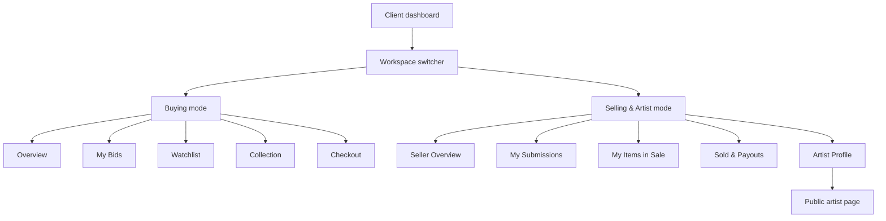

# Dashboard UX Audit

This audit covers the authenticated LAX dashboards for `administrator`, `accountant`, and `client`. It treats the client dashboard as a multi-persona workspace: every client can buy, sell, and potentially present as an artist by submitting work.

KYC and identity verification are intentionally out of scope for this audit.

## 1. Executive Summary

### P0 Gaps

- **No admin Categories CRUD.** The data model has `category.name`, `category.slug`, and `category.parentId` in `packages/db/src/schema/categories.ts`, but the API exposes only `GET /categories` and admin forms still collect category as a UUID-like field through `apps/web/src/lib/forms/schemas/admin-lot-form.ts` and `apps/web/src/lib/forms/schemas/admin-sale-form.ts`. This blocks non-technical catalog setup.
- **No artist entity or artist profile management.** The system has no `artist` role in `packages/types/src/user.ts`. Artist attribution is currently contextual via `LotMarketingDetails.sellerArtistId` and `artistNote` in `packages/types/src/lot.ts`. Admins cannot curate artist bios, portraits, links, featured status, profile claims, or attribution approvals.
- **No live saleroom console.** Sales support `deliveryMode` and `streamUrl` in `packages/db/src/schema/sales.ts`, but there is no auctioneer/clerk console for hammering lots, passing lots, entering floor/phone bids, or controlling the live sequence.
- **No client mode-switch UX.** A client can bid and submit, but the dashboard does not clearly separate buying tasks from selling/artist tasks. Seller activity, artist profile needs, payouts, and submission lifecycle are not organized as a coherent workspace.
- **No seller payouts or statements view.** `payment` stores `buyerId`, `sellerId`, `amount`, `platformFee`, and `status` in `packages/db/src/schema/payments.ts`, but sellers cannot see sold items, fees, net proceeds, payout holds, or statement PDFs.

### P1 Gaps

- **Admin lot creation is too thin for catalog operations.** The lot schema supports key auction fields in `packages/db/src/schema/lots.ts`, but the admin form lacks seller picker, artist picker, category picker, image manager, bulk import, duplicate/clone, public-card preview, fee preview, and operational state management for passed or withdrawn live lots.
- **No CMS, system settings, domain-events viewer, or webhook log viewer.** Tables exist for `domain_events`, `webhook_event`, email outbox/events, and Xero webhook events, but there is no operational UI for audit, debugging, static page content, platform defaults, or feature flags.
- **Submission review is not a full consignment workflow.** `item_submission` has review fields in `packages/db/src/schema/item-submissions.ts`, but the UI needs specialist assignment, photo-request threads, estimate/reserve negotiation, condition reports, and digital consignment agreements.
- **Accountant scope misses payout and tax operations.** Finance routes cover payments and Xero, but the accountant dashboard needs reconciliation, seller statements, payout schedules, refund reasons, partial refunds, VAT/tax exports, and failed sync queues.
- **Client settings and checkout are incomplete for auction ownership.** The API supports addresses, granular notifications, watchlists, artist follows, and checkout per lot, but the UX needs address management, payment methods, shipping/collection scheduling, multi-lot checkout, invoices, and resale shortcuts.

## 2. Methodology

Severity is assigned by operational impact:

- **P0:** Blocks a real auction marketplace from operating end-to-end or forces technical/manual workarounds for core staff tasks.
- **P1:** Causes frequent daily friction, manual reconciliation, or weak user confidence.
- **P2:** Improves speed, polish, personalization, or power-user efficiency.

For each role, this audit compares:

- The real role model in `packages/types/src/user.ts` and `packages/types/src/role-policy.ts`.
- The live route inventory under `apps/web/src/app/dashboard/**` and `apps/web/src/app/admin/**`.
- The data model under `packages/db/src/schema/**`.
- The mockups `LAX Dashboards.html`, `LAX Artist.html`, `LAX Saleroom.html`, `LAX Sales.html`, and `LAX Lot Detail.html`.
- Common marketplace patterns from buyer/seller dashboards, auction house account areas, and live auction clerking consoles.

KYC and identity verification are excluded even when a screen would commonly include them.

## 3. Cross-Cutting Gaps

### Navigation And Discovery

- **Global search / command palette:** `docs/design/mockup-parity.md` says a command palette exists as a deliberate superset, but the dashboard audit should verify it searches admin objects, lots, sales, users, submissions, payments, artists, and help actions, not just routes.
- **Saved views:** Admin tables need saved filters such as "Draft lots missing images", "Submissions pending > 48h", "Payments captured but unsynced", and "Users suspended".
- **Bulk actions:** Lots, submissions, users, invitations, email suppressions, and payments need bulk flows with confirmation and audit entries.
- **Mobile admin posture:** Admin can remain desktop-first, but tables and emergency actions need a safe mobile layout for operations away from a desk.

### Auditability

- **Record timeline:** Lots, sales, submissions, users, payments, and artists need a right-side activity timeline sourced from `domain_events`, status changes, email events, and staff notes.
- **Decision reasons:** Suspend, reject, refund, revoke, cancel, pass, withdraw, and publish actions need reason capture and a visible audit trail.
- **Operational logs:** `domain_events`, `webhook_event`, `xero_webhook_event`, `email_outbox`, and `email_event` have no dashboard-level viewer.

### Data Foundations

- **Currency:** `lot`, `sale`, and `payment` amounts are `numeric(18,2)` with no first-class currency column. Only `LotMarketingDetails.estimate.currency` exists in `packages/types/src/lot.ts`.
- **Timezone:** No user-level display timezone is visible in the schemas reviewed. Start/end times exist as timestamps, but operators need consistent display and export behavior.
- **Media:** Lots, submissions, and sales use string arrays for images. There is an `upload_object` table, but the admin UX needs primary image, alt text, captions, ordering, rejection state, and batch upload.
- **Notes and tags:** Admin users need internal notes and tags on users, lots, submissions, artists, sales, and payments.

## 4. Administrator Audit

Administrator is the only role with `platform.admin.full`, `auction.manage`, and `user.invite` in `packages/types/src/role-policy.ts`.

### 4.1 Operations / Overview

**Exists today:** `/admin` operations page with metrics, attention items, recent lots, and richer mockup-aligned components referenced in `docs/design/mockup-parity.md`.

**Missing UX:**

- SLA queues for submissions pending review, stale payments, draft lots scheduled in the past, failed Xero syncs, failed email sends, and webhook failures.
- Operational health cards for API, worker, websocket, email provider, uploads, Xero, and payment provider.
- "Today" run sheet: sales starting today, previews open today, lots ending soon, staff assignment gaps.
- Drill-down from each KPI into a filtered admin table.
- Record-level timeline preview for the latest critical events.

**Missing fields / data:**

- `payment` has no `updatedAt`, so stale payment status must use `createdAt` or event data from `packages/db/src/schema/payments.ts`.
- No explicit staff owner / specialist assignment on sale, lot, or submission.
- No priority, severity, or due date field for attention items.

**Severity:** P1. The current overview is useful, but staff still need separate tools or manual queries for real operations.

### 4.2 Sales

**Exists today:** `/admin/sales`, `/admin/sales/new`, `/admin/sales/[id]`, and `/admin/sales/[id]/edit`. `admin-sale-form.ts` captures title, description, cover images, category, delivery mode, stream URL, location, start/end/preview times, buyer premium, and terms.

**Missing UX:**

- Category picker instead of free text / UUID-style input.
- Sale duplication and sale template flows.
- Bulk lot attach, reorder, renumber, detach, and validation before publish.
- Catalog PDF generation and export package for marketing.
- Sale preview page from the admin perspective.
- Staff assignment: specialist, cataloguer, photographer, shipping contact, finance owner.
- Sale-level marketing workflow: banner copy, homepage feature, email schedule, social copy, press copy.
- Post-sale report: hammer total, sell-through, reserve misses, top bidders, payment status.
- Onsite run sheet: lot order, location setup, phone bidders, floor bidders, staff assignments.

**Missing fields / data:**

- Department / specialist assignment is absent from `packages/db/src/schema/sales.ts`.
- No sale slug / SEO title / SEO description fields in the sale table.
- No public publish checklist status.
- No sale-level currency.
- No default increment ladder, soft-close settings, or registration policy.

**Severity:** P0 for category picker and publish checklist; P1 for marketing and reporting workflow.

### 4.3 Lots

**Exists today:** `/admin/lots`, `/admin/lots/new`, `/admin/lots/[id]`, `/admin/lots/[id]/edit`. `admin-lot-form.ts` captures title, description, medium, dimensions, category ID, auction type, prices, buyer premium, increment, Dutch decrement settings, images, start time, and end time.

**Missing UX:**

- Seller picker. `lot.sellerId` is required in `packages/db/src/schema/lots.ts`, but the admin form does not collect it.
- Artist picker / attribution picker. `LotMarketingDetails.sellerArtistId` exists, but there is no first-class artist selection or approval workflow.
- Category tree picker with search, breadcrumbs, recent categories, and validation.
- Image manager: drag-drop upload, primary image, ordering, captions, alt text, crop preview, rejection reasons.
- Clone / duplicate lot.
- Bulk CSV or spreadsheet import with validation and image matching.
- Public-card preview and public detail preview.
- Fee and buyer-premium calculator.
- Increment ladder preview.
- Auction status controls: schedule, publish, cancel, pass, withdraw, re-open.
- Condition report authoring and download management.
- Certificate of authenticity and provenance attachment handling.
- Shipping fields: packed dimensions, weight, pickup restrictions, fragile flag, customs notes, HS code.

**Missing fields / data:**

- No first-class `artistId` column. Current best available path is `marketingDetails.sellerArtistId`.
- No lot slug or SEO metadata.
- No condition state, framed/unframed, signature, edition, year, provenance, exhibition history, or certificate fields outside JSON marketing details.
- No shipping dimensions or weight.
- No sale-room state for passed/withdrawn/reopened beyond `lot.status` values in `packages/db/src/schema/lots.ts`.

**Severity:** P0 for seller/category/artist picking; P1 for media, catalog enrichment, shipping, and bulk import.

### 4.4 Categories

**Exists today:** A `category` table with `name`, `slug`, and `parentId` in `packages/db/src/schema/categories.ts`. API inventory found `GET /categories` only.

**Missing UX:**

- Admin category list and tree view.
- Create, edit, delete, archive, merge, and reorder.
- Parent picker and breadcrumb preview.
- Slug generation and conflict handling.
- Category usage count before deletion.
- Category-specific defaults: buyer premium, increment ladder, shipping handling, terms note, display icon, featured flag.
- SEO fields for public category pages if categories become browsable.

**Missing fields / data:**

- No description, icon, sort order, archived flag, SEO title, SEO description, default buyer premium, or default increment ladder.

**Severity:** P0. Admin lot and sale creation cannot be operated comfortably without this.

### 4.5 Artists

**Exists today:** No `artist` role in `packages/types/src/user.ts`. Public artist profile mockup exists in `LAX Artist.html`. `artist_watchlist` references a user as an artist-like profile, and lot marketing JSON can store `sellerArtistId`.

**Missing UX:**

- Admin artist directory.
- Create/edit artist profile.
- Claim / link artist profile to a client user.
- Merge duplicate artist profiles.
- Attribution approval queue when a seller claims "I am the artist".
- Featured artist curation.
- Public profile preview from admin.
- Artist follow analytics and related-lot management.

**Recommended artist fields:**

- Display name, slug, portrait, hero image.
- Birth/death years, nationality, location.
- Short bio, long bio, artist statement.
- Website and social links.
- CV / exhibitions / awards.
- Signature image or marker.
- Featured flag, verified/claimed flag, profile owner user ID.
- Admin notes and merge history.

**Severity:** P0. The public UX treats artists as a first-class content type, but the admin system cannot manage them as one.

### 4.6 Submissions

**Exists today:** Client submission create/edit and admin submission list/detail. Schema has seller, title, description, medium, dimensions, images, asking price, reserve price, category, submitter notes, status, review fields, rejection reason, and converted lot ID in `packages/db/src/schema/item-submissions.ts`.

**Missing UX:**

- Specialist assignment and due date.
- Request-more-information thread with file requests.
- Estimate/reserve negotiation with visible counter-offers.
- Condition report request and internal review notes.
- Conversion preview before creating the draft lot.
- Batch approve / reject.
- Digital consignment agreement status.
- Seller-facing status explanation for every state.
- Internal duplicate detection against existing artists/lots.

**Missing fields / data:**

- No specialist/assignee.
- No conversation/thread model.
- No submission-level provenance, exhibition history, signature, year, edition, certificate, condition self-report, packed dimensions, or weight.
- No agreement ID/status.

**Severity:** P1. Current review covers a basic approval loop, but real consignment work needs structured negotiation and evidence gathering.

### 4.7 Users

**Exists today:** Admin users list with search, role filtering, suspend/unsuspend, and role updates. Invitations exist for pre-assigned roles.

**Missing UX:**

- Full user detail page, not just a drawer.
- Bid history, won lots, sold lots, submissions, payments, addresses, notifications, artist follows, lot watchlist.
- Suspension form with required reason and history.
- Paddle / sale registration and credit-limit decisions. Identity verification remains out of scope.
- Internal notes and tags.
- Account merge and duplicate detection.
- "View as user" / impersonation guardrails with audit logging.
- GDPR export and deletion workflow links.
- Email status timeline from email suppression/bounce data.

**Missing fields / data:**

- No first-class staff notes/tags.
- No credit limit, paddle number, or per-sale approval model.
- No user timezone/currency preference.

**Severity:** P1, with P0 impact once paddle registration or credit control becomes required.

### 4.8 Invitations

**Exists today:** Admin invitation form and list. `user_invitation` stores email, target role, token hash, status, expiration, accepted user, creator, and timestamps.

**Missing UX:**

- Bulk CSV invite.
- Custom message per invite.
- Role-specific preview of the email.
- Resend history and delivery status.
- Invite link copy action.
- Expiry extension.
- Invite-to-existing-user handling.

**Severity:** P2 for most items; P1 for resend history and delivery visibility.

### 4.9 Analytics

**Exists today:** Admin analytics page with GMV, lot, registration, hammer-rate, and conversion-style KPIs.

**Missing UX:**

- Per-sale, per-category, per-artist, per-seller analytics.
- Reserve performance: reserve met/missed, estimate accuracy, hammer vs estimate.
- Funnel analytics: view, watch, register, bid, win, pay.
- Cohort retention for bidders and sellers.
- Traffic source attribution and campaign performance.
- CSV export and scheduled reports.
- Drill-through from KPI to matching records.

**Missing fields / data:**

- No analytics aggregate tables are visible; most metrics must be computed from transactional data or events.
- No campaign/source attribution model.

**Severity:** P1.

### 4.10 Email

**Exists today:** Admin email outbox and suppression surfaces; email outbox/events/suppressions exist in the DB.

**Missing UX:**

- Template editor and preview.
- Test send.
- Per-template event history.
- Campaign/newsletter composer.
- Segment builder using watchlists, artist follows, category interests, and sale follows.
- Bounce/complaint remediation flow.

**Severity:** P1 for template preview and failed-send operations; P2 for campaign tooling.

### 4.11 Live Saleroom Console

**Exists today:** Public saleroom mockup and live saleroom cards, but no dedicated clerk/auctioneer console.

**Required UX:**

- Current lot panel with image, title, reserve indicator, estimate, current ask, high bidder, source, and warning states.
- Next/previous lot controls and searchable lot queue.
- Manual bid entry with source: floor, phone, absentee, online.
- Paddle lookup and bidder eligibility status.
- Hammer, pass, withdraw, re-open, and undo-last-action with confirmation.
- Asking price override and increment override.
- Bid history with timestamps and source.
- Auctioneer screen mode with large current ask and next increment.
- Broadcast messages to online bidders.
- Operator keyboard shortcuts for speed.

**Missing fields / data:**

- No explicit bid source enum in `bid`.
- No sale-room action log separate from generic domain events.
- No passed/withdrawn/reopened statuses beyond existing `lot_status`.

**Severity:** P0 if onsite/live sales are in V1 operations.

### 4.12 Content Management

**Exists today:** Static HTML mockups and marketing routes, but no admin CMS.

**Missing UX:**

- Edit About, FAQ, Terms, Privacy, Shipping, Contact copy.
- Homepage hero and featured sale selection.
- Featured artist and featured lot curation.
- Banners and announcement bars.
- Structured-data overrides.
- Draft/preview/publish flow for content.

**Severity:** P1.

### 4.13 System Settings

**Exists today:** No visible admin system settings area.

**Missing UX:**

- Platform defaults: buyer premium, increment ladder, currency, timezone, tax settings, soft-close window, reserve policy.
- Email provider settings health.
- Payment/Xero mapping rules.
- Upload limits and allowed media types.
- Feature flags.
- Terms revision and acceptance tracking.
- JWKS/key status visibility for operational support.

**Severity:** P1.

### 4.14 Domain Events / Audit

**Exists today:** `domain_events` and projector state exist in the data model.

**Missing UX:**

- Searchable event viewer.
- Filters by aggregate type, aggregate ID, actor, event type, correlation ID, and date.
- Linked record timeline.
- Event payload diff view.
- Projector lag / failure status.

**Severity:** P1.

### 4.15 Webhook Logs

**Exists today:** Generic webhook and Xero webhook tables exist.

**Missing UX:**

- Webhook inbox with provider, event type, status, created time, and retry count.
- Payload viewer with sensitive fields masked.
- Replay/reprocess action where safe.
- Dead-letter queue for permanent failures.

**Severity:** P1 for Xero/payment operations; P2 for low-volume integrations.

## 5. Accountant Audit

Accountant has `finance.read` and `finance.write` through `packages/types/src/role-policy.ts`, but cannot access full platform admin.

### 5.1 Payments

**Exists today:** `/admin/payments` with status filtering and actions for capture/refund paths. `payment` stores amount, platform fee, status, gateway external ID, buyer, seller, and lot.

**Missing UX:**

- Capture/refund reason capture.
- Partial refunds.
- Dispute / chargeback workflow.
- Manual payment record for wire, cash, or offline settlement.
- Receipt re-issue.
- Payment timeline with gateway events.
- Reconciliation status and bank export import.
- Search by invoice number, buyer, seller, lot, sale, amount, and gateway ID.

**Missing fields / data:**

- No `updatedAt` or status-change timestamp on `payment`.
- No payment method type or settlement date.
- No refund reason, dispute status, or reconciliation status.

**Severity:** P1.

### 5.2 Xero

**Exists today:** Xero connection UI and `payment_external_ref` / `xero_connection` / `xero_webhook_event` data support.

**Missing UX:**

- Per-payment sync timeline.
- Failed sync queue with retry action.
- Mapping rules editor.
- Tenant disconnect history.
- Webhook event viewer.
- Invoice preview and public invoice URL copy action.

**Severity:** P1.

### 5.3 Seller Payouts

**Exists today:** Seller is stored on `payment`, but there is no payout dashboard.

**Missing UX:**

- Payout schedule by seller.
- Statement preview and PDF export.
- Hold/release workflow.
- Net calculation: hammer, seller fee, platform fee, tax, adjustments, payout.
- Bank details status and change workflow.
- Bulk mark as paid.
- Seller-facing payout status synced with client seller mode.

**Missing fields / data:**

- No payout table.
- No seller statement table.
- No payout method or bank account status.

**Severity:** P0 for a marketplace that pays sellers through the platform.

### 5.4 Tax / VAT

**Missing UX:**

- VAT/tax settings per category and seller.
- Margin scheme handling for art where relevant.
- Tax report by period.
- Invoice tax code mapping to Xero.
- Buyer/seller business profile fields surfaced to finance.

**Severity:** P1.

### 5.5 Reports

**Missing UX:**

- Period close report.
- GMV and fee report.
- Refund and adjustment report.
- Seller statements export.
- Xero sync exception report.
- CSV exports with saved date ranges.

**Severity:** P1.

## 6. Client Audit

The `client` role has both `bid.place` and `client.submit`, so buying and selling are modes inside one account rather than separate roles.

### 6.1 Mode-Switch UX Recommendation

Use a **scoped workspace switcher** inside the client dashboard.

- **Default mode:** Buying.
- **Second mode:** Selling & Artist.
- **Placement:** Persistent two-pill switcher in the dashboard sidebar below the user card on desktop.
- **Mobile:** Account bottom sheet with the same switcher and contextual "View buying dashboard" / "View selling dashboard" links.
- **Persistence:** Store preferred mode per device or account preference, but deep links should always resolve directly.
- **Activation:** The selling mode is available to every client. If the user has never submitted, show an onboarding empty state instead of hiding the mode.
- **Artist opt-in:** Inside selling mode, offer "I am the artist of works I sell" to unlock artist profile editing and attribution workflows. Do not create a separate `artist` RBAC role.
- **Shared utilities:** Notifications, settings, global search, and support remain shared across both modes.

### 6.2 Buying Mode

**Overview:**

- Add next required action cards: pay invoice, arrange shipping, register for sale, outbid, won lot awaiting checkout.
- Add upcoming watched lots grouped by close time.
- Add sale registrations and bidder status.

**Bids:**

- Surface auto-bid ceiling editing for `bid.max_auto_bid_amount`.
- Show current position derived from bid history and `isWinning`.
- Add absentee bid / written bid request for live sales.
- Show bid receipts and timestamps.
- Show increment ladder and anti-snipe messaging where configured.

**Watchlist:**

- Add sort by closing soon, recently added, estimate, category, artist.
- Add per-lot notification rules.
- Add folders or saved groups.
- Keep artist follows visible as a sibling of lot watchlist.

**Collection / Won Lots:**

- Show paid/unpaid, invoice link, shipping/collection status, certificate/condition report downloads.
- Add resale-on-LAX shortcut.
- Add insurance/storage options where relevant.
- Show seller-facing distinction: buyer premium is paid by buyer, seller payout is separate.

**Checkout:**

- Add multi-lot checkout across a sale.
- Add billing/shipping address selection.
- Add saved payment methods.
- Add shipping quote and collection booking.
- Add invoice/receipt download.

**Settings:**

- Add address book UI backed by `/users/me/addresses`.
- Add payment methods.
- Add 2FA/security history.
- Add business/VAT profile, tax country, display currency, display timezone, language, data export, deletion request, and connected accounts.
- KYC remains out of scope.

**Live bidding / sale registration:**

- Add sale registration and paddle approval flow without identity-verification scope.
- Add live bidder view with current lot, big-bid button, max bid, stream, countdown, and bid confirmation.

### 6.3 Selling & Artist Mode

**Seller Overview:**

- Items in draft, submitted, in review, approved, in sale, sold, and paid.
- Payout due and next payout date.
- Specialist messages needing reply.
- Artist profile completeness if artist mode is enabled.

**My Submissions:**

- Existing submission fields should expand beyond `packages/db/src/schema/item-submissions.ts`.
- Add year, signature, edition, provenance, exhibition history, condition self-report, certificate upload, video link, packed size, weight, valuation expectations, and preferred reserve.
- Add draft quality checklist before submit.
- Add "copy from previous submission".

**Negotiation Thread:**

- Specialist messages and file requests.
- Estimate proposal and reserve counter-offer.
- Seller acceptance record.
- Consignment agreement signature status.

**My Items In Sale:**

- Show lots created from the seller's submissions.
- Current bid, reserve met, watch count, sale date, and public lot link.
- Seller-safe messaging: avoid revealing private bidder data.

**Sold & Payouts:**

- Lot, hammer price, seller fees, adjustments, tax, net payout, payout status, and statement PDF.
- Explain buyer premium separately from seller proceeds.
- Show hold reasons and expected payout date.

**Artist Profile:**

- Display name, portrait, bio, artist statement, links, CV, exhibitions, awards, signature image, location, featured request.
- Claim/verification here means profile ownership and attribution review, not KYC.
- Preview public page using the `LAX Artist.html` mental model.

**Followers & Stats:**

- Artist follower count from `artist_watchlist`.
- Lot views, watches, bids, sold count, average hammer, and category mix.
- New follower notifications and sale announcement targeting.

### 6.4 Shared Client Settings

Shared settings should remain outside the mode split:

- Profile, email, password/security.
- Addresses and payment methods.
- Notification preferences from `notification_preference`.
- Privacy, data export, deletion request.
- Language, display currency, display timezone.
- Business/tax profile.

## 7. Per-Creation-Flow Field Audit

### Sale Creation

**Present today:** title, description, cover images, category ID, delivery mode, stream URL, structured location, start/end/preview times, buyer premium rate, terms.

**Add for V1 operations:**

- Category picker replacing raw category entry. P0.
- Publish checklist. P0.
- Staff owner/specialist/contact assignment. P1.
- Sale slug, SEO title, SEO description. P1.
- Marketing schedule and featured sale flag. P1.
- Catalog PDF/export state. P1.
- Registration policy and paddle approval settings. P1.
- Increment ladder / soft-close defaults. P1.
- Post-sale report link. P2.

### Lot Creation

**Present today:** title, description, medium, dimensions, images, category ID, auction type, starting/current/reserve/buy-now prices, buyer premium, min increment, Dutch decrement fields, start/end, seller ID in schema, status, winner ID.

**Add for V1 operations:**

- Seller picker. P0.
- Artist picker / attribution picker. P0.
- Category tree picker. P0.
- Image manager with primary/caption/alt/order. P1.
- Year, signature, edition, provenance, exhibitions, condition, certificate. P1.
- Packed dimensions, weight, shipping restrictions, customs notes. P1.
- Public-card preview. P1.
- Fee/increment/reserve preview. P1.
- Clone and bulk import. P1.
- Passed/withdrawn/reopened live sale controls. P1.

### Lot Marketing

**Present today:** `LotMarketingDetails` supports estimate, condition report, provenance, seller artist ID, image alts, exhibitions, and artist note.

**Add for V1 operations:**

- Admin authoring UI for every marketing JSON field. P1.
- Structured condition report editor. P1.
- Artist profile fallback preview. P1.
- Provenance/exhibition list builder. P1.
- Public page preview. P1.

### Submission Creation

**Present today:** title, description, medium, dimensions, category, images, asking price, reserve price, submitter notes.

**Add for V1 operations:**

- Better category picker. P0.
- Year, signature, edition, provenance, exhibitions, condition self-report. P1.
- Certificate upload and supporting documents. P1.
- Packed dimensions, weight, shipping notes. P1.
- Preferred reserve / valuation expectations with explanation. P1.
- Artist opt-in claim. P1.

### Category Creation

**Present today:** data model only: name, slug, parent ID.

**Add for V1 operations:**

- Admin CRUD UI and API. P0.
- Tree view with reorder/merge/archive. P0.
- Description, icon, sort order, archived flag. P1.
- SEO fields. P1.
- Default premium/increment/shipping rules. P1.

### Artist Creation

**Present today:** no first-class entity; artist-like behavior is user/profile based.

**Add for V1 operations:**

- Artist profile model or clearly defined user-profile extension. P0.
- Admin artist CRUD. P0.
- Claim/link profile to client user. P0.
- Merge duplicates and attribution approval. P1.
- Featured artist curation. P1.

### User / Invitation

**Present today:** roles, invitation target role, invite status, suspension fields, profile basics, email status.

**Add for V1 operations:**

- User detail page. P1.
- Notes/tags. P1.
- Paddle/sale registration and credit decision state. P1.
- Bulk invites and invite delivery history. P2.
- GDPR export/delete workflow links. P1.

### Payment / Payout

**Present today:** payment amount, platform fee, status, lot, buyer, seller, gateway ID, Xero external reference.

**Add for V1 operations:**

- Payment updated/status-change timestamp. P1.
- Refund/capture reason. P1.
- Partial refund and dispute state. P1.
- Payout table and seller statement table. P0.
- Reconciliation status and settlement date. P1.

### Address

**Present today:** `user_address` exists and user API supports addresses.

**Add for V1 operations:**

- Client address book UI. P1.
- Checkout address picker. P1.
- Billing vs shipping distinction. P1.
- Collection/pickup preference. P2.

## 8. Recommendations Summary

1. Build admin Categories CRUD first, then replace all raw category inputs with a picker.
2. Define artist as a first-class content/profile concept while keeping RBAC roles unchanged.
3. Add seller and artist pickers to lot creation before expanding lower-priority catalog polish.
4. Design the client dashboard as two modes: Buying and Selling & Artist.
5. Add seller payouts/statements before inviting real sellers into the platform at scale.
6. Add a live saleroom console if onsite/live auctions are part of the near-term launch.
7. Add audit/log viewers for domain events, webhooks, email, and Xero to reduce production debugging risk.
8. Expand submission review into a real consignment workflow with specialist communication, negotiation, and agreement status.
