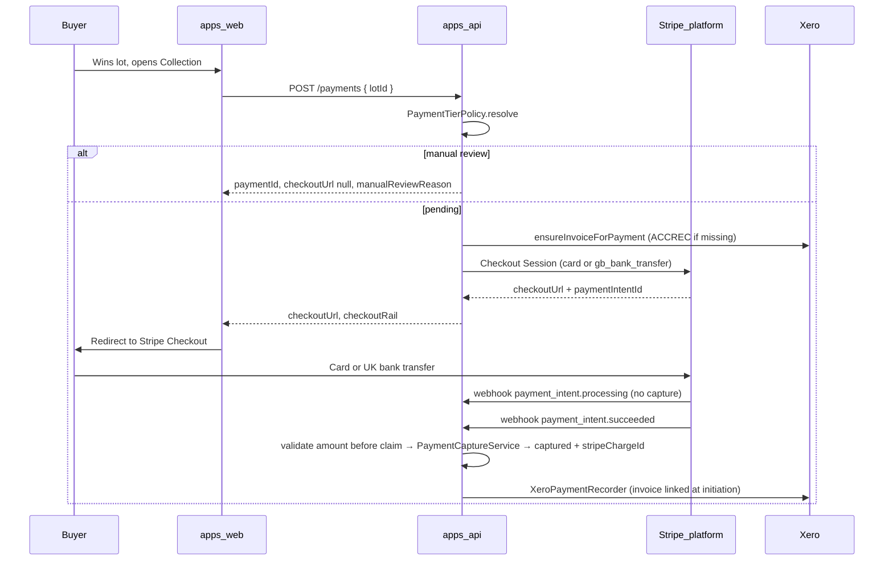

# Buyer payment flow (Stripe Checkout tiers + Xero ledger)

Buyers pay on the **LAX Stripe Connect platform account** via hosted **Stripe Checkout**. Xero is **ledger-only** (ACCREC invoice + payment sync) — not a buyer checkout rail.

## Tiered checkout

| Tier | Amount (default thresholds) | Rail |
|------|------------------------------|------|
| Card | ≤ £100,000 | Stripe card Checkout |
| Bank transfer | > £100,000 and < £500,000 | Stripe `gb_bank_transfer` |
| Manual review | ≥ £500,000 or archived seller | No URL until finance **Release for checkout** |
| Blocked | > £999,999.99 | `400 payment_amount_exceeds_limit` |

Env: `STRIPE_CARD_CHECKOUT_MAX`, `STRIPE_MANUAL_REVIEW_MIN`, `STRIPE_ABSOLUTE_MAX` (major GBP units).

## Journey (mermaid)

## Step-by-step

1. **Win:** Lot closes; buyer is `winnerId` on the lot.
2. **Checkout:** Buyer opens `/dashboard/checkout/[lotId]`. UI calls `POST /payments`.
3. **Tier policy:** Integer pence comparison — no float tier bugs.
4. **Xero invoice (when issuing checkout):** `ensureInvoiceForPayment` runs **only** when returning a checkout URL (not while `requires_manual_review`). Fails hard with `503 accounting_unavailable` when Xero is configured but invoice creation fails.
5. **Redirect:** Browser `window.location.assign(checkoutUrl)` when URL present.
6. **Stripe path:** `payment_intent.succeeded` → amount validated **before** event claim → capture + Xero invoice paid sync.

## Timing (record per environment)

| Hop | Typical observation | Notes |
|-----|---------------------|-------|
| POST /payments → checkout URL | 1–5 s | Stripe API latency |
| Stripe Checkout completion | user-dependent | Card: seconds; bank transfer: hours |
| DB `captured` after Stripe | seconds after webhook | Requires `STRIPE_PAYMENTS_WEBHOOK_SECRET` + `payment_intent.succeeded` |
| Bank transfer processing | hours | `payment_intent.processing` → status `authorized`; no capture until succeeded |
| Bank transfer underpaid | varies | `payment_intent.partially_funded` — stays uncaptured; domain event `payment.bank_transfer_partially_funded` |

## Troubleshooting

| Symptom | Check | Action |
|---------|-------|--------|
| No `checkoutUrl` | Amount tier / manual review | High value → finance release; archived seller → review queue |
| `503 accounting_unavailable` | Xero OAuth + invoice API | Fix Xero; no Stripe URL until invoice succeeds |
| Payment pending after Stripe pay | Payments webhook delivery | Verify `payment_intent.succeeded` subscribed |
| Amount mismatch | `payment_intent_amount_mismatch` metric | Fix payment row amount vs Stripe PI; webhook not claimed |
| Expired checkout link on retry | Same Stripe idempotency key returns stale session | API auto-renews with `:renewed:` key when session is expired |

## Related

- [Xero + Stripe platform setup](./xero-stripe-payment-setup.md)
- [Stripe Connect go-live](./stripe-connect-go-live.md)
