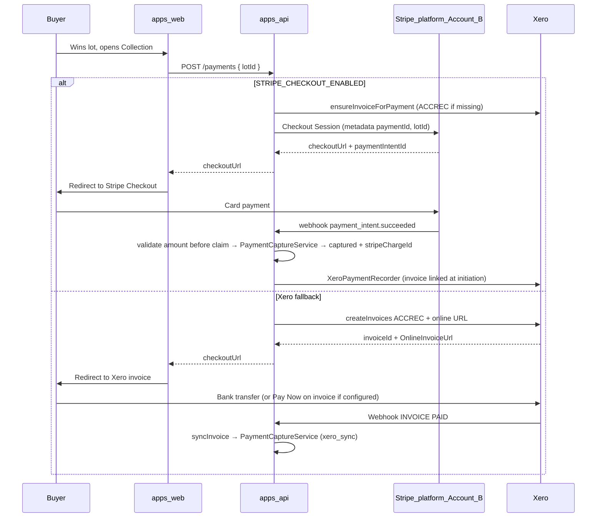

# Buyer payment flow (Stripe Checkout + Xero invoice)

Buyers pay on the **LAX Stripe platform account (Account B)** via hosted **Stripe Checkout** when `STRIPE_CHECKOUT_ENABLED=true`, or via **Xero online invoice** (bank transfer / legacy Pay Now on invoice) when Xero is configured.

## Journey (mermaid)

## Step-by-step

1. **Win:** Lot closes; buyer is `winnerId` on the lot.
2. **Checkout:** Buyer opens `/dashboard/checkout/[lotId]`. UI calls `POST /payments`.
3. **Xero invoice (eager):** When Xero is configured, `ensureInvoiceForPayment` creates an ACCREC invoice **before** redirect — required for Stripe-primary checkout so `XeroPaymentRecorder` can sync capture.
4. **Checkout URL:** `PaymentCheckoutOrchestrator` prefers Stripe Checkout when enabled; otherwise Xero invoice URL; otherwise error (no misleading “settlements team” default when Stripe is enabled).
5. **Redirect:** Browser `window.location.assign(checkoutUrl)` (`checkout-purchase-panel.tsx`).
6. **Stripe path:** Buyer pays on Stripe Checkout → `payment_intent.succeeded` → amount validated **before** event claim → capture + Xero invoice paid sync.
7. **Xero path:** Buyer pays invoice → Xero webhook → `markCapturedFromProviderSync` via `PaymentCaptureService`.

## Timing (record per environment)

| Hop | Typical observation | Notes |
|-----|---------------------|-------|
| POST /payments → checkout URL | 1–5 s | Stripe or Xero API latency |
| Stripe Checkout completion | user-dependent | Usually seconds |
| DB `captured` after Stripe | seconds after webhook | Requires `STRIPE_PAYMENTS_WEBHOOK_SECRET` + `payment_intent.succeeded` on payments destination |
| Xero bank transfer → `captured` | hours–days | Xero webhook when invoice PAID |

## Disputes and refunds

- Stripe emits `charge.dispute.*` and `charge.refunded` on `POST /webhooks/stripe/payments`.
- Refund/dispute lines update open payout totals via `PayoutAdjustmentService`. Multiple partial refunds on the same open payout **aggregate** into one line per `(payout, payment, kind)` instead of inserting duplicates.
- Settlement sale lines use the **gross** captured amount; prior refund/dispute clawback lines are the ledger of record (no double-debit at settlement).
- Dispute clawback runs only when `dispute.status === "lost"` (`warning_closed` / `charge_refunded` do not claw back).
- Post-payout refunds create clawback payouts (parity with dispute-lost).
- Admin refunds that succeed in Stripe but fail DB persist enqueue `payment_refund_reconcile` for cron replay (`POST /internal/jobs/retry-refund-reconciles`).
- See [Dispute clawback](./dispute-clawback.md).

## Troubleshooting

| Symptom | Check | Action |
|---------|-------|--------|
| No `checkoutUrl` | `STRIPE_CHECKOUT_ENABLED`, Xero OAuth | Enable Stripe checkout or fix Xero trio |
| Payment pending after Stripe pay | Payments webhook delivery | Verify `payment_intent.succeeded` subscribed; check API logs |
| Payment pending after Stripe pay (amount drift) | `payment_intent_amount_mismatch` metric | Fix payment row amount vs Stripe PI; webhook is **not** claimed so Stripe retries |
| Xero capture sync missing after Stripe pay | `xero_payment_record_failed` metric | Confirm ACCREC invoice exists (`payment_external_ref.xero_invoice_id`); run `POST /internal/jobs/retry-xero-stripe-capture-sync` |
| No `stripeChargeId` after Xero capture | Charge lookup metadata | Ensure invoice reference `payment:{id}`; capture service backfills from Stripe search |
| Connect onboarding fails | Stripe account type | Platform must be Account B — not Xero-OAuth account |

## Related

- [Xero + Stripe platform setup](./xero-stripe-payment-setup.md)
- [Stripe Connect go-live](./stripe-connect-go-live.md)
