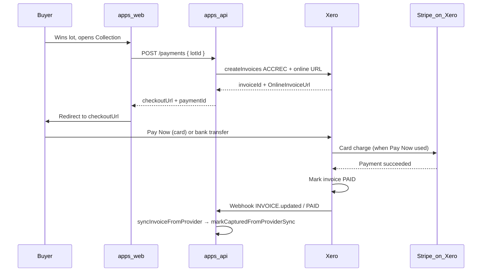

# Buyer payment flow (Xero invoice + Stripe on Xero)

This document describes the **implemented** buyer pay-in path: no in-app Stripe.js; payment is completed on **Xero’s hosted invoice** with **Pay Now** (Stripe on Xero) or bank transfer.

## Journey (mermaid)

## Step-by-step

1. **Win:** Lot closes; buyer is `winnerId` on the lot.
2. **Checkout shell:** Buyer opens `/dashboard/checkout/[lotId]` (`apps/web`). UI calls server action → `POST /payments` (`apps/api/src/routes/payments.ts`).
3. **Invoice:** `PaymentService.createPendingForWinner` inserts `payment` with `stripePaymentIntentId = null` and, when Xero is configured, `XeroAccountingProvider.createCheckoutForWinner` creates the ACCREC invoice and returns `checkoutUrl` (online invoice).
4. **Redirect:** Browser `window.location.assign(checkoutUrl)` (`checkout-purchase-panel.tsx`).
5. **Pay on Xero:** Buyer uses **Pay Now** (Stripe) or enters bank transfer per Xero’s options.
6. **Reconciliation:** When Xero shows the invoice **paid**, our **Xero webhook** (`apps/api/src/routes/xero-webhook.ts`) triggers `accountingProvider.syncInvoiceFromProvider` → `PaymentService.markCapturedFromProviderSync` → `payment.status` becomes **`captured`**.

## Timing (record per environment)

| Hop | Typical observation | Notes |
|-----|---------------------|-------|
| POST /payments → Xero invoice created | 1–5 s | Depends on Xero API latency |
| Buyer completes Pay Now | user-dependent | Stripe processing usually seconds |
| Xero shows PAID | seconds–minutes | |
| Our DB shows `captured` | seconds after Xero PAID + webhook delivery | Requires `XERO_WEBHOOK_KEY` and reachable `https://api…/webhooks/xero` |

_Fill the “Observed” row after each drill in staging/production._

## Disputes and refunds

- **Disputes:** Stripe emits `charge.dispute.*`; we handle `charge.dispute.created`, `charge.dispute.closed`, and `charge.refunded` on `POST /webhooks/stripe/payments` (`stripe.ts`).
- **Refunds:** Same payments webhook path; see [Dispute clawback](./dispute-clawback.md).

## Troubleshooting

| Symptom | Check | Action |
|---------|-------|--------|
| No `checkoutUrl` from API | Xero OAuth vars unset or partial | Fix `XERO_CLIENT_ID` / `SECRET` / `REDIRECT_URI` trio; see [Xero token loss](./xero-token-loss.md) |
| Invoice unpaid after buyer paid | Xero invoice status | Wait; if stuck, **Admin** → Xero sync for payment |
| Webhook missed | Xero developer delivery log, API logs | Replay sync; verify signing key `XERO_WEBHOOK_KEY` |
| Pay Now missing | Xero payment service + branding theme | Follow [xero-stripe-payment-setup](./xero-stripe-payment-setup.md) |

## Screenshot requirement

Attach **Pay Now** on the live-style online invoice page to the same evidence pack as `xero-stripe-payment-setup.md` (see that runbook for path).

## Related

- [Xero + Stripe payment setup](./xero-stripe-payment-setup.md)
- [Monitoring alerts](./monitoring-alerts.md) — money-path metrics once enabled
