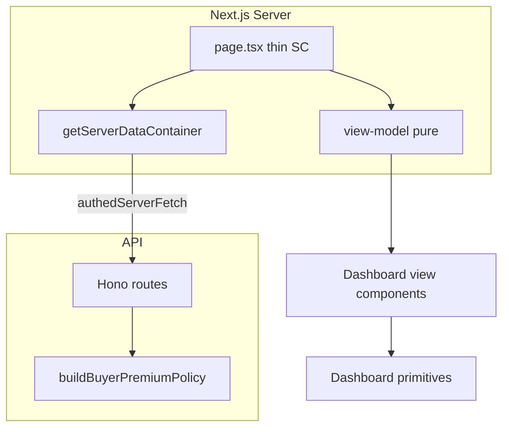

# Client dashboard audit — SOLID, BE-first, UI/UX

**Scope:** All routes under `apps/web/src/app/dashboard/` and shared components under `apps/web/src/components/dashboard/`.  
**Audience:** Engineering — prioritised backlog for hardening PRs.  
**Method:** Static review of data flow (SSR vs CSR), container vs direct `*.server.ts` imports, view-model purity, and UI patterns (loading / empty / error / dark / responsive / a11y).

---

## Cross-cutting summary

- **Data access (buyer + settings):** Pages use `getServerDataContainer()`; shared types live in `apps/web/src/lib/data/dto/dashboard-dtos.ts` (not `*.server.ts`).
- **Pricing:** `checkoutPricing` is attached on portfolio, single-lot `GET`, public `GET /lots`, `/users/me/bids`, and `/users/me/watchlist` via `lotsWithCheckoutPricing`. Web VMs (`dashboard-checkout.vm`, `lot-pricing-helpers`, portfolio cards) consume BE numbers only.
- **Parallelism:** `dashboard/page.tsx` uses `Promise.allSettled` with per-slice error messages.
- **Empty / error / loading:** Dashboard primitives (`DashboardSection`, `DashboardEmptyState`, `DashboardErrorAlert`, `DashboardSkeleton` incl. `checkout`) + co-located `loading.tsx` for settings and key buyer routes; nested `settings/error.tsx`.
- **SOLID:** Composition root documented in `apps/web/src/lib/data/README.md`; seller/team/live still have backlog items outside this pass.
- **BE gaps (remaining):** Optional aggregated `GET /users/me/portfolio`; bid eligibility on lot DTOs for dashboard (P1 elsewhere).
- **Sequencing:** Sale tier JSON flows through `computeLotCheckoutPricing` / shared batch helper.

---

## Route-by-route findings

Bulleted rows: **Path** — purpose · **Data** · **SOLID** · **BE** · **UI/UX** · **Severity** · **Effort**

### `/dashboard` (home)

- **Status (buyer pass):** Container-only fetches, `Promise.allSettled`, `DashboardSkeleton` suspense fallback, `OrgSubmittedAlert`, slice errors via `OverviewErrorsAlert` → `DashboardErrorAlert`.

### `/dashboard/bids`

- **Path:** `apps/web/src/app/dashboard/bids/page.tsx`
- **Purpose:** Bid history with artist resolution.
- **Data:** Container + `resolveArtistNames` (server helper). Generally SSR-aligned.
- **SOLID:** Artist name resolution is cross-cutting; acceptable as infra; could move to API.
- **BE:** Optional: return artist display name on bid row from API.
- **UI/UX:** Has `loading.tsx`. Uses `BidsBoard` — verify empty state and mobile table overflow.
- **Severity:** P2 · **Effort:** S.

### `/dashboard/watchlist`

- **Path:** `apps/web/src/app/dashboard/watchlist/page.tsx`
- **Data:** Container watchlist reader. SSR.
- **SOLID:** OK.
- **BE:** Lot pricing for display if showing estimates — low priority.
- **UI/UX:** Has `loading.tsx`. Confirm heart/remove actions use server actions consistently.
- **Severity:** P2 · **Effort:** S.

### `/dashboard/portfolio`

- **Status (buyer pass):** `DashboardSection` / `DashboardEmptyState` / `DashboardErrorAlert`; analytics + grid; BE `checkoutPricing` on portfolio lots; VM has no hammer×rate path.

### `/dashboard/payments`

- **Path:** `apps/web/src/app/dashboard/payments/page.tsx`
- **Data:** Container payments + auth guard. SSR.
- **SOLID:** Page may still format status — check duplication with presenters.
- **BE:** Status labels ideally single source (`@/lib/presenters/payment-status`).
- **UI/UX:** Has `loading.tsx`. Card list — check responsive image aspect.
- **Severity:** P2 · **Effort:** S.

### `/dashboard/checkout`

- **Path:** `apps/web/src/app/dashboard/checkout/page.tsx`
- **Purpose:** Hub / redirect?
- **Data:** Read file in implementation pass.
- **Severity:** P2 · **Effort:** S.

### `/dashboard/checkout/[lotId]`

- **Status (buyer pass):** Container + parallel fetch; `buildCheckoutTotalsVm` requires `checkoutPricing`; `DashboardSection` wraps flow; mobile totals bar unchanged.

### `/dashboard/notifications`

- **Path:** `apps/web/src/app/dashboard/notifications/page.tsx`
- **Data:** Likely SSR + board component.
- **BE:** Grouping/unread counts could be API-driven (P2).
- **UI/UX:** Has `loading.tsx`. Inbox board a11y (list roles).
- **Severity:** P2 · **Effort:** M.

### `/dashboard/live/upcoming` and `/dashboard/live/[saleId]`

- **Paths:** `live/upcoming/page.tsx`, `live/[saleId]/page.tsx`
- **Data:** Minimal shells — verify data sources (may be client-heavy).
- **SOLID:** Risk of client-only fetch — audit in Phase 3B.
- **UI/UX:** Has `live/loading.tsx`. Empty states use `EmptyState` — good.
- **Severity:** P2 · **Effort:** M.

### `/dashboard/seller` (hub)

- **Path:** `seller/page.tsx`
- **Data:** `requireAuthenticatedUser`, `getServerLotReader`, `getServerSaleWithLots`, `getMySubmissions` — **not** container.
- **SOLID:** High coupling; seller hub should use container + seller reader interface.
- **BE:** Aggregated “seller dashboard summary” endpoint would reduce fan-out (P2).
- **UI/UX:** Cards and links — verify dark mode on secondary text.
- **Severity:** P1 · **Effort:** M.

### `/dashboard/seller/in-sale`

- **Path:** `seller/in-sale/page.tsx`
- **Data:** Seller-specific; likely acting context + lots.
- **Severity:** P1 · **Effort:** M.

### `/dashboard/seller/payouts`

- **Path:** `seller/payouts/page.tsx`
- **Data:** `authedServerFetch` + acting headers — imperative.
- **SOLID:** Move to typed `PayoutService` client impl.
- **Severity:** P1 · **Effort:** M.

### `/dashboard/seller/connect`

- **Path:** `seller/connect/page.tsx` + `seller-connect-actions.tsx`
- **Data:** `authedServerFetch` + client actions component.
- **SOLID:** OK split; ensure actions only call services.
- **Severity:** P2 · **Effort:** S.

### `/dashboard/seller/artist`

- **Path:** `seller/artist/page.tsx`
- **Data:** Mostly presentational forms.
- **Severity:** P2 · **Effort:** S.

### `/dashboard/team`

- **Path:** `team/page.tsx`
- **Data:** Legal entity members — custom fetch + error messages helper.
- **SOLID:** Good use of `describeMemberFetchFailure`.
- **UI/UX:** Has `team/loading.tsx`. Empty state for non-org — verify.
- **Severity:** P2 · **Effort:** S.

### `/dashboard/artist-follow`

- **Path:** `artist-follow/page.tsx`
- **Data:** Container + `resolveArtistNames`.
- **Severity:** P2 · **Effort:** S.

### `/dashboard/verify-identity`

- **Path:** `verify-identity/page.tsx` + client wrapper.
- **Data:** Client-heavy Stripe Identity — acceptable.
- **UI/UX:** Has `loading.tsx`.
- **Severity:** P2 · **Effort:** S.

### `/dashboard/submissions`, `/dashboard/submissions/new`, `/dashboard/submissions/[id]`

- **Paths:** `submissions/page.tsx`, `new/page.tsx`, `[id]/page.tsx`
- **Data:** `getMySubmissions`, categories reader, boards/forms.
- **SOLID:** Submissions list should go through container reader.
- **UI/UX:** `submissions/loading.tsx` exists. Forms — field spacing audit.
- **Severity:** P1 · **Effort:** M.

### `/dashboard/settings` (index)

- **Path:** `settings/page.tsx`
- **Data:** `requireAuthenticatedUser`, `getServerMyAddresses`, `authedServerFetch` — mixed.
- **SOLID:** Settings hub is a mini-orchestrator — candidate for container batch.
- **Severity:** P1 · **Effort:** M.

### `/dashboard/settings/*` (sub-routes)

- **account, account/confirm, appearance, addresses, bidding, notifications, payment-methods, profile, security, security/two-factor, sessions**
- **Data:** Mix of `getServerSessionUser`, `authedServerFetch`, `authedServerFetch` from different modules (`authed-fetch.server` vs `authed-server-fetch`) — **inconsistency risk**.
- **SOLID:** Unify fetch entrypoints; wrap in small services per domain (account, prefs, security).
- **UI/UX:** Many lack dedicated `loading.tsx` (only parent `settings/loading.tsx`) — verify cascade; add per-route skeletons where heavy.
- **Severity:** P1 (consistency) / P2 (loading) · **Effort:** L (spread across files).

### Layout / error boundary

- **Path:** `layout.tsx`, `error.tsx`, `not-found.tsx`, `loading.tsx`
- **Data:** Layout prefetches KYC + org onboarding — good.
- **UI/UX:** Single `error.tsx` for whole tree — acceptable; consider nested error for settings.
- **Severity:** P2 · **Effort:** S.

---

## Target architecture (mermaid)

---

## Severity legend

- **P0** — Incorrect money / compliance / security (fix before release).
- **P1** — Architectural debt causing bugs or slow iteration.
- **P2** — Polish, consistency, performance at scale.

## Effort legend

- **S** — &lt; 0.5 day · **M** — 0.5–2 days · **L** — 2+ days / many files.

---

## Pass 2 — Post-ship UX, flows, and observability (full `/dashboard`)

| Area | Change |
|------|--------|
| Checkout `[lotId]` | Inline `DashboardErrorAlert` when `checkoutPricing` missing; non-winner redirect adds `?notice=not-winner`; mobile CTA reads “Complete purchase”; stable `#checkout-complete-purchase` anchor on `CheckoutPurchasePanel` |
| Multi-lot checkout | Normalizes `?lots=` via `redirect`, invalid-UUID messaging, `skippedPricingCount` + `DashboardErrorAlert`, `DashboardErrorAlert` for unauthorised lots |
| Verify identity | Skeleton no longer hides Cancel; KYC start uses `getServerDataContainer().kyc.startSession` |
| Overview | `errors.session` + `OverviewErrorsAlert`; `react.cache` on session / KYC / org-onboarding readers |
| Org submitted | Client clears `org_submitted=1` from URL after first paint |
| Submissions | `SubmissionWorkflowActions` returns `null` when no actions; confirm before withdraw |
| Addresses | Confirm before remove; default checkbox `FormLabel` + `id` |
| Profile | Removed duplicate header Save; sr-only name label |
| Bidding prefs | Hint matches API (default max bid not persisted server-side) |
| Banners | Up to 6 visible; overflow link to settings; compliance strip hides identity pill when KYC blocking banner shows |
| Bids | `BidsPageContent` inside `Suspense` so `loading.tsx` runs |
| Portfolio | `PortfolioNoticeToast` for `notice=not-winner`; browse CTA → `/search` |
| Empty-state CTAs | Portfolio, payments, watchlist, bids, live → `/search` |
| Seller hub / in-sale | `DashboardErrorAlert` / `DashboardEmptyState`, parallel `Promise.allSettled`, `sellerLots` reader |
| Seller payouts | Empty state suppressed when list error |
| Team | `DashboardErrorAlert` when current user missing from member list |
| Fetch cache | `cache: "no-store"` defaults on `hc-server`, `authed-fetch.server`, `authed-server-fetch` |
| Error boundaries | `Sentry.captureException` on dashboard + settings; nested `error.tsx` for seller, team, live |
| Loading / shell | Root `dashboard/loading.tsx` and notifications page use `DashboardPage` |
| VMs | `buildDashboardOverviewVm` accepts optional `now`; `buildPortfolioAnalytics(rows, { now })` |
| Container | `buyerLots` / `sellerLots` readers; `kyc.startSession` on reader |

---

## Completion tracking

| Phase | Artifact / outcome | Status |
|-------|-------------------|--------|
| 0 | This document | Done |
| 1 | `dashboard-dtos.ts`, `apps/web/src/lib/data/README.md`, primitives on buyer + settings; overview errors use `DashboardErrorAlert` | Done |
| 2 | `checkoutPricing` on `GET /lots`, bids, watchlist, portfolio; VMs require BE pricing only | Done |
| 3A–B | Co-located `loading.tsx` (settings + submissions); `settings/error.tsx` | Done (seller/team/live out of scope) |
| 4 | Primitives + sections for portfolio / checkout / payments | Done (targeted) |
| 5 | VM, primitive, and API `lot-checkout-pricing` tests | Done |
| **Pass 2** | **Full-dashboard UX fixes (table above), Sentry on errors, fetch `no-store`, reader split, tests** | **Done** |

_Last updated: dashboard Pass 2 (re-audit implementation)._
