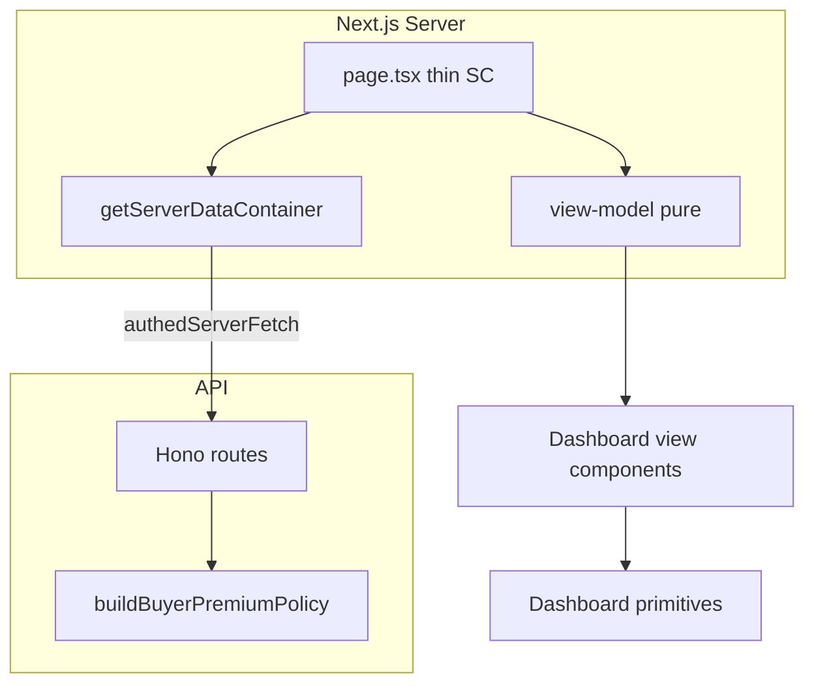

# Client dashboard audit — SOLID, BE-first, UI/UX

**Scope:** All routes under `apps/web/src/app/dashboard/` and shared components under `apps/web/src/components/dashboard/`.  
**Audience:** Engineering — prioritised backlog for hardening PRs.  
**Method:** Static review of data flow (SSR vs CSR), container vs direct `*.server.ts` imports, view-model purity, and UI patterns (loading / empty / error / dark / responsive / a11y).

---

## Cross-cutting summary

- **Two data-access styles:** Pages mix `getServerDataContainer()` with direct imports from `@/lib/data/http/*.server.ts` and `authedServerFetch`. Target: **one composition root** — extend `ServerDataContainer` so route files only depend on the container + auth guards + session where unavoidable.
- **Business logic in view-models:** `dashboard-portfolio.vm.ts` and `dashboard-checkout.vm.ts` compute hammer × rate. Target: **BE-attached `checkoutPricing`** on `Lot` (or dedicated DTO) using `buildBuyerPremiumPolicy` so web VMs only format strings.
- **Parallelism:** `dashboard/page.tsx` used sequential `try/catch` blocks for independent fetches. Target: **`Promise.allSettled`** (or batched container call) with structured per-slice errors.
- **Empty / error / loading:** Inconsistent use of `@auction/ui` `EmptyState`, `Alert`, `PageSkeleton`. Some routes lack `loading.tsx` / route-level `error.tsx`. Target: **dashboard primitives** (`DashboardSection`, `DashboardEmptyState`, `DashboardErrorAlert`, `DashboardSkeleton`) + co-located `loading.tsx` per route.
- **SOLID:** Several pages embed orchestration (fetch + map + branch) in `page.tsx`. Target: **thin server component** → VM builder (pure) → presentational component; mutations via **client service** interfaces (mirror `apps/web/src/lib/services/impl` for admin).
- **BE gaps (tracked):** Portfolio API currently joins lots + payments in the route handler; optional future **`GET /users/me/portfolio`** aggregation is deferred — we first attach **pricing** per lot. **Bid eligibility** already exists server-side (`BidEligibilityService` in API container); web still re-runs policies — document as P1 to expose on lot DTOs for dashboard consumers.
- **Sequencing:** Buyer-premium migration `0060` + tier JSON on `sale` is live; dashboard totals must consume **sale tiers** via BE-computed pricing, not duplicated math.

---

## Route-by-route findings

Bulleted rows: **Path** — purpose · **Data** · **SOLID** · **BE** · **UI/UX** · **Severity** · **Effort**

### `/dashboard` (home)

- **Path:** `apps/web/src/app/dashboard/page.tsx`
- **Purpose:** Overview — active lots, portfolio, watchlist, artist follow, bids, submissions count, activity feed.
- **Data:** SSR + `Suspense`. Mixes `getServerDataContainer()` with `getServerMyAddresses`, `getServerKycStatusSummary`, `getServerMyNotifications`, `getServerOrgOnboardingResume`, `getMySubmissions`, `getServerSessionUser`. Sequential try/catch for first six slices; then `Promise.all` for second batch.
- **SOLID:** Page orchestrates too much; should delegate to one `loadDashboardHomeData()` or container batch.
- **BE:** Portfolio totals in VM use flat rate; should use `checkoutPricing` from API once attached.
- **UI/UX:** Uses `PageSkeleton` fallback; org submitted `Alert` is good. Per-slice errors passed into VM — good pattern; unify with `DashboardErrorAlert`.
- **Severity:** P1 · **Effort:** M (reference migration in Phase 1).

### `/dashboard/bids`

- **Path:** `apps/web/src/app/dashboard/bids/page.tsx`
- **Purpose:** Bid history with artist resolution.
- **Data:** Container + `resolveArtistNames` (server helper). Generally SSR-aligned.
- **SOLID:** Artist name resolution is cross-cutting; acceptable as infra; could move to API.
- **BE:** Optional: return artist display name on bid row from API.
- **UI/UX:** Has `loading.tsx`. Uses `BidsBoard` — verify empty state and mobile table overflow.
- **Severity:** P2 · **Effort:** S.

### `/dashboard/watchlist`

- **Path:** `apps/web/src/app/dashboard/watchlist/page.tsx`
- **Data:** Container watchlist reader. SSR.
- **SOLID:** OK.
- **BE:** Lot pricing for display if showing estimates — low priority.
- **UI/UX:** Has `loading.tsx`. Confirm heart/remove actions use server actions consistently.
- **Severity:** P2 · **Effort:** S.

### `/dashboard/portfolio`

- **Path:** `apps/web/src/app/dashboard/portfolio/page.tsx`
- **Data:** Container + `resolveArtistNames`. Analytics + grid from VMs.
- **SOLID:** VM contains premium math — **violates BE-first** once tiers exist.
- **BE:** **P0** — attach `checkoutPricing` on portfolio `GET /users/me/portfolio` response lots.
- **UI/UX:** Filters client-side (`filterPortfolioRows`) — acceptable for &lt;50 rows; document P2 for query-param filters.
- **Severity:** P0 (pricing) / P2 (filters) · **Effort:** M.

### `/dashboard/payments`

- **Path:** `apps/web/src/app/dashboard/payments/page.tsx`
- **Data:** Container payments + auth guard. SSR.
- **SOLID:** Page may still format status — check duplication with presenters.
- **BE:** Status labels ideally single source (`@/lib/presenters/payment-status`).
- **UI/UX:** Has `loading.tsx`. Card list — check responsive image aspect.
- **Severity:** P2 · **Effort:** S.

### `/dashboard/checkout`

- **Path:** `apps/web/src/app/dashboard/checkout/page.tsx`
- **Purpose:** Hub / redirect?
- **Data:** Read file in implementation pass.
- **Severity:** P2 · **Effort:** S.

### `/dashboard/checkout/[lotId]`

- **Path:** `apps/web/src/app/dashboard/checkout/[lotId]/page.tsx`
- **Purpose:** Winner checkout — lot, addresses fetch, fulfilment strip.
- **Data:** `getServerLotReader` + `authedServerFetch` for addresses + payments fulfilment helper. Not containerised.
- **SOLID:** Mixed fetch styles; sequential `await`s.
- **BE:** **P0** — use same `checkoutPricing` on lot from API (extend lot reader or portfolio-style join sale).
- **UI/UX:** Good copy and layout; ensure `DashboardPage` spacing tokens on small screens.
- **Severity:** P0 · **Effort:** M.

### `/dashboard/notifications`

- **Path:** `apps/web/src/app/dashboard/notifications/page.tsx`
- **Data:** Likely SSR + board component.
- **BE:** Grouping/unread counts could be API-driven (P2).
- **UI/UX:** Has `loading.tsx`. Inbox board a11y (list roles).
- **Severity:** P2 · **Effort:** M.

### `/dashboard/live/upcoming` and `/dashboard/live/[saleId]`

- **Paths:** `live/upcoming/page.tsx`, `live/[saleId]/page.tsx`
- **Data:** Minimal shells — verify data sources (may be client-heavy).
- **SOLID:** Risk of client-only fetch — audit in Phase 3B.
- **UI/UX:** Has `live/loading.tsx`. Empty states use `EmptyState` — good.
- **Severity:** P2 · **Effort:** M.

### `/dashboard/seller` (hub)

- **Path:** `seller/page.tsx`
- **Data:** `requireAuthenticatedUser`, `getServerLotReader`, `getServerSaleWithLots`, `getMySubmissions` — **not** container.
- **SOLID:** High coupling; seller hub should use container + seller reader interface.
- **BE:** Aggregated “seller dashboard summary” endpoint would reduce fan-out (P2).
- **UI/UX:** Cards and links — verify dark mode on secondary text.
- **Severity:** P1 · **Effort:** M.

### `/dashboard/seller/in-sale`

- **Path:** `seller/in-sale/page.tsx`
- **Data:** Seller-specific; likely acting context + lots.
- **Severity:** P1 · **Effort:** M.

### `/dashboard/seller/payouts`

- **Path:** `seller/payouts/page.tsx`
- **Data:** `authedServerFetch` + acting headers — imperative.
- **SOLID:** Move to typed `PayoutService` client impl.
- **Severity:** P1 · **Effort:** M.

### `/dashboard/seller/connect`

- **Path:** `seller/connect/page.tsx` + `seller-connect-actions.tsx`
- **Data:** `authedServerFetch` + client actions component.
- **SOLID:** OK split; ensure actions only call services.
- **Severity:** P2 · **Effort:** S.

### `/dashboard/seller/artist`

- **Path:** `seller/artist/page.tsx`
- **Data:** Mostly presentational forms.
- **Severity:** P2 · **Effort:** S.

### `/dashboard/team`

- **Path:** `team/page.tsx`
- **Data:** Legal entity members — custom fetch + error messages helper.
- **SOLID:** Good use of `describeMemberFetchFailure`.
- **UI/UX:** Has `team/loading.tsx`. Empty state for non-org — verify.
- **Severity:** P2 · **Effort:** S.

### `/dashboard/artist-follow`

- **Path:** `artist-follow/page.tsx`
- **Data:** Container + `resolveArtistNames`.
- **Severity:** P2 · **Effort:** S.

### `/dashboard/verify-identity`

- **Path:** `verify-identity/page.tsx` + client wrapper.
- **Data:** Client-heavy Stripe Identity — acceptable.
- **UI/UX:** Has `loading.tsx`.
- **Severity:** P2 · **Effort:** S.

### `/dashboard/submissions`, `/dashboard/submissions/new`, `/dashboard/submissions/[id]`

- **Paths:** `submissions/page.tsx`, `new/page.tsx`, `[id]/page.tsx`
- **Data:** `getMySubmissions`, categories reader, boards/forms.
- **SOLID:** Submissions list should go through container reader.
- **UI/UX:** `submissions/loading.tsx` exists. Forms — field spacing audit.
- **Severity:** P1 · **Effort:** M.

### `/dashboard/settings` (index)

- **Path:** `settings/page.tsx`
- **Data:** `requireAuthenticatedUser`, `getServerMyAddresses`, `authedServerFetch` — mixed.
- **SOLID:** Settings hub is a mini-orchestrator — candidate for container batch.
- **Severity:** P1 · **Effort:** M.

### `/dashboard/settings/*` (sub-routes)

- **account, account/confirm, appearance, addresses, bidding, notifications, payment-methods, profile, security, security/two-factor, sessions**
- **Data:** Mix of `getServerSessionUser`, `authedServerFetch`, `authedServerFetch` from different modules (`authed-fetch.server` vs `authed-server-fetch`) — **inconsistency risk**.
- **SOLID:** Unify fetch entrypoints; wrap in small services per domain (account, prefs, security).
- **UI/UX:** Many lack dedicated `loading.tsx` (only parent `settings/loading.tsx`) — verify cascade; add per-route skeletons where heavy.
- **Severity:** P1 (consistency) / P2 (loading) · **Effort:** L (spread across files).

### Layout / error boundary

- **Path:** `layout.tsx`, `error.tsx`, `not-found.tsx`, `loading.tsx`
- **Data:** Layout prefetches KYC + org onboarding — good.
- **UI/UX:** Single `error.tsx` for whole tree — acceptable; consider nested error for settings.
- **Severity:** P2 · **Effort:** S.

---

## Target architecture (mermaid)

---

## Severity legend

- **P0** — Incorrect money / compliance / security (fix before release).
- **P1** — Architectural debt causing bugs or slow iteration.
- **P2** — Polish, consistency, performance at scale.

## Effort legend

- **S** — &lt; 0.5 day · **M** — 0.5–2 days · **L** — 2+ days / many files.

---

## Completion tracking

| Phase | Artifact / outcome |
|-------|-------------------|
| 0 | This document |
| 1 | Extended `ServerDataContainer`, primitives, `README`, overview refactored |
| 2 | `checkoutPricing` on portfolio (and checkout) lot payloads; VMs use BE numbers |
| 3A–B | All routes on container + patterns |
| 4 | Dark / responsive / a11y sweep |
| 5 | Tests + CI green |

_Last updated: implementation pass start._
