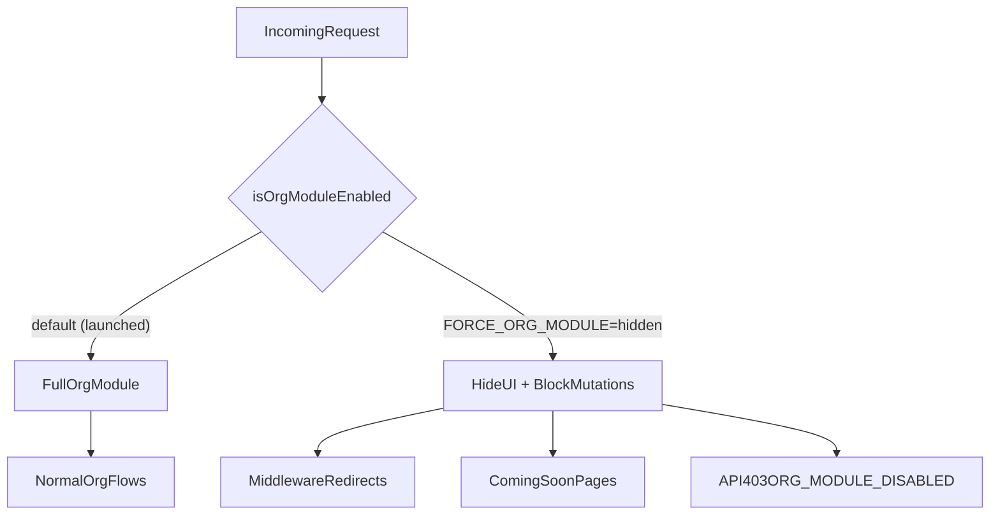

# Organisation module launch

> **Status: LAUNCHED.** As of June 2026 the organisation module (register org, invitations, onboarding, org buyer profiles) is **live on all hosts**, including production web (`lax.bid`, `www.lax.bid`). The host-based gate has been removed; an emergency kill switch remains (see below).

## Emergency kill switch

The flag plumbing was kept so the module can be hidden again without a code change beyond setting env vars and redeploying:

| Tier | Env var | Effect |
|------|---------|--------|
| Web | `NEXT_PUBLIC_FORCE_ORG_MODULE=hidden` | Hides nav / sign-up entry points, shows coming-soon page, middleware redirects org deep links |
| API | `FORCE_ORG_MODULE=hidden` | Org mutations return `403` with code `ORG_MODULE_DISABLED` |

### Production (Terraform + CI)

On prod, both vars are wired in infrastructure when `org_module_hidden = true` (default):

| Location | What |
|----------|------|
| `infra/terraform/ephemeral/prod/variables.tf` | `org_module_hidden` (default `true`) |
| `infra/terraform/ephemeral/prod/main.tf` | Injects env on `web` + `api` components |
| `infra/web-build/prod.env` | `NEXT_PUBLIC_FORCE_ORG_MODULE=hidden` for prebuilt web images |

To **launch** on prod: set `org_module_hidden = false` in Terraform, remove `NEXT_PUBLIC_FORCE_ORG_MODULE=hidden` from `infra/web-build/prod.env`, `terraform apply`, rebuild web image, redeploy.

To disable the module in an emergency (manual / droplet deploy):

1. Set **both** env vars (`NEXT_PUBLIC_FORCE_ORG_MODULE=hidden` on web, `FORCE_ORG_MODULE=hidden` on API).
2. Redeploy **web + API together** (API guards must match web UI or users see hidden UI but the API still accepts actions, or vice versa).
3. Unset both vars and redeploy to re-enable.

## How the flag works

Two small helpers, both defaulting to **enabled**:

| Tier | File | Kill switch input |
|------|------|-------------------|
| Web | [`apps/web/src/lib/legal-entity/org-module-enabled.ts`](../../apps/web/src/lib/legal-entity/org-module-enabled.ts) | `NEXT_PUBLIC_FORCE_ORG_MODULE` |
| API | [`apps/api/src/lib/org-module-enabled.ts`](../../apps/api/src/lib/org-module-enabled.ts) | `FORCE_ORG_MODULE` |

Web resolves the flag per request via [`org-module-host.server.ts`](../../apps/web/src/lib/legal-entity/org-module-host.server.ts) and threads it down as the `orgModuleEnabled` prop. The API exposes it through [`org-module-gate.ts`](../../apps/api/src/lib/org-module-gate.ts) on the container.

> Note: `isProductionWebHost` / `normalizeHostname` in the web helper are still used by SEO indexing logic (`apps/web/src/lib/seo/is-indexing-allowed.ts`) — do not remove them.

## History

The module was hidden on production web until launch (June 2026) via a host-based gate (`lax.bid` / `www.lax.bid` in a `PRODUCTION_HOSTS` set).

Implementation commits:

- [`79d4b67a`](https://github.com/LAX-UK/monorepo/commit/79d4b67a) — `feat: hide organisation module on production domain until launch`
- [`4b5773ef`](https://github.com/LAX-UK/monorepo/commit/4b5773ef) — `fix(api): route org module gate through container for DIP lint`

## Post-launch verification checklist

Verify on `lax.bid` after deploying:

- [ ] Nav shows **Organisations** and **Invitations**
- [ ] `/dashboard/organisations` loads the hub (not coming-soon)
- [ ] Sign-up shows **Representing a gallery, dealer, or estate** persona option
- [ ] `POST /organizations` succeeds (not `ORG_MODULE_DISABLED`)
- [ ] `NEXT_PUBLIC_FORCE_ORG_MODULE` / `FORCE_ORG_MODULE` are **not** set in any production env

## What the kill switch hides

- **Nav / switcher** — Organisations, Invitations, register-org links
- **Pages** — org hub → coming-soon; invitations / onboarding / deep org URLs → redirect
- **Sign-up** — org persona + invite flows blocked
- **Dashboard** — org banners, attention items, settings CTAs
- **Saleroom** — org buyer profile link → "coming soon" text
- **API** — org create, invite accept/decline, org-persona register, onboarding mutations → 403

## Request flow

## File inventory

### Core flag helpers

- `apps/web/src/lib/legal-entity/org-module-enabled.ts`
- `apps/web/src/lib/legal-entity/org-module-host.server.ts`
- `apps/api/src/lib/org-module-enabled.ts`
- `apps/api/src/lib/org-module-gate.ts`

### Coming-soon UI (shown only when kill switch is on)

- `apps/web/src/components/organisations/org-module-coming-soon.tsx`
- `apps/web/src/lib/dashboard/dashboard-copy.ts` (`orgModuleComingSoon` copy)

### Middleware + acting-context hardening

- `apps/web/src/middleware.ts` — redirects org deep links when hidden
- `apps/web/src/lib/legal-entity/derive-acting-context.ts` — neutralises stale org acting cookie when hidden

### Web pages (early return / redirect when hidden)

- `apps/web/src/app/dashboard/organisations/page.tsx`
- `apps/web/src/app/dashboard/organisations/[id]/layout.tsx`
- `apps/web/src/app/dashboard/invitations/page.tsx`
- `apps/web/src/app/dashboard/invitations/accept/[token]/page.tsx`
- `apps/web/src/app/(task)/onboarding/organisation/layout.tsx`
- `apps/web/src/app/(task)/register/page.tsx`
- `apps/web/src/app/(task)/verify-email/page.tsx`
- `apps/web/src/app/dashboard/settings/account/page.tsx`
- `apps/web/src/app/dashboard/page.tsx`
- `apps/web/src/app/dashboard/layout.tsx`

### Web components (`orgModuleEnabled` prop)

- `apps/web/src/components/layout/app-shell-nav.ts`
- `apps/web/src/components/layout/legal-entity-switcher.tsx`
- `apps/web/src/components/layout/acting-as-banner.tsx`
- `apps/web/src/components/shell/client-shell.tsx`
- `apps/web/src/lib/shell/build-shell-config.ts`
- `apps/web/src/components/auth/sign-up-fields.tsx`
- `apps/web/src/components/auth/sign-up-form.tsx`
- `apps/web/src/components/dashboard/dashboard-banner-stack.tsx`
- `apps/web/src/components/dashboard/dashboard-overview-view.tsx`
- `apps/web/src/components/dashboard/overview/build-attention-items.ts`
- `apps/web/src/components/dashboard/overview/overview-hero-band.tsx`
- `apps/web/src/components/sections/saleroom/saleroom-register-to-bid.tsx`
- `apps/web/src/components/sections/saleroom/saleroom-hero-actions.tsx`
- `apps/web/src/components/sections/artwork/artwork-bid-panel.tsx`
- `apps/web/src/components/bid/bid-gate.tsx`

### Web lib

- `apps/web/src/lib/auth/post-verify-destination.ts`
- `apps/web/src/lib/bid/policies/types.ts`
- `apps/web/src/lib/bid/policies/sale-registration.policy.tsx`

### Marketing pages

- `apps/web/src/app/(marketing)/lot/[slug]/[id]/page.tsx`
- `apps/web/src/app/(marketing)/sales/[slug]/[id]/page.tsx`

### API guards

- `apps/api/src/routes/organizations.ts`
- `apps/api/src/routes/legal-entities.ts`
- `apps/api/src/routes/legal-entity-members.ts`
- `apps/api/src/routes/users.ts`
- `apps/api/src/routes/organization-onboarding.ts`

### Tests

- `apps/web/src/lib/legal-entity/org-module-enabled.test.ts`
- `apps/web/src/lib/legal-entity/derive-acting-context.test.ts`
- `apps/web/src/middleware.test.ts`
- `apps/api/src/lib/org-module-enabled.test.ts`
- `apps/web/src/lib/auth/post-verify-destination.test.ts`
- `apps/web/src/components/layout/app-shell-nav.test.ts`
- `apps/web/src/components/auth/sign-up-fields.test.tsx`
- `apps/api/src/routes/users.register.routes.test.ts`
