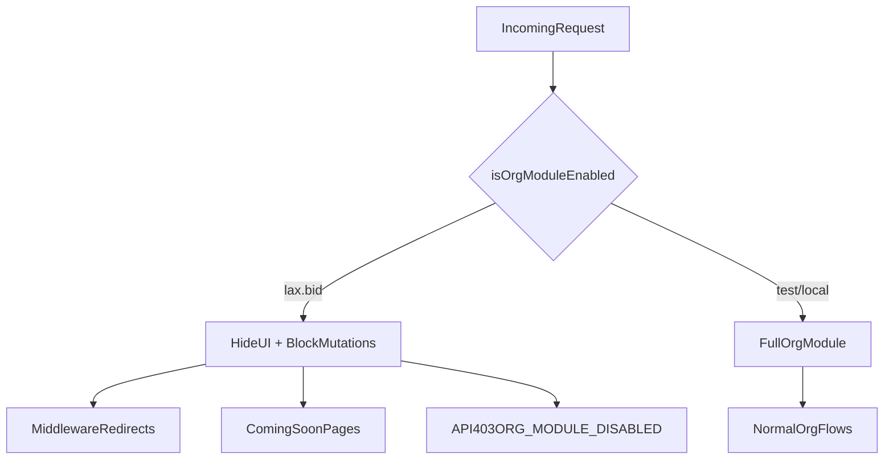

# Organisation module launch

The organisation module (register org, invitations, onboarding, org buyer profiles) is **hidden on production web** (`lax.bid`, `www.lax.bid`) until launch. It remains fully functional on `test.lax.bid`, `localhost`, and all other hosts.

When disabled:

- UI shows a friendly **coming soon** page and hides nav / sign-up entry points.
- Mutations are blocked at the API layer with `403` and code `ORG_MODULE_DISABLED`.

## Implementation commit

Introduced in [`476d4dbf`](https://github.com/LAX-UK/monorepo/commit/476d4dbf) (`feat: hide organisation module on production domain until launch`).

## How the toggle works

Two small helpers share the same production host list:

| Tier | File | Input |
|------|------|-------|
| Web | [`apps/web/src/lib/legal-entity/org-module-enabled.ts`](../../apps/web/src/lib/legal-entity/org-module-enabled.ts) | Request hostname |
| API | [`apps/api/src/lib/org-module-enabled.ts`](../../apps/api/src/lib/org-module-enabled.ts) | `WEB_ORIGIN` env var |

```typescript
// Both files — edit this to enable on prod:
const PRODUCTION_HOSTS = new Set(["lax.bid", "www.lax.bid"]);
// isOrgModuleEnabled → return !PRODUCTION_HOSTS.has(host)
```

Web resolves the flag via [`org-module-host.server.ts`](../../apps/web/src/lib/legal-entity/org-module-host.server.ts) (`host` / `x-forwarded-host` headers).

### Local testing overrides (web only)

```bash
NEXT_PUBLIC_FORCE_ORG_MODULE=hidden   # simulate prod UI locally
NEXT_PUBLIC_FORCE_ORG_MODULE=visible  # force visible even on lax.bid (web UI only)
```

These do **not** affect API guards. To test API behaviour locally, use a non-production `WEB_ORIGIN` or hit the API on `test.lax.bid`.

## Launch checklist

1. Edit **both** `org-module-enabled.ts` files — remove `lax.bid` / `www.lax.bid` from `PRODUCTION_HOSTS`, or change `isOrgModuleEnabled` to always return `true`.
2. Deploy **web + API together** (API guards must match web UI or users see enabled UI but get 403 on actions).
3. Verify on `lax.bid`:
   - [ ] Nav shows **Organisations** and **Invitations**
   - [ ] `/dashboard/organisations` loads the hub (not coming-soon)
   - [ ] Sign-up shows **Representing a gallery, dealer, or estate** persona option
   - [ ] `POST /organizations` succeeds (not `ORG_MODULE_DISABLED`)
4. Remove `NEXT_PUBLIC_FORCE_ORG_MODULE` from any env if set.

Optional post-launch cleanup (not required): remove [`OrgModuleComingSoon`](../../apps/web/src/components/organisations/org-module-coming-soon.tsx) and the `orgModuleEnabled` prop threading. The flag can stay as a permanent toggle if preferred.

## What is hidden when disabled

- **Nav / switcher** — Organisations, Invitations, register-org links
- **Pages** — org hub → coming-soon; invitations / onboarding / deep org URLs → redirect
- **Sign-up** — org persona + invite flows blocked
- **Dashboard** — org banners, attention items, settings CTAs
- **Saleroom** — org buyer profile link → "coming soon" text
- **API** — org create, invite accept/decline, org-persona register, onboarding mutations → 403

## Request flow



## File inventory

### Core flag helpers (edit these to launch)

- `apps/web/src/lib/legal-entity/org-module-enabled.ts`
- `apps/web/src/lib/legal-entity/org-module-host.server.ts`
- `apps/api/src/lib/org-module-enabled.ts`

### Coming-soon UI

- `apps/web/src/components/organisations/org-module-coming-soon.tsx`
- `apps/web/src/lib/dashboard/dashboard-copy.ts` (`orgModuleComingSoon` copy)

### Middleware + acting-context hardening

- `apps/web/src/middleware.ts` — redirects org deep links on prod
- `apps/web/src/lib/legal-entity/derive-acting-context.ts` — neutralises stale org acting cookie on prod

### Web pages (early return / redirect)

- `apps/web/src/app/dashboard/organisations/page.tsx`
- `apps/web/src/app/dashboard/organisations/[id]/layout.tsx`
- `apps/web/src/app/dashboard/invitations/page.tsx`
- `apps/web/src/app/dashboard/invitations/accept/[token]/page.tsx`
- `apps/web/src/app/(task)/onboarding/organisation/layout.tsx`
- `apps/web/src/app/(task)/register/page.tsx`
- `apps/web/src/app/(task)/verify-email/page.tsx`
- `apps/web/src/app/dashboard/settings/account/page.tsx`
- `apps/web/src/app/dashboard/page.tsx`
- `apps/web/src/app/dashboard/layout.tsx`

### Web components (`orgModuleEnabled` prop)

- `apps/web/src/components/layout/app-shell-nav.ts`
- `apps/web/src/components/layout/legal-entity-switcher.tsx`
- `apps/web/src/components/layout/acting-as-banner.tsx`
- `apps/web/src/components/shell/client-shell.tsx`
- `apps/web/src/lib/shell/build-shell-config.ts`
- `apps/web/src/components/auth/sign-up-fields.tsx`
- `apps/web/src/components/auth/sign-up-form.tsx`
- `apps/web/src/components/dashboard/dashboard-banner-stack.tsx`
- `apps/web/src/components/dashboard/dashboard-overview-view.tsx`
- `apps/web/src/components/dashboard/overview/build-attention-items.ts`
- `apps/web/src/components/dashboard/overview/overview-hero-band.tsx`
- `apps/web/src/components/sections/saleroom/saleroom-register-to-bid.tsx`
- `apps/web/src/components/sections/saleroom/saleroom-hero-actions.tsx`
- `apps/web/src/components/sections/artwork/artwork-bid-panel.tsx`
- `apps/web/src/components/bid/bid-gate.tsx`

### Web lib

- `apps/web/src/lib/auth/post-verify-destination.ts`
- `apps/web/src/lib/bid/policies/types.ts`
- `apps/web/src/lib/bid/policies/sale-registration.policy.tsx`

### Marketing pages

- `apps/web/src/app/(marketing)/lot/[slug]/[id]/page.tsx`
- `apps/web/src/app/(marketing)/sales/[slug]/[id]/page.tsx`

### API guards

- `apps/api/src/routes/organizations.ts`
- `apps/api/src/routes/legal-entities.ts`
- `apps/api/src/routes/legal-entity-members.ts`
- `apps/api/src/routes/users.ts`
- `apps/api/src/routes/organization-onboarding.ts`

### Tests

- `apps/web/src/lib/legal-entity/org-module-enabled.test.ts`
- `apps/web/src/lib/legal-entity/derive-acting-context.test.ts`
- `apps/web/src/middleware.test.ts`
- `apps/api/src/lib/org-module-enabled.test.ts`
- `apps/web/src/lib/auth/post-verify-destination.test.ts`
- `apps/web/src/components/layout/app-shell-nav.test.ts`
- `apps/web/src/components/auth/sign-up-fields.test.tsx`
